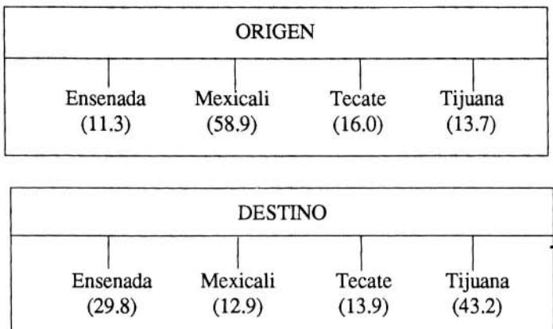
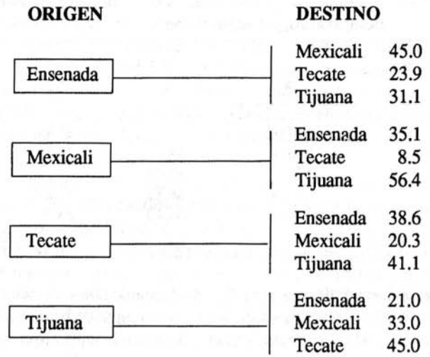

# **POBLACIÓN, EMPLEO Y MIGRACIÓN INTERMUNICIPAL EN BAJA CALIFORNIA 1980-1988***

Por Margarita Barajas Tinaco··

#### RESUMEN

El presente ensayo describe la expansión de la estructura ocupacional y la dinámica del empleo en Baja California en los momentos 1980 y 1988 a la luz del contexto de la aguda crisis económica sufrida en la década de los ochenta.

Los flujos migratorios ocurridos en Baja California durante el periodo de estudio se caracterizan en cuanto a magnitud, ocupación, edad y sexo; destacando, además, el nivel urbano y ocupacional de los puntos de destino. El ensayo concluye con un breve apartado de consideraciones finales.

#### ABSTRACT

This essay describes the growth of the occupational structure and the employment dynamics in Baja California in 1980 and 1988, within the context of the economica1 crisis suffered throughout the decade of the 80's.

The migratory flows occurred in Baja California during this period are characterized in magnitude, occupation, age, and sex; underlining the urban levels as well as the occupationallevels of the destination points. The essay ends with a briefparagraph offmal considerations.

#### INTRODUCCIÓN

Este ensayo tiene el propósito de describir cómo se ha comportado la estructura ocupacional de la población económicamente activa (PEA) en 1980 y 1988 en el estado de Baja California y sus municipios, asociando el perfil sociodemográfico con procesos de crecimiento económico y regional y, por otra parte, caracterizar la migración intermunicipal de la población total y de la correspondiente a la PEA en el periodo 1980-1988, , evaluando la importancia del flujo migratorio en relación con la estructura ocupacional del punto de destino.

• Trabajo apoyado por CONACYT •

•• Investigadora del Instituto de Investigaciones Sociales de la VADC.

En el primer apartado, q!le trata sobre antecedentes, se destaca la importancia de estudiar el empleo en general y los niveles de ocupación en Baja California en particular, atendiendo básicamente a dos aspectos peculiares de la región: su vulnerabilidad económica por las implicaciones de ser estado fronterizo y su dinámica demográfica, tanto por crecimiento poblacional como por la integración funcional del flujo de personas dentro del propio estado. Enseguida se maneja un breve apartado que resume los efectos económicos más contundentes que hacia 1982 incidieron en la expansión y contracción de los distintos sectores económicos de actividad,

A continuación se exponen los resultados sobre las características de la población y de la estructura ocupacional a nivel estatal y municipal respectivamente, a la vez que se hace una caracterización del flujo migratorio intemlUnicipal dentro del periodo 1980-1988. Finalmente, concluimos con 1m aspectos más sobresalientes de la información revisada y expuesta en este trabajo.

# ANTECEDENTES

Estudiar los niveles de empleo cobra importancia dentro del contexto de la aguda crisis económica que el país sufre en el primer quinquenio de los ochenta, particularmente a partir de 1982. Como consecuencia de la crisis, la inflación alcanzó niveles sin precedente y los sectores encontraron de pronto en una profunda recesión. 1 Esto trajo consecuencias directas sobre la demanda de trabajo y desde luego sobre el crecimiento del empleo;2 con ello se agudiza uno de los problemas más graves que enfrenta el país y sus regiones. Los desajustes entre la evolución de la oferta y la demanda de fuerza de trabajo, junto con el deterioro de los salarios han provocado en los últimos años dificultades en el acceso al empleo y han hecho surgir formas de ingreso a partir de actividades consideradas como empleo informal. El crecimiento de este tipo de trabajo, los marcados

1 Esto también se dejó ver en el sistema producúvo. La información correspondiente a los quince años transcurridos entre 1970 y 1984 permite afirmar que la capacidad instalada en su operación también ha venido disminuyendo, mientras que su contraparte, la capacidad ociosa, se ha ido incrementando. Durante el periodo 1970 a 1984, el grado de utilización· de la capacidad instalada bajó de 92.6% a 76.5% en tanto que la capacidad ociosa subió de 7.4 a 23.5%. Este hecho también puede ser apreciado al analizar el comportamiento de la tasa del producto por trabajador en los distintos sectores de la acúvidad económica (Consejo ~acional de Población, 1988).

&quot;Resulta interesante tener en cuenta que mientras entre 1976 y 1982 se generaron cerca de 4 millones de empleos (aproximadamente 700 mil cada año), de 1983 a la fecha (sólo han sido creados 850 mil, canúdad equivalente a la quinta parte de los que se generaron en el sexenio anterior (280 mil en promedio al año)" (Arroio y Fuentes, 1986: 15).

cambios en la distribución sectorial, los niveles distintos en la calificación de la fuerza de trabajo, su composición urbana y rural, así como el incremento en la participación femenina en la actividad económica, constituyen manifestaciones sobresalientes de nuevas configuraciones en la estructura ocupacional.

Si bien Baja California es uno de los estados fronterizos que tradicionalmente y en relación con los estados no fronterizos ha mantenido altos niveles de bienestar social en diferentes rubros, donde los niveles de empleo en particular han sido favorables en su mayor parte y además, el nivel de ocupación, aunque no ha sido de pleno empleo, es aceptable según criterios público y privado; es cierto también que en la región se notan procesos que rompen en cierta manera con tendencias ya definidas en las últimas décadas. En términos del comportamiento ocupacional de los distintos sectores y ramas de actividad se pasa por una serie de cambios que se perciben en el primer quinquenio de la década y que se constatan hacia su terminación. Por otra parte, y en cierto modo como explicación a esto, cabe señalar que las políticas económicas, específicamente monetarias -caso particular de la devaluación de la moneda y el control de cambio-- provocaron en la economía de la frontera obstáculos y estímulos en ciertas actividades económicas que se manifestaron en el comportamiento diferencial de la demanda ocupacional por sector económico, afectando de esta manera el comportamiento de la expansión de la estructura sectorial, donde la migración intermunicipal de la población en edad de trabajar es considerada como reflejo de dicho cambio.

La manifestación de los cambios se da en forma peculiar según la región que se esté analizando. En el caso particular, el alto grado de interacciones económicas que dentro de un ámbito binacional mantiene Baja California con el sur de California, le condiciona, entre otras cosas, las características de empleo.3 Por su situación de estado fronterizo resulta ser más vulnerable a las fluctuaciones del mercado cambiario y a convertirse en punto de atracción migratoria. El estado presenta así una dinámica demográfica que mucho se explica por el grado de crecimiento económico observable en los niveles de empleo.

3 &quot;durante los últimos cinco años algunas de las principales ciudades de la franja fronteriza del norte del país han experimentado un auge inusitado, precisamente a partir de la devaluación drástica del peso mexicano que tanto ha afectado al resto de la actividad económica que de 1981 a 1986 había sido del 80% en témúnos reales. En dichas ciudades tanto el comercio y los servicios turísticos como las actividades de ensamble o maquila han crecido a elevadas tasas a partir de 1982" (Trejo Reyes, 1988: 42).

En el futuro inmediato, y según indicadores de crecimiento poblacional tanto por migración neta como por creci\lliento natural,4 la PEA seguirá expandiéndose, y por lo tanto los ni veles de empleo y/o desempleo también presentarán cambios definidos.

La información sobre la PEAS en relación con la estructura ocupacional nos da un panorama general de la composición sectorial del sistema productivo; pero, además, cabe llamar la atención sobre un factor que en los últimos años se ha venido manifestando en su composición en las diferentes ciudades del estado de Baja California, nos referimos a la migración intraestatal o intermunicipal que constituye un tipo de fenómeno que apenas se ha comenzado a estudiar,6 y que, sin embargo, cobra una singular importancia debido a que del total de las migraciones intermunicipales en el estado, sólo en la década de los ochenta se concentra alrededor del 40% de ella.

La evidencia en los últimos años de un marcado flujo migratorio intermunicipal, que por su edad se ubica dentro de la PEA, manifiesta cambios en la composición tanto de los sectores, ramas y actividades económicas, como en el perfil de la población que demanda empleo. Es por ello que si el estado, más que un todo homogéneo en su productividad económica, presenta una diversidad notoria en sus ramas económicas, y si a la vez cada municipio presenta un caso específico de la estructura ocupacional, resulta entonces que dicho proceso debe de tener algún efecto sobre los flujos migratorios.

### CONTEXTO ECONÓMICO SOCIAL INCIDENTE SOBRE LA DI-NÁMICA OCUPACIONAL EN BAJA CALIFORNIA, DÉCADA DE LOS OCHENTA 7

La década de los ochenta fue de aguda crisis económica para el país en su conjunto; varios factores confluyeron para darle lugar y desencadenar una serie de procesos en diferentes ámbitos. Lo que interesa ahora

4 Los datos más recientes de estos indicadores los maneja Rodolfo Corona (1990) y son como sigue: la tasa de crecimiento poblacional para Baja California en 1986 es de 39.7 por mil. la tasa ~e crecimiento natural es de 22.3 y la tasa de crecimiento social es de 17.4.

Para su conceptualización ver nota de pie de página no.ll de este trabajo.

6 Pionero en el tema lo es Gabriel Estrella Valenzuela con el trabajo "Migraciones ~terurbanas en la frontera norte de México" (1988).

Debido a la no sistematizaci6n de la informaci6n sobre ocupaci6n es que no se puede hacer una evaluaci6n de su comportamiento en intervalos más cortos; bianual o trianual digamos. En caso de poder hacerlo así, estableceríamos relaciones más directas y con menor probabilidad de error entre un fenómeno de naturaleza económica y su impacto en el empleo regional. Ante la dificultad de realizarlo de esta manera, en este apartado s610 se establecen relaciones generales.

destacar son los efectos en el mercado de trabajo, consecuencia de las relaciones económicas gestadas por la crisis y de algunas políticas que se implantaron para contrarrestar algunos de sus efectos.

Durante 1982, las condiciones económicas mostraron una situación completamente diferente respecto a los afias inmediatamente anteriores. La inflación alcanzó niveles sin precedente, el sector productivo se encontró en una profunda recesión; a nivel nacional se registraron despidos masivos de trabajadores, con lo que se agudizó el desempleo, y el sistema financiero entró en una etapa de profundos desequilibrios e inestabilidad (Ramírez,1988).

La diversidad entre las regiones del país fue una condición para que los efectos de la crisis y las políticas monetarias disefladas ante ella tuvieran distintos efectos. Particularmente en la frontera el determinante básico ha sido la intemacionalización de su economía. En lo singular, la política del tipo de cambio trajo influencias regionales extraordinarias alentando la actividad de algunos sectores e inhibiendo la de otros (Tamayo, 1988). En las ciudades fronterizas las actividades que se dinamizaron fueron el comercio y los servicios turísticos y, de manera especial, las actividades de ensamble o maquila.

El proceso devaluatorio afectó directamente al consumidor y al sistema productivo en sentido negativo. El consumidor disminuyó sus compras cotidianas en Estados Unidos al disminuir su poder adquisitivo; de la misma manera, el sistema productivo del estado se paralizó al no poder adquirir los insumos productivos necesarios para su crecimiento.

Las repercusiones más importantes, a raíz de las devaluaciones, se dieron en el ámbito de diferentes actividades económicas. Como era de esperarse, hubo desestímulo en todas aquellas actividades que se enfrentaron a las restricciones de importación de maquinaria e insumos, como fue el caso para ciertas ramas de la industria (por ejemplo, algunos alimentos procesados y bebidas).

La actividad comercial se dinamizó debido a que el consumidor fronterizo reorientó su consumo sobre los productos nacionales en la medida que los artículos importados se encontraban cada vez más lejos de su poder adquisitivo.8

La actividad que se vio más favorecida fue la industria maquiladora, que a partir de 1982 aumentó considerablemente debido a la subvaluación del peso, lo que con la caída del salario real ha representado importantes

8 Para una documentación amplia sobre el crecimiento de establecimientos comerciales, ver AgusÚll Sández y Ana María Avilés M. (1990).

ahorros en el costo de la producción. En Tijuana es donde se han registrado las tasas de crecimiento más altas de la maquilad ora mexicana. De 1980 a 1986 los indicadores de plantas y empleo de la maquiladora en Tijuana crecieron a una tasa de 11.0% y 14.94% respectivamente, para enero de 1988 se localizaban 315 plantas, que ocupaban a 60 mil empleados. En Mexicali, otro centro maquilador aunque de menor importancia, existían 86 plantas en 1986 y ocupaban a 12,727 trabajadores (Fuentes, el al., 1990).

Definitivamente, la política económica de devaluación del peso frente al dólar es lo que ha estimulado el crecimiento de las actividades de tipo maquilador, ya que el efecto inmediato de dicha medida es, como se sabe, el abaratamiento de factores productivos nacionales tales como trabajo, suelo, servicios públicos, servicios profesionales, equipamiento industrial, etc. (Barajas, 1989).

La mayoría de los trabajos9 que hay sobre análisis económico del estado han identificado procesos económicos consecuentes de la crisis económica, en general, y de las políticas monetarias, en particular, que afectan directamente las relaciones económicas transfronterizas. Así es como en primera instancia se ha visto que algunas actividades económicas han sido estimuladas y otras obstaculizadas en su crecimiento. Sin embargo, los efectos inmediatos que después de 1982 se dejaron sentir en la economía, la producción y el empleo en el estado, no necesariamente han manifestado las mismas características en todas las ramas de producción. En el caso de las actividades agrícolas, por ejemplo, más bien ha ocurrido una dinamización después de las política de devaluación. 10 La distribución de la PEA dentro de los sectores, para 1988, no puede distinguir en sí misma el nivel de la importancia de los sectores económicos en cuanto a valor, pero nos puede dar pistas para establecer hipótesis al respecto. Es de suponer que las actividades económicas que se dinamizan en la frontera dentro del contexto de la crisis tuvieron un especial crecimiento en la demanda de empleo; por lo tanto, es posible inferir también determinados

9 Algunos de ellos son: "El comercio entre California y Baja California: ¿relación fronteriza o vinculación binacional?", de Joel Siqueiros Canales (1987); "La disputa del mercado fronteriw, 1960- 1983" de Alejandro Mungaray y Patricia Moctezuma (1984); "La frontera norte de México y la crisis de 1982, algunos comentarios preliminares", de Jesús Tamayo (1983).

10 Mientras que en el año 1981 a 1982 el cultivo de hortalizas (que como se sabe demanda importante mano de obra) decrece, para 1983 la recuperación de su dinamismo supera los promedios hortícolas nacionales, e incluso el resto de la producción agrícola regional. Su crecimiento se encuentra asociado a su rentabilidad en ascenso, resultado del crecimiento de su precio interno a partir de las fuertes devaluaciones de 1982. Cabe recordar que la producción de hortalizas es más sensible al tipo de cambio, debido a que se destina al mercado externo casi en un 100%. Para un diagnóstico amplio sobre el sector ver Martha Stamatis M. (1991).

cambios en el comportamiento de los sectores económicos. Dichos cambios, en un momento dado, son más perceptibles a nivel municipal, lomando en consideración que las distintas ramas de actividad económica en los respectivos municipios no guardan el mismo grado de importancia que se muestra a nivel estatal.

Es por estas mismas razones que la migración intermunicipal que se observa durante el periodo 1980-1988 la podemos entender también como un indicador de la integración funcional del subsistema de ciudades que guarda esta región. Las causas de este tipo de migración pueden muy bien ser el desplazamiento de actividades económicas en el espacio y el crecimiento diferencial de dichas actividades en lugares distintos.

Bajo estas consideraciones y supuestos se lee la información que sobre población global, económicamente activa y migración intennunicipal se presenta en este trabajo.

# **ASPECTOS METODOLÓGICOS**

Se utilizaron como principales instrumentos de información la *Encuesta Continua* de *Migración de Baja California* (ECMBC) 1988 y el *Censo General*  de *Población* de 1980 de *Baja California.* Por un lado, se describe el perfil de la estructura ocupacional en dos momentos: 1980 y 1988; por otra parte, se analiza el estado que guarda la migración de carácter intermunicipal dentro de ese mismo periodo (1980-1988). La base estadistica para el desarrollo de la primera parte constituye información sobre las variables de edad, sexo, condición de actividad, rama y posición en el trabajo de la población total estatal y municipal, 1980 y 1988 respectivamente. Para la segunda parte se trabajaron, a partir de la ECMBC, los flujos migratorios por cambio de lugar de residencia que se registraron en Baja California entre agosto de 1980 y septiembre de 1988. De esta población se analizaron sus características básicas, como: flujo total, municipios de origen y de destino, edad, sexo, condición de actividad y posición en el trabajo.

Los grupos de población en estudio están divididos de la siguiente forma: a) poblacion total; b) población económicamente activa (PEA)11 i) PEA ocupada ti) PEA desocupada.

11 La PEA se tema de la forma que la define el *Censo de Población de 1980;* es decir, primero la población mayor de 12 años que durante la semana anterior al censo se encootraba trabajando; por otra parte, la que no trabajó pero tenía trabajo y, finalmente, los desocupados, aquéllos que se encootraban buscando trabajo habiendo onotrabajado antes. Para 1988 se hace la misma subdivisién. Para el perfil de los migrantes intermunicipales no temamos esuictarnente a la PEA como grupo de estudio, sino la coodición de actividad en general de la población mayor de 12 años de edad, de esta forma nos era suficiente en un primer nivel de aproximación en la coofonnacién de su perfil.

Las comparaciones que se intentan establecer entre 1980 y 1988 estuvieron dadas para la población total, población económicamente activa y población ocupada por rama 12 y posiciónl 3 en el trabajo, Al respecto, cabe señalar cómo las fuentes de información captaron cada uno de estos grupos. El censo de 1980 al igual que los anteriores y la propia encuesta fue un censo de derecho; sin embargo, el concepto de residente habitual se manejó de manera distinta. 14 Conceptualmente en 1980 se consideró como residente habitual a todo aquel ocupante de la vivienda que tuviera en el lugar de residencia un periodo de seis meses o más, y a los ausentes, siempre y cuando el periodo de ausencia fuera menor a seis meses. La ECMBC, análoga al censo de 1970, determinó como residente habitual el lugar donde la persona tiene su domicilio o lugar de residencia, y es el que normalmente señala como respuesta a la pregunta ¿en dónde vive? Dadas las diferentes conceptualizaciones de residente habitual, en 1980 se dio pauta a una omisión de habitantes con menos de seis meses de estancia, aspecto que no necesariamente sucedió en 1988, dado que en esta ocasión el concepto no estuvo restringido por el tiempo. Bajo estas consideraciones es de suponer que en 1980 hubo cierto grado de subenumcración de la población total, lo cual repercute en los indicadores de crecimiento calculados para 1988 teniendo como base los datos de 1980. Por otra parte, al tratar de localizar en qué grupos de población específicos se localizó esta subenumeración de la población total, es de suponer que en principio afectó a un número considerable de inmigrantes ele corta temporada, que a su vez, al estar dentro de los grupos de edad activa forma parte de la PEA; es de esperarse también que por su condición de inmigrantes no estuvieran incorporados dentro de la PEA ocupada,15 por tanto, las bajas tasas de desempleo para los municipios del estado en 1980 deben ser en realidad más altas que las que arrojan los datos, de aquí que el aumento aparente de las tasas de desempleo que nosotros encontramos en la información para 1988 deben verse a la luz de los problemas ya planteados respecto a la información de 1980.

En ambas fuentes de información se consideró como población ocupada a todas las personas que trabajaron al menos una hora al día durante la semana anterior al ser entrevistados.

12 La rama viene a ser la actividad del establecimiento, empresa, institución o negocio en el We declara ocuparse la persona.

Define la situación de la persona con su trabajo o empleo principal.

14 Para una explicación amplia del uso de este concepto y sus efectos en la cuantificación de l~ población, ver Rodolfo Corona (1986).

1 &quot;Se ha visto que el desempleo a veces es mayor entre los migrantes y que éstos ocupan más los trabajos de tipo temporal" (Oliveira y García, 1984).

Debido a los altos porcentajes del "no especificado" en rama de actividad económica y posición en el trabajo en 1980 (del orden del 33% y 25% respectivamente), para los fines de este trabajo se optó por reasignarlo mediante la forma:

PT *P.est. = PT. NE x* rr DondePT NE n Población total No especificada Población inicial P.est. Población estimada.

Para el caso de la misma información, en 1988 se decidió conservar el "no especificado" debido a su pequei'ia proporción dentro de la población total ocupada. Esta proporción fue de .54 en rama y .43 en posición en el trabajo. Los indicadores de crecimiento porcentual de los sectores económicos entre 1980 y 1988 consideraron de la misma manera el "no especificado".

### POBLACIÓN Y ESTRUCTURA OCUPACIONAL EN BAJA CALIFORNIA

En términos demográficos y de acuerdo con el cuadro 1, lo primero y más importante a destacar es el crecimiento de la población global en el estado. En 1980 el estado registró l' 177 ,886 habitantes mientras que en 1988 según la ECMBC se registran 1 '708,100. Este aumento en tan sólo ocho años significó una tasa de crecimiento de 4.5% anual. En la década inmediata anterior, es decir, de 1970 a 1980 el estado registró una tasa de 2.8%. Aparentemente, esto significa que en los ochenta se da un nuevo aceleramiento en el crecimiento de la población en el estado, parecido al de las décadas anteriores a los setenta. Estas notables diferencias entre los indicadores de crecimiento en ambos periodos han llamado la atención de los especialistas que se enfrentan ante la disyuntiva de pensar que la encuestal6 sobrestima la población, o que el censo de 1980 subestimó, en general, a la población de la emidad. Según diversos análisis lo segundo es lo más plausible, 17 ya que si se calcula la tasa de crecimiento de la población para 1988 con base en la obtenida en 1970, se obtiene un indicador más regular y coherente con los indicadores precedentes. Esto

16 Se refiere en particular a los datos de la *Encuesta Demográfica de Baja California, 1986.*  ~esultados ..

1 Un análisis detallado se encuentra en "Notas sobre la confiabilidad de los primeros resultados de la Encuesta Demográfica de Baja California", capítulo v de la *Encuesta Demográfica* de *Baja California* 1986. *Resultados. 1987.* 

llevaría a pensar que en realidad en 1988 Baja California no presentó tal disminución en el crecimiento de la población y que' continuaron las tendencias de crecimiento de la población, e~íficarnent.e por migración interna (flujo de inmigrantes en el estado):8

|                     |||| B.C.      |||| Ensenada |||| Mexicali |||| Tecate |||| Tijuana |
| ---                 |||| ---       |||| ---      |||| ---      |||| ---    |||| ---     |
| 1980                ||||           ||||          ||||          ||||        ||||         |
| Población total     |||| 1 177 886 |||| 175425   |||| 510664   |||| 30540  |||| 461257  |
| Menor de 12 años    |||| 386118    |||| 56375    |||| 166518   |||| 10668  |||| 152536  |
| Mayor de 65 años    |||| 38764     |||| 5933     |||| 16709    |||| 1101   |||| 15012   |
| Ind. de dependencia ||||           ||||          ||||          ||||        ||||         |
| total*              |||| 36.07     |||| 35.51    |||| 35.88    |||| 38.53  |||| 36.32   |
| r de la población   |||| 2.8       ||||          ||||          ||||        ||||         |
| 1988                ||||           ||||          ||||          ||||        ||||         |
| Población total     |||| 1708100   |||| 218854.  |||| 700928   |||| 41671  |||| 746647  |
| Menor de 12 años    |||| 469825    |||| 62929    |||| 186656   |||| 12072  |||| 208168  |
| Mayor de 65         |||| 54020     |||| 8386     |||| 25362    |||| 1565   |||| 18707   |
| Ind. de dependencia ||||           ||||          ||||          ||||        ||||         |
| total*              |||| 30.66     |||| 32.58    |||| 30.24    |||| 32.72  |||| 30.38   |
| r de la población** |||| 4.51      |||| 2.68     |||| 3.84     |||| 3.77   |||| 5.84    |
| rde la PEA          |||| 5.24      |||| 2.9      |||| 24.89    |||| 4.40   |||| 6.40    |

|
|  |

FUENTE: La información para 1980 es a partir del *Censo General de Población* y *Vivienda.* 1980; Para Baja California: la información correspondiente a 1988 se obtuvo de la *Encuesta Continua de Migración de B.C.* CONEPO-UABC.

*Es la relación entre la población menor de 12 años más la mayor de 65 entre el resto de la población.

* [10] De la forma $r=\frac{Ln\left|\frac{\mu}{po}\right|}{\left|\frac{\mu}{po}\right|}$ **Donde: t = a 8.24 aros.**

18 Resulta claro que si en 1980 OQJrrió una subestimación de la población total, esto afectó también al total de los demás grupos de análisis que II1Ibaja el censo (total de hombres, total de mujeres, población tOtal mayor de 6 años. mayor de 12 años, etc.)

En 1988, la población menor de 12 años presenta un porcentaje menor que en 1980, y el índice de dependencia total19 baja considerablemente de 36.07 a 30.66 (cuadro 2). Por otra parte, podemos ver cómo en 1988 la PEA es un porcentaje mayor de la población total que la PEA de 1980, no obstante que la población ocupada, en términos porcentuales, es considerablemente menor en 1988. De aquí se deriva entonces que en el segundo periodo de referencia había más población desocupada no sólo en términos absolutos, sino también relativos en comparación con ocho años atrás. Esto se puede apreciar comparando las tasas de ocupación y desocupación para los dos periodos.

La tasa neta de participación20 no ha tenido variación significativa, aunque en términos absolutos en 1988 se encontraron casi 200 mil personas más ocupadas que en 1980. Este aumento, se debe en parte a la alta tasa de crecimiento de la PEA que es de 5.24% para todo el estado.

Analizando la PEA por sexo, podemos ver que el aumento absoluto de personas que hubo de 1980 a 1988 fue en tres cuartas partes afectado por hombres y sólo en una cuarta parte por mujeres. Por ello, las tasas brutas y netas de participación aumentaron en 1988 más en el sexo masculino que en el femenino y de hecho, en este último, se mantiene casi invariable.

En 1988 la tasa de ocupación21 es ligeramente mayor en las mujeres, aunque con respecto a 1980 no se puede establecer una comparación; pero, como en el caso general, es de suponer que en 1980 dicha tasa fuera más alta22 (ver cuadro 2).

Observando la incorporación de la población al trabajo por grupos de edad, vemos primero que en general en 1988 las tasas de ocupación son más bajas, excepto en el grupo de 15 a 19 años. En 1980 el grupo de edad con mayor participación económica fue marcadamente el de 25 a 29 años, mientras que en 1988 el grupo más alto era el inmediatamente anterior, es decir, el grupo de 20 a 24 años. Aunque en general yen terminos relativos se presenta una menor incorporación al trabajo en 1988, en específico no ha sido el caso para el grupo de edad 15-19, más bien, su incorporación a la estructura ocupacional se ha incrementado levemente (ver cuadro 3).

19 Se toma como el indicador de la carga económica que soporta la población productiva de ~a población total (ver cuadro 1).

Es la proporción que representa la PEA respecto a la población de 12 años y más; cuando ~ proporción es respecto a la población total, se lee entonces como tasa bruta de participación. 1 Es lo que representa la población ocupada respecto a la eoonómicamente activa.

22 A nivel nacional se ha registrado en las últimas décadas una mayor participación de la mujer en la fuerza de trabajo. En 1980 esto fue más notorio, en parte debido a que se incluyó dentro de la población activa a todo aquél que hubiese trabajado como mínimo una hora y no 15, como una década atrás se había considerado. Esto pennitió que se captara un tipo de trabajo especial, conocido como "secundario" donde la mujer junto con los jóvenes ocupa un lugar importante.

|         || Pobo      || Mayor de ||        || PEA     || PEA     || Tsa. bruta || Tsa. neta || Tsa.  || Tsa.     |
| ---     || ---       || ---      || ---    || ---     || ---     || ---        || ---       || ---   || ---      |
| Año     || total     || 12 años  || PEA    || ocupada || noocup. || parto      || part      || ocupo || desocupo |
|         ||           ||          || (1)    || (2)     || (3)     || (4)        || (5)       || (6)   || (7)      |
| 1980    || 1177 886  || 791 768  || 403279 || 400 837 || 2442    || 34.23      || 50.93     || 99.39 || 0.60     |
| 1988    || 1 708 100 || 1238275  || 621484 || 595430  || 26054   || 36.38      || 50.18     || 95.80 || 4.19     |
| Hombres ||           ||          ||        ||         ||         ||            ||           ||       ||          |
| 1980    || 580727    || 386423   || 282646 ||         ||         || 48.67      || 73.14     ||       ||          |
| 1988    || 862581    || 626409   || 446375 || 425999  || 20376   || 51.74      || 71.25     || 95.43 || 4.50     |
| Mujeres ||           ||          ||        ||         ||         ||            ||           ||       ||          |
| 1980    || 597159    || 405345   || 120633 ||         ||         || 20.20      || 29.76     ||       ||          |
| 1988    || 845519    || 610788   || 175109 || 169431  || 5678    || 20.71      || 28.66     || 96.48 || 3.24     |

CUADRO 2. **Indicadores de la población en Baja California 1980-1988.** 

FUENfE: La información para 1980 a partir del *Censo General de Población y vivienda, 1980;* Para Baja California. La información correspondiente a 1988 de la *Encuesta Continua de Migración de B.C.* CONEPO-UABC.

NOTA: No se dispone de información por sexo para 1980.

1. Personas de 12 años y más que en el periodo de referencia estaban ocupados o buscaban empleo.

- 2. Asalariados y no asalariados, que en el periodo de referencia trabajaron cuando menos una hora.
3. Quienes no trabajaron ni tenían empleo, pero que estaban realizando trámites para conseguirlo.

4. La TBP es el porcentaje que representa la población económicamente activa respecto a la población total.

5. La TNP es el porcentaje que representa la población económicamente activa respecto a la población de 12 años y *más.* 

6. La TO es el porcenteje que representa la población ocupada respecto a lo económicamente activa

7. La ID es el porcentaje que representa la población desocupada respecto a la económicamente activa.

| Grupos   ||       || Baja California || Ensenada ||       || Mexicali ||       || Tecate ||       ||       || Tijuana |
| ---      || ---   || ---             || ---      || ---   || ---      || ---   || ---    || ---   || ---   || ---     |
| de edad  || 1980  || 1988            || 1980     || 1988  || 1980     || 1988  || 1980   || 1988  || 1980  || 1988    |
| 12 a 14  || 8.84  || 6.06            || 9.88     || 10.04 || 8.24     || 5.89  || 7.69   || 7.05  || 9.18  || 4.96    |
| 15 a 19  || 39.23 || 41.47           || 37.91    || 38.82 || 35.17    || 40.32 || 42.67  || 42.95 || 44.29 || 43.25   |
| 20a24    || 63.53 || 63.40           || 61.17    || 63.27 || 62.09    || 62.89 || 65.87  || 61.08 || 65.92 || 64.03   |
| 25 a29   || 67.67 || 61.50           || 65.02    || 59.12 || 66.28    || 64.72 || 65.38  || 61.86 || 66.47 || 59.29   |
| 30a34    || 64.90 || 60.28           || 64.73    || 65.6  || 64.56    || 55.06 || 64.30  || 62.76 || 65.37 || 63.26   |
| 35 a39   || 64.37 || 61.76           || 64.62    || 64.21 || 63.46    || 60.31 || 64.50  || 59.54 || 65.21 || 62.53   |
| 40a44    || 63.06 || 57.69           || 63.34    || 63.24 || 62.22    || 59.69 || 60.43  || 56.04 || 64.01 || 54.01   |
| 45 a49   || 61.25 || 51.21           || 61.71    || 56.71 || 60.93    || 45.73 || 63.66  || 58.97 || 61.28 || 54.83   |
| 50a54    || 60.18 || 47.70           || 61.23    || 53.01 || 60.06    || 48.72 || 58.58  || 52.73 || 60.01 || 45.08   |
| 55 a59   || 59.14 || 43.82           || 59.33    || 44.38 || 59.62    || 35.98 || 63.19  || 44.49 || 58.22 || 51.33   |
| 6Oa64    || 51.84 || 44.57           || 54.72    || 38.70 || 51.87    || 43.83 || 56.19  || 35.51 || 50.33 || 48.48   |
| 65 a69   || 42.64 || 21.38           || 46.28    || 23.80 || 43.52    || 23.03 || 40.78  || 14.44 || 40.36 || 18.88   |
| 70a 74   || 35.75 ||                 || 37.10    ||       || 36.70    ||       || 38.09  ||       || 33.94 ||         |
| 75 Y más || 23.98 ||                 || 23.71    ||       || 26.09    ||       || 27.37  ||       || 21.53 ||         |

CUADRO 3. Tasas de ocupación por grupos de edad a nivel estatal y municipal, 1980 y 1988.

FUENTE: La infonnación para 1980 a partir del *Censo General de Población y vivienda, 1980;* Para Baja California. La infonnación correspondiente a 1988 de la *Eru:uesta Continua de Migración de E.C.* CONEPO-UABC. NafA: Para el caso de 1988 el grupo de edad abierto es de 65 y más.

La distribución de la PEA ocupada en diferentes sectores23 económicos del estado ha sido como sigue. Para 1980 el sector 1 ocupó el 14% de la PEA, el 20% y 65% los sectores n y ID respectivamente. Para 1988 se mantuvo la misma estructura y el sector ID siguió siendo el más numeroso (ver cuadro 4). Visto como crecimiento porcentual entre 1980 y 1988 tenemos que el sector 1 aumentó en un 37.25%, el sector n, en un 83.65% yel sector ID, en un 35.25%. Vemos que aunque se mantuvo la misma estructura en cuanto a población absoluta para 1988, el sector n fue el que porcentualmente aumentó más (ver cuadro 5).

Con respecto a lo que estuvo ocurriendo hasta 1980 sí se registran cambios. Por ejemplo, el sector l, hasta 1970, venía presentando una disminución no sólo porcentual, sino también absoluta. Para 1980 parece continuar esta disminución, aunque asignándole la proporción de "no especificado" apenas crece en seis mil personas ocupadas; en cambio, en 1988 no continúa esta tendencia, porque crece en términos absolutos y relativos. Las políticas monetarias de devaluación tuvieron efectos diversos sobre este sector. En el caso de la agricultura no parece que haya ocurrido un estancamiento, sino más bien un nuevo perfil de cultivos que demandó mayor fuerza de trabajo.

A diferencia de la década anterior, se destaca el crecimiento especial que tuvo el sector industrial dentro del periodo 1980-1988. De registrar en 1980 82,248 personas, pasó a 151,051 en 1988, lo que significa un crecimiento porcentual de 83.6; a pesar de que en 1980 este sector pudo haber sido subestimado, el crecimiento es muy importante. En el contexto de la crisis de 1980 tenemos que la industria de la transformación en el estado fue una de las actividades económicas golpeada más duramente24 y que se ve estancada, no así las actividades de la industria de tipo maquilador, que por el contrario, se ve beneficiada de las nuevas ventajas comparativas por seguirse estableciendo en la frontera. De hecho, más del

23 En el sector I se incluyen las actividades de agricultura, pesca y silvicultura; en el sector I1,las actividades de industria y explotación de minas; en el sector III, las actividades de comercio y servicios. Es importante advertir el problema del "no especificado" para este rubro y matizar los cambios encontrados. Según un estudio especializado, el "no especificado" fue más grave en las ramas de comercio, servicios y gobierno (ver Etemod y González, 1984). En otras palabras, el "no especificado" se centro particularmente en el sector III, de alú que el =cimiento porcentual de la PBA <benida denlro del periodo para este sector es probablemente meno a! que obtuvimos.

u Los principales obstáculos (en el contexto de la crisis) fueron restricciones sobre la importación de ciertas materias primas, obtención de dólares para cumplir con créditos contraídos en E. U., y dificultades de crédito para el fomento económico, además" ... mientras de 1980 a 1981 el número de penonas integradas ala actividad industrial en el estado, de acuerdo a los registros del Instituto Mexicano del Seguro Socia!, pasó de 45,661 a 52,274 trabajadores, para 1982 la cifra se redujo a 48,533,10 que implicó una disminución del7.! % con respecto a! año anterior'. *(RanúrezAcosta,elal.,* 1985:22).

50% de la PEA en el sector II pertenece exclusivamente a la industria maquiladora en 1988 (ver cuadro 7). De 1980 a 1986 las plantas maquiladoras presentan un crecimiento dell1 % sólo en Tijuana, y después de 1986 se han seguido extendiendo. Para 1988 se contabilizaron 315 plantas en Tijuana y 86 en Mexicali. Por lo tanto mantiene, e incluso incrementa, su importancia como captadora de trabajo (Fuentes, *et al., 1990).* 

El sector terciario es el más importante en Baja California, al menos por el gran número de empleos que genera. Las actividades de comercio y servicios, para 1988, siguen siendo las que captan más PEA (cuadros 4 y 5).

Las ramas específicas de actividad económica donde se ocupó la población fueron, en 1980, en servicios de tipo comunal, social y personal captando el 25.4% de la PEA; según esta clasificación, un gran número ocupado en este rubro eran trabajadores del estado (ver cuadro 6). Le sigue en importancia la rama de actividades en comercio y hotelería ocupando un 20.6% de la PEA total. Dentro de ésta se pueden ubicar trabajadores por "su cuenta" en establecimientos de distinta dimensión e importancia económica. Por su parte, la industria manufacturera ocupa un valor casi igual que el anterior (20.3% de la PEA total); posiblemente se deba a que acapara a la mayoría de los trabajadores asalariados y trabajadores a sueldo fijo.

En 1988 la distribución por rama aumenta en cada rubro. El comercio es la rama con mayor captación de PEA, esta vez ocupando un 20%. La industria ocupa un 18% y dentro de ella sólo la industria maquiladora capta un 14%. Cabe decir que este sector de actividad en particular presenta un dinamismo, sobre todo a partir de 1986, que se explica por las ventajas comparativas que la región significa para la industria maquiladora de exportación.

En 1980 el comercio ocupó 82,626 personas; para 1988 esta cifra había aumentado a 124,288. Las políticas de tipo de cambio orginadas a partir de 1982 dieron la pauta para que en el estado se dinamizara la actividad comercial de carácter nacional, por lo que pequeños y grandes establecimientos, sobre todo de alimentos, se establecieron en la región para satisfacer la demanda de la población que ante la inflación en la frontera y a la pérdida de valor del peso frente al dólar requiere productos nacionales accesibles a su poder adquisitivo. El turismo es otro subsector económico que también estimuló el comercio (cuadros 6 y 7).

La posición en el trabajo más numerosa registrada en 1980 es la de empleados y obreros; el trabajador ''por su cuenta", aunque mucho menor que el primer rubro, es el siguiente en importancia, ubicándose ahí un 13% de la PEA. De forma global, en 1988 se presenta el mismo orden jerárquico (ver cuadro 9) donde las diferencias que se registran están en otro tipo de posiciones en el trabajo. Por ejemplo, el rubro de patrón en 1988 aparenta menos importancia que 8 años atrás, al igual que los ocupados en algún tipo de cooperativa (cuadros 8 y 9).

| Sector de  || BajaCfa.       ||      || Ensenada ||        || Mexicali ||        || Tecate        ||      || Tijuana       ||      |
| ---        || ---            || ---  || ---      || ---    || ---      || ---    || ---           || ---  || ---           || ---  |
| Actividad  || 1980           || 1988 || 1980     || 1988   || 1980     || 1988   || 1980          || 1988 || 1980          || 1988 |
| Total      || 400 837 595430 ||      || 60109    || 75649  || 169532   || 242309 || 10 109 13 994 ||      || 161087 263487 ||      |
| Sector 1   || 14.19          || 13.1 || 22.20    || 29.6   || 20       || 18.1   || 14.17         || 8.0  || 5.2           || 3.9  |
| Sector II  || 20.51          || 25.2 || 15.57    || 10.6 · || 17       || 21.9   || 31.20         || 42.7 || 25.3          || 31.0 |
| Sector III || 65.28          || 59.4 || 62.20    || 58.8   || 63       || 57.6   || 54.60         || 48.0 || 69.5          || 61.8 |
| Noespec.   ||                || 2.0  ||          || 0.1    ||          || 2.0    ||               || 1.3  ||               || 3.0  |

CUADRO 4. Distribución de la población económicamente activa por municipio y sector de actividad económica en 1980 y 1988.

FUENTE: La información para 1980 a partir del *Censo General de Población y vivienda, 1980;* Para Baja California. la información correspondiente a 1988 de la *Encuesta Continua de Migración de B.C.* CONEPO-UABC.

| Sector de || Baja Cfa. || Ensenada || Mexicali || Tecate || Tijuana |
| ---       || ---       || ---      || ---      || ---    || ---     |
| actividad || 80-88     || 80-88    || 80-88    || 80-88  || 80-88   |
| Sector 1  || 37.25     || 67.84    || 29.66    || 21.42  || 29.02   |
| Sector II || 83.65     || -13.60   || 84.54    || 89.50  || 104.83  |
| Sector ID || 35.25     || 19.02    || 30.48    || 21.88  || 45.53   |

| CUADROS. || Crecimiento porcentual'" de los sectores de actividad |
| ---      || ---                                                   |
|          || económica a nivel estatal y municipal 1980-1988.      |

FUENTE: La infonnación para 1980 es a partir del *Censo General de Población y Vivienda, 1980.* Para Baja California; la infonnación correspondiente a 1988 se obtuvo de la *Encuesta Continua* de *Migración de B.C.* CONEPO-UABC.

$$\bullet\;\left({\frac{N88}{N80}}\right)=\,100$$

### POBLACIÓN Y ESTRUCTURA OCUPACIONAL A NIVEL MUNICIPAL 1980-1988

Lo más importante a destacar es que el municipio de Mexicali no aparece por primera vez en la historia poblacional del estado como el municipio más poblado, lo separa del municipio de Tijuana una diferencia de poco más de 20 mil habitantes. A su vez, el municipio de Tijuana ocupa el primer lugar en población absoluta, además de que también presenta la tasa de crecimiento más alta: 5.84% anual, 2 puntos más que el municipio de Mexicali. El municipio de Tecate aunque es el menos poblado, presentó una tasa de crecimiento casi tan alta como Mexicali (de 3.77). Ensenada presentó la tasa más baja de crecimiento poblacional (ver cuadro 1)

La tasa bruta de participación económica en los respectivos municipios subió, oscilando entre .68 y 3.01 puntos porcentuales. Aunque en 1988 dicha tasa fue mayor, hay que denotar que es en Mexicali donde más aumentó (36.43%) a pesar de que este municipio no fue el que más creció en población absoluta (cuadro lOa).

Esta tasa bruta de participación para el caso de Mexicali revela más bien una disminución de la población menor de 12 años, porque en contrapartida la tasa neta de participación se mantuvo invariable. La población no ocupada representó un 5.12% de la PEA. En contraste, Ensenada sólo ocupó 1.42%; los municipios restantes, es decir, Tecate y Tijuana, registraron también en 1988 una tasa análoga de desocupación de 4.26 y 4.09 respectivamente (cuadro lOa).

| Rama actividad    ||        || BajaCfa ||        || Ensenada ||        || Mexicali || Tecate ||       || Tijuana ||       |
| ---               || ---    || ---     || ---    || ---      || ---    || ---      || ---    || ---   || ---     || ---   |
|                   || Abs.   || %       || Abs.   || %        || Abs.   || %        || Abs.   || %     || Abs.    || %     |
| Total PEA         || 400837 ||         || 60109  ||          || 169532 ||          || 10109  ||       || 162064  ||       |
| Agríe. ganad.     ||        ||         ||        ||          ||        ||          ||        ||       ||         ||       |
| Pesca             || 56888  || 14.10   || 13 358 || 22.20    || 34001  || 20;00    || 1433   || 14.17 || 8096    || 5.02  |
| Explotac. minas   || 748    || .18     || 200    || .33      || 280    || .16      || 77     || .76   || 191     || .11   |
| Ind. manufactura  || 81500  || 20.33   || 9160   || 15.23    || 28538  || 16.80    || 3078   || 30.44 || 40724   || 25.28 |
| E1ectr. gas agua  || 2143   || .53     || 247    || .41      || 1308   || .77      || .74    || .73   || 514     || .31   |
| Construcción      || 37265  || 9.29    || 5912   || 9.83     || 14621  || 8.62     || 1158   || 11.40 || 15574   || 9.66  |
| Comercio hoteles  || 82626  || 20.61   || 10455  || 17.39    || 30922  || 18.23    || 1328   || 13.10 || 39921   || 24.78 |
| Transp. y comun.  || 23880  || 5.95    || 3551   || 5.90     || 10 133 || 5.97     || 590    || 5.80  || 9606    || 5.96  |
| Establecimientos  ||        ||         ||        ||          ||        ||          ||        ||       ||         ||       |
| financieros       || 13 836 || 3.4     || 1770   || 2.94     || 6142   || 3.62     || 218    || 2.15  || 5706    || 3.54  |
| Serv. comunales   ||        ||         ||        ||          ||        ||          ||        ||       ||         ||       |
| social y personal || 101951 || 25.4    || 15456  || 25.71    || 43587  || 25.71    || 2153   || 21.2  || 40755   || 25.29 |

CUADRO 6. Distribución de la PEA en el estado y sus municipios según rama de actividad, 1980.

FUEN1E: La infonnación para 1980 es a partir del *Censo General de Población y vivienda, 1980.* Para Baja California, la infonnación correspondiente a 1988 de la *Encuesta Continua de Migración de B.C* . CONEPO-UABC.

NorA: Distribución, porcentual respecto al total de la PEA del estado y de cada municipio respectivamente (%vertical).

| Rama de actividad   ||        || BajaCfa. ||       || Ensenada ||        || Mexicali || Tecate ||       ||        || Tijuana |
| ---                 || ---    || ---      || ---   || ---      || ---    || ---      || ---    || ---   || ---    || ---     |
|                     || Abs.   || %        || Abs.  || %        || Abs.   || %        || Abs.   || %     || Abs.   || %       |
| Total PEA           || 595430 ||          || 75649 ||          || 242309 ||          || 13 994 ||       || 263478 ||         |
| Agric. ganad.       || 66562  || 11.18    || 13623 || 18.01    || 42163  || 17.40    || 1092   || 7.80  || 9684   || 3.68    |
| Pesca               || 10556  || 1.77     || 8620  || 11.39    || 1676   || 0.69     || 8      || 0.06  || 252    || 0.10    |
| Explotac. minas     || 963    || 0.16     || 178   || 0.24     || 249    || 0.10     || 26     || 0.19  || 510    || 0.19    |
| Ind. transfonnación || 27969  || 4.70     || 2544  || 3.36     || 2052   || 0.85     || 3016   || 21.55 || 20357  || 7.73    |
| Ind. maquiladora    || 82001  || 13.77    || 1089  || 1.44     || 33266  || 13.73    || 1834   || 13.11 || 45812  || 17.39   |
| Construcción        || 36992  || 6.21     || 4448  || 5.88     || 15267  || 6.30     || 1102   || 7.87  || 16175  || 6.14    |
| Energ. eléctric.    || 4089   || 0.69     ||       ||          || 2596   || 1.07     || 27     || 0.19  || 1466   || 0.56    |
| Comercio            || 124288 || 20.87    || 16949 || 22.40    || 46028  || 19.00    || 2090   || 14.93 || 59221  || 22.48   |
| Transporte          || 19323  || 3.25     || 3280  || 4.34     || 6995   || 2.89     || 582    || 4.16  || 8466   || 3.21    |
| Gobierno            || 49840  || 8.37     || 10452 || 13.82    || 22549  || 9.31     || 998    || 7.13  || 15841  || 6.01    |
| Finanzas seguro     || 9114   || l.53     || 82    || 0.11     || 2445   || l.01     || 127    || 0.91  || 6460   || 2.45    |
| Turismo             || 23077  || 3.88     || 1672  || 2.21     || 5837   || 2.41     || 537    || 3.84  || 14991  || 5.69    |
| Educación           || 16883  || 2.84     || 1475  || 1.95     || 11304  || 4.67     || 292    || 2.09  || 3812   || l.45    |
| Serv. doméstico     || 13 726 || 2.31     || 1329  || 1.76     || 5565   || 2.30     || 217    || 1.55  || 6615   || 2.51    |
| Serv. tec Y prof.   || 38555  || 6.48     || 9056  || 1l.97    || 8332   || 3.44     || 877    || 6.27  || 20290  || 7.70    |
| Otro                || 59207  || 9.94     || 208   || 0.27     || 30689  || 12.67    || 1009   || 7.21  || 27301  || 10.36   |
| N.E.                || 3268   || 0.55     || 42    || 0.06     ||        || 0.00     || 74     || 0.53  || 3152   || l.20    |

CUADRO 7. Distribución de la PEA en el estado y sus municipios según rama de actividad, 1988.

FUENTE: La infonnación para 1980 es a partir del *Censo General de Población y vivienda, 1980.* Para Baja California, la información correspondiente a 1988 de la *Encuesta Continua de Migración de B.C.* CONEPO-UABC. NOTA: porcentaje vertical

| Posición trnbajador        ||         || BajaCfa ||       || Ensenada || Mexicali ||       || Tecate ||       || Tijuana ||       |
| ---                        || ---     || ---     || ---   || ---      || ---      || ---   || ---    || ---   || ---     || ---   |
|                            || Abs.    || %       || Abs.  || %        || Abs.     || %     || Abs.   || %     || Abs.    || %     |
| Total PEA                  || 400 837 ||         || 60109 ||          || 169532   ||       || 10109  ||       || 162064  ||       |
| Patrón empres              || 36282   || 9.0     || 5373  || 8.9      || 15574    || 9.18  || 763    || 7.54  || 14572   || 9.04  |
| Empleado obrero            || 275474  || 68.7    || 39943 || 66.4     || 117556   || 69.30 || 7159   || 70.81 || 110816  || 68.79 |
| Miemb. cooperat            || 7632    || 1.9     || 2133  || 3.5      || 2972     || 1.75  || 134    || 1.32  || 2413    || 1.49  |
| Trab. por su cuenta        || 53761   || 13.4    || 8817  || 14.6     || 21798    || 12.80 || 1304   || 12.89 || 21842   || 13.55 |
| Trab. no remunerado 27 688 ||         || 6.9     || 3863  || 6.4      || 11632    || 6.86  || 749    || 7.40  || 11444   || 7.10  |

CUADRO 8. Distribución de la PEA en el estado y sus municipios según posición en el trabajo, 1980.

FUENfE: La infonnación para 1980 es a partir del *Censo GeTJeral de Población y vivienda, 1980.* Para Baja California, la infonnación correspondiente a 1988 de la *Encuesta Continua de Migración de B.e.* CONEPO-UABC.

NOTA: Distribución porcenUJal respecto al total de la PEA del estado y los municipios respectivamente (%vertical).

| Posición tI'aOOjador ||        || Baja efa || Ensenada ||       || Mexicali ||       || Tecate ||       || Tijuana ||       |
| ---                  || ---    || ---      || ---      || ---   || ---      || ---   || ---    || ---   || ---     || ---   |
|                      || Abs.   || %        || Abs.     || %     || Abs.     || %     || Abs.   || %     || Abs.    || %     |
| Total PEA            || 595430 ||          || 75649    ||       || 242309   ||       || 13994  ||       || 263478  ||       |
| Patrón               || 11226  || 1.89     || 1852     || 2.45  || 3720     || 1.54  || 373    || 2.67  || 5281    || 2.00  |
| Subcontratista       || 1354   || 0.23     || 160      || 0.21  || 159      || 0.07  || 69     || 0.49  || 966     || 0.37  |
| Trab. por su cuenta  || 92459  || 15.53    || 14624    || 19.33 || 36047    || 14.88 || 1837   || 13.13 || 39951   || 15.16 |
| Trabaj. coopera      || 1845   || 0.31     || 1433     || 1.89  || 305      || 0.13  || 72     || 0.51  || 35      || 0.01  |
| Sueldo fijo          || 427532 || 71.80    || 50536    || 66.80 || 186557   || 76.99 || 9988   || 71.37 || 180451  || 68.49 |
| Trab. a destajo      || 40201  || 6.75     || 3635     || 4.81  || 6483     || 2.68  || 1340   || 9.58  || 28743   || 10.91 |
| Trab. no familiar    ||        ||          ||          ||       ||          ||       ||        ||       ||         ||       |
| sin pago             || 671    || 0.11     || 3176     || 4.20  || 472      || 0.19  || 41     || 0.29  || 158     || 0.06  |
| Trabajador familiar  ||        ||          ||          ||       ||          ||       ||        ||       ||         ||       |
| sin pago             || 16865  || 2.83     ||          ||       || 7434     || 3.07  || 160    || 1.14  || 6095    || 2.31  |
| Otro                 || 658    || 0.11     ||          ||       ||          ||       || 47     || 0.34  || 611     || 0.23  |
| N.S.                 || 2619   || 0.44     || 233      || 0.31  || 1132     || 0.47  || 67     || 0.48  || 1187    || 0.45  |

CUADRO 9. Distribución de la PEA en el estado y sus municipios según posición en el trabajo, 1988.

FUENIE: La infonnación para 1980 es a partir del *Censo General de Población y vivienda, 1980.* Para Baja California, la infonnación correspondiente a 1988 de la *Encuesta Continua de Migración de B .C.* CONEPO-UABC.

NaTA: Distribución porcentual respecto al total de la PEA del estado y los municipios respectivamente (% vertical).

|          || Población || Mayor de || PEA    || Población || no      || Tsa. bruta || Tsa. neta || Tasa   || Tasa    |
| ---      || ---       || ---      || ---    || ---       || ---     || ---        || ---       || ---    || ---     |
| Años     || total     || 12 años  ||        || ocupada   || ocupada || partici.   || partici.  || ocupa. || desocu. |
| Ensenada ||           ||          ||        ||           ||         ||            ||           ||        ||         |
| 1980     || 175425    || 119050   || 60327  || 60109     || 263     || 34.38      || 50.67     || 99.63  || 0.43    |
| 1988     || 218854    || 155925   || 76740  || 75649     || 1091    || 35.06      || 49.21     || 98.57  || 1.42    |
| Mexicali ||           ||          ||        ||           ||         ||            ||           ||        ||         |
| 1980     || 510664    || 344 146  || 170675 || 169532    || 1 143   || 33.42      || 49.59     || 99.33  || 0.66    |
| 1988     || 700928    || 514272   || 255385 || 242309    || 13 076  || 36.43      || 49.65     || 94.87  || 5.12    |
| Tecate   ||           ||          ||        ||           ||         ||            ||           ||        ||         |
| 1980     || 30540     || 19851    || 10 168 || 10109     || 59      || 33.29      || 51.22     || 99.41  || 0.58    |
| 1988     || 41671     || 29599    || 14618  || 13 994    || 624     || 35.07      || 49.38     || 95.73  || 4.26    |
| Tijuana  ||           ||          ||        ||           ||         ||            ||           ||        ||         |
| 1980     || 461257    || 308721   || 162064 || 161087    || 977     || 35.13      || 52.49     || 94.39  || 0.6     |
| 1988     || 746647    || 538479   || 274741 || 263478    || 11263   || 36.79      || 51.02     || 95.91  || 4.09    |

### CUADRO 10a.Indicadores de la población en Baja California a nivel municipal, 1980-1988.

FUENTE: La infonnación para 1980 a partir del *Censo General de Población y vivienda, 1980.* Para Baja California; la infonnación correspondiente a 1988 de la *Encuesta Continua de Migración de B.C.* CONEPQ.UABC.

Otro detalle de especial importancia es que, del total de personas que a nivel estado se incorporaron a la estructura ocupacional dentro del periodo que va de 1980 a 1988, alrededor del 50% de ese absoluto lo hizo en el muniCipio de Tijuana con todo lo que ello implica. De hecho, la tasa de crecimiento de la PEA para este municipio resultó de 6.4%, le siguió Mexicali con 4.89 % Y Ensenada y Tecate con 2.92% y 4.4% respectivamente (cuadro lOa).

Analizando la PEA municipal por sexo para 1988, tenemos que en los cuatro municipios más del 70% de ella está compuesta por hombres. Ensenada incorpora proporcionalmente más hombres que el resto; a su vez Tijuana es el que incorpora menos, por lo tanto es en este municipio donde hay una proporción mayor de mujeres participando en la PEA. Estas diferentes proporciones corresponden y son coherentes, desde luego, con el tipo de sector económico predominante en cada uno de los municipios. Por ejemplo en Ensenada, donde su sector económico más dinámico no se caracteriza por presentar una composición ocupacional femenina (ver cuadros lOb y lOe).

Sabemos que la población ocupada del sexo femenino es menor; sin embargo, sobresale que en términos proporcionales la tasa de ocupación es más favorable para este sexo. Las tasas de ocupación femenina son mayores en todos los municipios, excepto en Ensenada. En cuanto a la participación económica entre 1980 y 1988, no se registran variaciones (ver cuadros IOh y 1 Oc).

Según el conocimiento de otros estudios, es importante hacer la relación entre mayor incorporación de población femenina a la actividad económica con las actividades propias del sector terciario.25 Es el comercio y los servicios en donde generalmente se ha identificado que se ocupan mujeres, no cumpliendo necesariamente una jornada completa, sino de tiempo parcial. En Tijuana, donde el sector terciario es más importante respecto al resto de los municipios, también el índice ocupacional femenino es mayor.

Observando la incorporación de la población al trabajo por grupos de edad, cada municipo presenta tasas de ocupación más bajas en 1988 que en 1980; pero dicha baja en la tasa, se presenta más bien a partir del grupo de edad de 25 a 29 y los subsiguientes, ya que los grupos de 15 a 19 y de 20 a 24 aflos son, en todos los municipios, más altos, excepto en Tijuana; yen Tecate, el grupo de 20 a 24.

2S En el trabajo de Teresa Rendón "El empleo en México, tendencias recientes" (1982: 157-181), se señala la mayor incorporación femenina al trabajo favorecida en parte por las actividades de comercio propias del sector m. Otro trabajo señala al respecto que: "En México, por lo general, el principal mercado laboral para las mujeres es el sector terciario, mientras que los hombres se emplean principalmente en la agriculn¡ra y la industria". (Cruz Piñeiro, 1988:115).

|          || Población || Mayor de || PEA     || Población || No      || Tsa. bruta || Tsa. neta || Tasa   || Tasa    |
| ---      || ---       || ---      || ---     || ---       || ---     || ---        || ---       || ---    || ---     |
| Afio     || total     || 12 afios ||         || ocupada   || ocupada || partici.   || partici.  || ocupa. || desocu. |
| Ensenada ||           ||          ||         ||           ||         ||            ||           ||        ||         |
| 1980     || 87839     || 59402    || 44427   ||           ||         || 50.57      || 74.79     ||        ||         |
| 1988     || 109 738   || 77 865   || 56996   || 56201     || 795     || 51.93      || 73.19     || 98.60  || 1.39    |
| Mexicali ||           ||          ||         ||           ||         ||            ||           ||        ||         |
| 1980     || 252851    || 169126   || 121398  ||           ||         || 48.01      || 71.70     ||        ||         |
| 1988     || 359672    || 263142   || 183668  || 173313    || 10 355  || 51         || 69.79     || 94.36  || 5.63    |
| Tecate   ||           ||          ||         ||           ||         ||            ||           ||        ||         |
| 1980     || 15176     || 9759     || 7231    ||           ||         || 47.64      || 74        ||        ||         |
| 1988     || 21266     || 15049    || 10812   || 10318     || 494     || 50.84      || 71.84     || 95.43  || 4.56    |
| Tijuana  ||           ||          ||         ||           ||         ||            ||           ||        ||         |
| 1980     || 224861    || 148136   || 109 590 ||           ||         || 48.73      || 73.92     ||        ||         |
| 1988     || 371905    || 270353   || 194899  || 186167    || 8732    || 52.4       || 72.09     || 95.51  || 4.48    |

CUADRO 10b. Indicadores de la población masculina en Baja California a nivel municipal, 1980-1988.

FUENTE: La información para 1980 es a partir del *Censo General de Poblaci6n y vivienda, 1980.* Para Baja California. la información correspondiente a 1988 de la *Encuesta Continua de Migración de B .C.* CONEPO-UABC.

|          || Población || Mayor de || PEA    || Población || No      || Tsa. bruta || Tsa. neta || Tasa   || Tasa    |
| ---      || ---       || ---      || ---    || ---       || ---     || ---        || ---       || ---    || ---     |
| Año      || total     || 12 años  ||        || ocupada   || ocupada || partici.   || partid.   || ocupa. || desocu. |
| Ensenada ||           ||          ||        ||           ||         ||            ||           ||        ||         |
| 1980     || 87586     || 59648    || 15945  ||           ||         || 18.20      || 26.73     ||        ||         |
| 1988     || 109 116   || 77 978   || 19744  || 19448     || 296     || 18.09      || 25.31     || 96.07  || 1.46    |
| Mexicali ||           ||          ||        ||           ||         ||            ||           ||        ||         |
| 1980     || 257813    || 175020   || 49277  ||           ||         || 19.11      || 28.15     ||        ||         |
| 1988     || 341256    || 250908   || 71 717 || 68996     || 2721    || 21.01      || 28.58     || 96.2   || 3.79    |
| Tccate   ||           ||          ||        ||           ||         ||            ||           ||        ||         |
| 1980     || 15364     || 10092    || 2937   ||           ||         || 19.11      || 29.10     ||        ||         |
| 1988     || 20405     || 14514    || 3806   || 3676      || 130     || 18.65      || 26.22     || 96.58  || 3.41    |
| Tijuana  ||           ||          ||        ||           ||         ||            ||           ||        ||         |
| 1980     || 236396    || 160 585  || 52474  ||           ||         || 22.19      || 32.67     ||        ||         |
| 1988     || 374742    || 267388   || 79842  || 77 311    || 2531    || 21.30      || 29.85     || 96.82  || 3.17    |

### CUADRO IOc.Indicadores de la población femenina en Baja California a nivel municipal 1980-1988.

FUENTE: La información para 1980 a partir del *Censo General de Población y vivienda, 1980.* Para Baja California, la información correspondiente a 1988 de la *Eru:uesta Continua de Migración de B.C.* CONEPO-UABC.

El grupo de edad que en términos proporcionales se incorpora más como población ocupada es el de 15 a 19 aflos, sobre todo en Mexicali. Al parecer, es un hecho de carácter general que cada vez más la población de menor edad forme parte de la fuerza de trabajo (cuadro 3).

La distribución de la PEA por sector económico a nivel municipal presenta diferente comportamiento, según sea el municipio. En Ensenada el sector económico que más aparenta dinamismo dentro del período 1980-1988 fue el sector 1 (en 67.8%) y para el resto de los municipios lo hizo el sector n, excepto en Ensenada, donde incluso registró un crecimiento negativo. El caso totalmente opuesto de este sector está en Tijuana, donde creció en mayor medida y otorgó una oferta de empleo muy importante.

En Mexicali los sectores 1 y ID no presentan una diferencia marcada, ya que su crecimiento porcentual fue de 29.6% y 30.4%. De la misma manera ocurre en Tecate, donde registraron un crecimiento del 21 % respecti vamente.

En Ensenada, el sector con más población captada es el de comercio y servicios, al igual que en el resto de los municipios; no obstante no fue éste el que más creció dentro del periodo, sino el sector 1.

En Mexicali, el sector de las actividades de agricultura, ganadería y pesca pasó al tercer lugar respecto a 1980, desplazado por el sector industrial; mismo que, además de que pasó a segundo orden también fue el que más creció en el municipio.

Tecate mantiene una estructura muy similar a la de 1980, aunque el sector industrial cobra particularmente importancia relativa en este municipio.

Tijuana, por su parte, aumenta significativamente la población ocupada en los sectores de servicios e industria manufacturera y maquiladora; pero al igual que Mexicali y Tecate, y a un mayor grado, el sector industrial aumentó su población en importante medida, porque de ocupar 40,915 personas aproximadamente, pasa a 83,810. Hay que apuntar también que es en este municipio donde hay más industria de tipo maquilador y que significa el 54% del 100% ubicado en este sector (ver cuadros 5 y 6).

En resumen, y de acuerdo con la información tratada para 1988, tenemos que el sector 1 se expande más en Mexicali y los sectores n y ID en Tijuana.

En cuanto a ramas específicas de actividad y posición en el trabajo a nivel estatal, se había encontrado que en 1980 las tres más importantes en cuanto a población ocupada eran de mayór a menor: servicios comunales, sociales y personales, servicios de hotelería y, finalmente, industria. A nivel municipal se observa que este orden no se mantiene, aunque de hecho esas son las tres ramas más numerosas más la que incluye actividades de

agricultura, pesca y ganadería, donde a nivel local tienen más importancia relativa que en el conjunto, excepto para el municipio de Tijuana donde este tipo de actividades aparece en proporción realmente muy baja respecto al resto (ver cuadro 6).

En 1988 las actividades de comercio y servicios, industria, agricultura y pesca se distribuyeron en diferente orden de importancia a nivel municipal. Por ejemplo, las actividades relacionadas con el comercio no ocuparon más PEA que otras en el municipio de Tecate. Ahí el sector del comercio y los servicios ocupó el segundo lugar con un 15% de la PEA.

Las actividades de industria tanto de tipo maquilador como industria de la transformación ocuparon importantes cantidades de población en los últimos años; pero es importante denotar que si bien a nivel estado estas actividades están en el segundo orden de jerarquía, donde realmente se concentran y están en mucho mayor número es en el municipio de Tijuana. En los otros tres municipios aumentan, pero en menor proporción comparativamente con Tijuana.

En cuanto a las actividades de agricultura, ganadería y pesca, Ensenada y Mexicali continúan siendo los municipios que más expanden estas actividades, ocupándose en cada uno el 23% y 60% de la PEA. Esto tradicionalmente así ha sido, por lo que resulta más importante sefialar que las actividades de este tipo habían venido presentando en las últimas décadas una disminución cada vez mayor de PEA ocupada en términos absolutos y relativos. En cambio, en 1988 no sólo no sigue disminuyendo la PEA en el sector, sino que aumenta considerablemente. Este comportamiento tiene coherencia con la diversificación de nuevos cultivos que se han introducido en el estado, cultivos que por su naturaleza y condiciones muy especiales requieren incorporación de mayor capital variable que fijo, por lo que el trabajo se intensifica (cuadro 7).

La codificación de la variable "posición en el trabajo" es muy general en el tipo de fuentes de que se vale este trabajo; por lo tanto es más difícil registrar diferencias en caso de que las hubiese. A pesar de que sí hay ciertas distinciones en cuanto a sectores de actividad y sus específicas ramas entre el caso general que es el estado y los casos particulares, es decir, los municipios; para el caso de la caracterización en la posición en el trabajo hacer lo mismo resulta más difícil. Sin embargo, se tiene que en los cuatro municipios se mantiene el mismo orden que a nivel estado. En trabajador "a sueldo fijo" y trabajador "por su cuenta" los cuatro municipios presentan un porcentaje similar de acuerdo al total de su PEA respectiva. El rasgo más significativo de diferencia, en todo caso, está en el rubro de trabajador "a destajo". En 1988, en Ensenada y Mexicali se mantiene bajo, 4.8% y 2.6% respectivamente;

no así en Tecate y Tijuana, ya que del total de la PEA de cada uno de ellos, ocupa un 9.58 y 10.9% respectivamente. Esto puede hablar de un tipo de trabajo que se da más en condiciones de eventualidad aunque no exactamente informal (cuadros 8 y 9).

# FLUJOS MIGRATORIOS INTERMUNICIPALES, 1980.198826

La migración que a continuación se va a caracterizar, aparte de cumplir la condición de ser intermunicipal, es la que sólo se ha dado en un periodo de 8 afios y que ha ocwrido entre agosto de 1980 Y septiembre de 1988. Caen en la categoría de migran tes toda la población residente en cualquiera de los cuatro municipios que a su vez hayan tenido su residencia anterior en alguno de los municipios del estado y que, además, dicho cambio de residencia haya ocwrido dentro del periodo seleccionado.

Dentro del periodo de estudio se registraron 22,318 migrantes en el estado (ver cuadro 11), de los cuales el 29 .8 % tuvo como destino Ensenada; el 12.9%, Mexicali; el 13.9%, Tecate y el 43.28%, Tijuana (figura 1). Tijuana, como se sabe, es el municipio más poblado y a donde llegó más población migrante, tanto interna como intraestatal, pero en contraste, el municipio que le sigue en población, es decir, Mexicali, es el que recibe menos inmigrantes intraestatales, incluso menos de los que recibió el municipio más pequeño (Tecate). Aquí no se cumple estrictamente la regla de que las ciudades más dinámicas y de mayor conformación urbana27 son las que también mantienen un mayor estímulo a la migración, al menos en el caso que estamos abordando.

Según diversos estudios28 se ha encontrado que las ciudades donde predominan los servicios son también las de mayor atracción migratoria, ya que en éstas el sector m ofrece un refugio al migrante en actividades que pudieran ser de carácter temporal. Desde este punto de vista Tijuana sí cumple el caso, pues además de ser el municipio donde el sector m se encuentra más expandido, también es el de mayor atracción en la migración interna e intraestatal.

26 La migraci6n que en este apartado se va a caracterizar es por cambio de lugar de residencia.

&#x27;El Pensemos en los ejemplos clásicos del Distrito Federal, Guadalajara y Monterrey.

28 De acuerdo con una revisión sobre la literatura en el tema y de acuerdo con resultados empíricos Unikel señala que: " ... podría deducine que las ciudades donde predominan los servicios, serán de mayor atracción que las ciudades industriales ya que ellas experimentarán mayor crecimiento". De acuerdo con estudios específicos hechos sobre algunas ciudades de México se encontró también que: "la asociaci6n entre los factores de atracción y la migraci6n es mayor en las ciudades de servicios que en las industriales". (Unikel, 1978: 232 y 236).

## CUADRO 11. Población por lugar de residencia anterior, según lugar de residencia actual, 1988 (migración intermunicipal en los últimos 8 años 1981-1988).

| Lugar de residencia ||       ||          || Lugar de residencia actual ||        ||         |
| ---                 || ---   || ---      || ---                        || ---    || ---     |
| anterior            || B.C.  || Ensenada || Mexicali                   || Tecate || Tijuana |
| Total               || 22318 || 6659     || 2893                       || 3105   || 9661    |
| Ensenada            || 2530  || O        || 1140                       || 605    || 785     |
| Mexicali            || 13155 || 4623     || O                          || 1 126  || 7406    |
| Tecate              || 3577  || 1382     || 725                        || O      || 1470    |
| Tijuana             || 3056  || 654      || 1028                       || 1374   || O       |

FUENfE: *Encuesta Continua de Migración de R.C.* CONEPO-UABC.l989.

Teniendo a la inmigración interna como un punto de referencia, vemos que del total de inmigrantes que llegaron a residir a Ensenada, el 18% fueron intraestatales y 77% internos; en Mexicali fue de 4.1 % Y 89% respectivamente. En Tecate, del 100% que llegaron, el 30% lo constituyeron inmigrantes de otro municipio del estado y un 60% de otras entidades. Tijuana tuvo un 6.4% de inmigrantes intermunicipales y de internos un 90% (ver cuadro 12).

Como se puede observar, Tecate es el municipio cuya inmigración intermunicipal proporciona un valor importante en relación a su migración total, destacando, al respecto, sobre el resto de los municipios.

# CUADRO 12. Distribución porcentual comparativa entre la migración interna y la intraestatal de acuerdo a lugar de destino (residencial actual) 1980-1988.

| Lugar de resi-   ||          || Lugar de residencia actual ||        ||         |
| ---              || ---      || ---                        || ---    || ---     |
| dencia anterior  || Ensenada || Mexicali                   || Tecate || Tijuana |
| Total            || 100.00   || 100.00                     || 100.00 || 100.00  |
| Otros municipios || 17.97    || 4.10                       || 30.27  || 6.45    |
| Otra entidad     || 77.22    || 88.88                      || 59.70  || 89.68   |
| Otro             || 0.41     || 7.10                       || 9.00   || 3.79    |

FUENfE: *Encuesta Continua de Migración de R .C.* CONEPO-UABC.l989.

### FIGURA 1. Flujo y dirección de la migración intermunicipal (origen y destino). 1980-1988.

Analizando los flujos migratorios intennunicipales por sexo, tenemos que del 100% que se dirigieron a Ensenada, el 52% fueron hombres y el 48% mujeres. Los que lo hicieron a Mexicali 60% fueron hombres y 40% mujeres. A Tecate llegaron casi la misma proporción que en Ensenada, 53% y47% respectivamente. A Tijuana se dirigieron 44% hombres y 56% mujeres (ver cuadro 13).

En el apartado de la estructura ocupacional a ni vel municipal habíamos visto que Ensenada era el municipio cuya estructura ocupacional estaba menos confonnada por mujeres en relación con los otros municipios; ahora también se ve que es aquí mismo (casi al igual que Tecate) donde migran menos mujeres. De igual manera, pero en sentido contrario, Tijuana es el municipio que tiene la tasa de ocupación femenina más alta que otros municipios y, a su vez, es el punto de destino que comparativamente recibe más mujeres que hombres (ver cuadro 9).

En cuanto a la caracterización del total estatal de los migrantes por grupos de edad, tenemos que en conjunto se distribuyen de la siguiente manera: E121 % son menores de 12 años; los grupos de 12 a 14, 15 a 19 y 20 a 24 suman lo que es el grueso de la población migrante que representa e143%; de 25 años de edad y hasta 49 años se aglutina un 30% más. Como es claro, la población que más migra es la que se encuentra en edad de trabajar, de estudiar, de contraer matrimonio, con lo que ejercen, lógicamente, una serie de demandas en el municipio que han tomado como punto de destino.

| Municipios || Hombres || Mujeres |
| ---        || ---     || ---     |
| Total      || 100.00  || 100.00  |
| Ensenada   || 52.20   || 47.70   |
| Mexicali   || 60.00   || 40.00   |
| Tecate     || 52.90   || 47.00   |
| Tijuana    || 43.58   || 56.41   |

CUADRO 13. Migrantes intermunicipales según sexo y municipio de residencia actual 1980-1988 (porcentajes).

FUENTE: *Encuesta Continua de Migración de B.C.* CONEPO-UABc.1989.

A nivel municipal la estructura porcentual por grupos de edad no tiene grandes diferencias respecto a la estructura estatal. Lo más notorio es que en Tijuana la población inmigrante menor de 12 afio s es más baja (sólo el 16% del total que ahí llegan), mientras que en Ensenada, por ejemplo, es casi de 26%. El grueso de la población que se concentra entre 12 y 24 afios de edad es porcentualmente más alta en Mexicali y Tijuana, ocupando un 47% y 48% respectivamente (ver cuadro 14).

Caracterizando el flujo migratorio según el municipio de residencia anterior, o también llamado punto "expulsor" tenemos el siguiente comportamiento: Del total de los emigrantes intermunicipales, el 58% sale de Mexicali, el 16% de Tecate, el 13% de Tijuana, y el 11 % de Ensenada.

Ensenada envía más población a Mexicali (el 45%) y Mexicali a Tijuana (56%). Tecate envía más a Ensenada (38%) Y Tijuana lo hace más a Tecate (35%) (cuadro 11 y figuras 1 y 2).

En cuanto a la condición de actividad tenemos que la población migran te intermunicipal mayor de 12 afio s en su mayoría trabajaba; es decir, representó el 54%. A nivel municipal se registró una composición contrastante. Mientras que en Tijuana trabajaba un 61.4% de sus inmigrantes, en Mexicali sólo lo hacía un 35%. En Tecate trabajaba un 46% y, finalmente, en Ensenada un 54% (cuadro 15).

La posición en el trabajo de los migrantes intermunicipales no parece ser diferente a la que propiamente se presenta en cada municipio, los trabajadores a sueldo fijo son los que representan el mayor porcentaje (43%), los trabajadores a destajo representan el 4.5% y los trabajadores por su cuenta 3.2 (cuadro 16).

| Grupos   ||       ||          ||      ||          || Con residencia anterior en otro municipio de ||          ||      || l estado ||      ||         |
| ---      || ---   || ---      || ---  || ---      || ---                                          || ---      || ---  || ---      || ---  || ---     |
| de       ||       || Baja efa ||      || Ensenada ||                                              || Mexicali ||      || Tecate   ||      || Tijuana |
| Edad     || Abs.  || %        || Abs. || %        || Abs.                                         || %        || Abs. || %        || Abs. || %       |
|          || 22318 ||          || 6659 ||          || 2893                                         ||          || 3105 ||          || 9661 ||         |
| -de 12   || 4648  || 20.83    || 1704 || 25.59    || 586                                          || 20.26    || 780  || 25.12    || 1578 || 16.33   |
| 12 a 14  || 2063  || 9.24     || 807  || 12.12    || 287                                          || 9.92     || 363  || 11.69    || 606  || 6.27    |
| 15 a 19  || 4698  || 2l.05    || 1216 || 18.26    || 742                                          || 25.65    || 455  || 14.65    || 2285 || 23.65   |
| 20a24    || 2928  ||          || 619  || 9.30     || 337                                          || 1l.65    || 204  || 6.57     || 1768 || 18.30   |
| 25 a29   || 2150  || 9.63     || 987  || 14.82    || 295                                          || 10.20    || 268  || 8.63     || 1219 || 12.62   |
| 30a34    || 1610  ||          || 669  || 10.05    || 74                                           || 2.56     || 228  || 7.34     || 639  || 6.61    |
| 35 a 39  || 1372  || 6.15     || 364  || 5.47     || 286                                          || 9.89     || 195  || 6.28     || 527  || 5.45    |
| 40a44    || 928   || 4.16     || 388  || 5.83     || 286                                          || 9.89     || 159  || 5.12     || 95   || 0.98    |
| 45 a49   || 687   || 3.08     || 194  || 2.91     ||                                              ||          || 124  || 3.99     || 369  || 3.82    |
| 50a54    || 216   || 0.97     || O    || 0.00     ||                                              ||          || 102  || 3.29     || 114  || 1.18    |
| 55 a 59  || 557   || 2.50     || 244  || 3.66     ||                                              ||          || 58   || 1.87     || 255  || 2.64    |
| 6Oa64    || 96    || 0.43     || 43   || 0.65     ||                                              ||          || 53   || 1.71     || O    || 0.00    |
| 65 Y más || 141   || 0.63     || 43   || 0.65     ||                                              ||          || 98   || 3.16     || O    || 0.00    |
| N.S.     || 224   || 1.00     || O    || 0.00     ||                                              ||          || 18   || 0.58     || 206  || 13 2.   |

CUADRO 14. Población migrante intermunicipal, por municipio de residencia actual y por grupo de edad 1988.

FUENTE: *Encuesta Con/inua de Migración de B.C.* CONEPO·UABC. 1989.

## FIGURA 2. Punto de origen de la migración y su distribución porcentual según punto de destino.

Respecto a las ramas y actividades económicas que están estimulando la migración intraestatal podemos suponer, en principio, que el sector industrial no tiene más influencia que las actividades relacionadas con el sector terciario; un indicador es que el sector industrial-sobre todo de tipo maquilador- aumenta en general el empleo, aunque desde luego no en la misma magnitud en cada municipio. Podemos pensar que las actividades del sector terciario, muchas de ellas derivadas precisamente por la expansión del sector industrial, siguen siendo las que estimulan la migración intraestatal. Estas inferencias desde luego quedan por contrastar con los referentes empíricos a fin de definir apreciaciones precisas.

Ensenada es el municipio que ocupa el segundo lugar en la captación de inmigrantes intraestatales (o intermunicipales) y, a la vez, es el único municipio donde la PEA del sector 1 concentró su crecimiento. Hay que recordar también que quienes envían más población a Ensenada son Mexicali y Tecate, dos municipios cuyo sector 1 ha crecido poco en el primero y disminuido levemente en el segundo (comparativamente con el resto de la PEA, no en sí mismos) durante el periodo.

# Pesidencia Condición de actividad actual % Sí No B.C. 100.00 54.11 45.88 Ensenada 100.00 54.24 45.75 Mexicali 100.00 35.89 64.19 Tecate 100.00 46.32 53.67 Tijuana 100.00 61.40 38.50

# CUADRO 15. Población migrante de 12 años y más, según condición de actividad, por lugar de residencia actual, 1980-1988.

# FUENTE: *Encuesta Corúinua de Migración* de *B.C.* CONEPo-uABc.1989.

A partir de la naturaleza de estos flujos además de otras interrelaciones de carácter diverso?9 podemos decir que los municipios de Baja California representan una red de interrelaciones a la manera de un sistema urbano, donde el municipio de Tijuana, en particular, puede considerarse un polo de crecimiento en la medida en que crece por encima del resto de los municipios en determinados rubros.

| Posición en           ||       ||      || Población residente por municipio ||      ||      |
| ---                   || ---   || ---  || ---                               || ---  || ---  |
| el trabajo            || B.e.  || Ens. || Mxl.                              || Tec. || Tij. |
| Total                 || 17670 || 4955 || 2307                              || 2325 || 8083 |
| Patrón                || 139   ||      ||                                   || 8    || 131  |
| Trabaja por su cuenta || 578   || 239  ||                                   || 87   || 252  |
| Cooperativista        || 7678  || 2099 || 654                               || 762  || 4163 |
| a sueldo fijo         ||       ||      ||                                   ||      ||      |
| A destajo             || 802   || 43   || 172                               || 162  || 425  |
| Trab. no familiar     || 24    ||      ||                                   || 24   ||      |
| Trab. familiar        ||       ||      ||                                   ||      ||      |
| sL'1 pago             || 387   || 353  ||                                   || 34   ||      |
| No ocupados           || 8062  || 2221 || 1481                              || 1248 || 3112 |

# CUADRO 16. Población migrante intermunicipal de 12 años y más según posición en el trabajo y lugar de residencia actual.

FUENTE: *Encuesta Continua de Migración* de *B.C.* CONEPO-UABc.l989.

29 Podemos pensar en interrelaciones intermunicipales de tipo comercial, político-administrativo, e incluso en los movimientos que se dan por rarones familiares, de salud y recreativas.

### **CONSIDERACIONES FINALES**

Lo primero que habría que reconocer es que las políticas de devaluación tuvieron en la economía del estado repercusiones diversas en periodos distintos, y que no todas las características en la estructura ocupacional pueden ser únicamente explicadas por efectos de la crisis aunque puedan encontrarse algunas asociaciones, como las que se describen en este trabajo.

La recesión económica, vivida en el país a partir de 1982, afectó de diferente forma a los estados fronterizos respecto de los no fronterizos. Si bien algunas actividades productivas, y más precisamente algunas ramas económicas, se vieron de pronto obstaculizadas, otros por el contrario, se vieron repentinamente estimulados hacia el crecimiento y otros más al parecer, pasaron por una etapa d e "d od l ' 30 rapl o reacom o como e tunsmo.

Pese a la recesión económica de naturaleza nacional, en Baja California se creó un importante número de empleos; esto es, casi 200 mil personas se sumaron a la fuerza de trabajo productiva, lo que nos demuestra que al menos no hubo estancamiento económico en términos de la oferta de empleo.

La PEA tuvo el siguiente comportamiento global; disminuyó en la industria de tipo doméstico o local, sobre todo en un municipio particular (Ensenada), pero aumentó en importante medida en el sector tipo maquilador en el resto del estado. La caída del salario real representó y sigue representando un factor importantísimo para el establecimiento de la . industria maquiladora en los dos municipios del estado (Mexicali y Tijuana) que cuentan con la mejor infraestructura para el desarrollo de esa actividad. Cabe decir que el sector industrial es el que porcentualmente se expande más dentro del periodo observado, y Que este comportamiento contrastó con el obtenido en la década anterior.31

Se puede decir que a raíz de la política cambiaria, el efecto económico más inmediato tuvo lugar en las actividades de tipo comercial y turístico; los empresarios mexicanos extienden numerosos centros comerciales ante

30 En efecto, los cambios que se registraron en las actividades económicas son de índole diverso, por ejemplo tenemos que en el comercio, las ventas específicas de autos y camiones usados de importación, las ferreterías y aruculos de construcción y las de bienes duraderos registró un gran número de cierres por falta de demanda. Otro de los cambios, resultados de la nueva política cambiaria, incidió en el turismo; para 1983 destaca cierta recuperación en relación a 1982 donde había descendido debido a la inoertidumbre cambiaria. Debido también a las fuertes restricciones de importación en materias primas extranjeras, se vieron afectadas en importante medida industrias claves, como por ejemplo las empresas productoras de artículos de madera química y alimentos (Ramírez, el al., 1985).

31 En números absolutos de 1970 a 1980, se registra un aumento en el sector 11 de alrededor de 25 mil personas (ver cuadro 12 de García Montaño, 1987:40).

el estímulo que representó de pronto el mercado cautivo de consumidores, y más de cuarenta mil empleos fueron creados en las actividades de servicios. En téiminos absolutos el efecto es importante, pero proporcionalmente al total de la PEA, el efecto es menor.

Globahnente, todas las actividades incluidas dentro del sector m presentaron un crecimiento porcentual menor al prestado por el sector n, e incluso el sector l. Este hecho es importante porque se rompe la tendencia hacia la terciarización en cuanto a la ubicación de la PEA, ya peculiar en Baja California.

Algunas actividades relacionadas con el sector 1 (por ejemplo el cultivo de hortalizas) presentan una dinámica de expansión aumentando su población ocupada en mayor medida que en las décadas anteriores. Cabe decir que el aumento es peculiar en el municipio de Ensenada, y que en Mexicali se mantiene su importancia.

A nivel municipal se encontró que cada municipio tiene una dinámica particular debido a sus propias características cualitativamente diferentes en su producción económica.

Se encontraron rasgos específicos de la estructura ocupacional distintos al perfil que a nivel estatal se guarda. Por ejemplo, diferencias en la composición de la PEA por sexo, tasas de ocupación muy diferentes al indicador estatal, cambios en el orden de importancia de los sectores, etc. Lo prioritario, en este caso, es relacionar las singularidades con las políticas de planeación e inversión sobre la zona, y con las políticas y programas específicos de empleo.

En cuanto al comportamiento del flujo migratorio intermunicipal tenemos aspectos muy interesantes para destacar. Por ejemplo, si tomamos al estado de Baja California como un sistema urbano compuesto de ciudades de distinto tamaño y vemos sus flujos de población intraestatal, veremos que los flujos más numerosos no necesariamente se dirigieron a las ciudades de mayor tamaño, excepto el caso de Tijuana.

Mexicali fue la ciudad que ocupó el segundo lugar en crecimiento poblacional y, sin embargo, fue el municipio donde en menor número se dirigieron migrantes intermunicipales. Por otra parte, Tecate es el municipio más pequeño en el estado, no obstante, recibió más inmigrantes que Mexicali. En Baja California se presentan simultáneamente dos patrones. Por un lado, Tijuana, municipio de mayor tamaño, capta el porcentaje mayor de inmigrantes, pero el que le sigue en tamaño es Mexicali; sin embargo, no es este municipio el que ocupa el segundo lugar como destino de los flujos, sino Tecate (precisamente el más pequeño). Por tanto, para este caso particular, podemos pensar que en Tecate lo que parece influir más en la inmigración que recibe tiene que ver más con su propia dinámica y estructura económica que con su jerarquía urbana dentro del estado.

| Lugar       || Población || PEA    || PEA    || PEA      || Tsa.  || Tsa.     || rde      || Orden  || Orden |
| ---         || ---       || ---    || ---    || ---      || ---   || ---      || ---      || ---    || ---   |
|             ||           ||        || ocupo  || no ocupo || ocupo || desocupo || la pob.* || inmig. || emig. |
| Baja Calif. || 1 708 100 || 621484 || 595430 || 26054    || 99.39 || 4.19     || 4.50     ||        ||       |
| Ensenada    || 218854    || 76740  || 75649  || 1091     || 98.57 || l.42     || 2.68     || 2      || 4     |
| Mexicali    || 700928    || 255385 || 242309 || 13 076   || 94.87 || 5.12     || 3.80     || 4      || 1     |
| Tecate      || 41671     || 14618  || 13 994 || 624      || 95.73 || 4.26     || 3.77     || 3      || 3     |
| Tijuana     || 746647    || 274741 || 263478 || 11263    || 95.91 || 4.09     || 5.84     || 1      || 2     |

CUADRO 17. Indicadores de la población en Baja California y su relación en el orden de la inmigración y emigración intermunicipaI1980-1988.

FUENTE: *Encuesta CorúinWl de Migración de R.C.* CONEPO-UABC. 1989.

* Tasa aproximada de crecimiento de la población de acuerdo a los datos entre 1980 y 1988.

Encontramos que los dos municipios donde predominaron las actividades de los servicios y el comercio de acuerdo con su PEA total respectiva (es el caso de Tijuana y Ensenada) coincidieron con ser también los dos municipios que tuvieron el primero y el segundo lugar como punto de destino de los flujos migratorios.

La migración siempre se ha relacionado con ciertos grados de desarrollo urbano y empleo o desempleo de los lugares de origen y de destino. Se supone que los lugares con niveles de empleo alto son favorables a la migración y viceversa. En el caso de la región que fue nuestro objeto de estudio pudimos observar que es en Mexicali donde se presentó la tasa de ocupación más baja (94.87%) y, a su vez, es a donde los migrantes intraestatales se dirigieron en menor número y de donde más emigraron. Por otra parte, Ensenada y Tijuana son los municipios cuya tasa de ocupación es mayor, 98.57% y 95.91 % respectivamente, y a la vez son los más importantes puntos de destino de los flujos (ver cuadro 17)

A pesar de las especificidades que ya se han marcado, y son en sí mismas importantes, cabe decir que en la migración intraestatal (intermunicipal) que se da en Baja California no se identifica en extremo un punto particular de origen. En cuanto a destino, a Tijuana es a donde se dirige un mayor número de migrantes, alrededor del 50% se distribuye en el resto de los tres municipios. El hecho de que los cuatro municipios participen como regiones expulsoras tanto como regiones de atracción, lleva implícito que lo que realmente está ocurriendo es unacomplementaridad de recursos, en este caso humanos.

Respecto al perfil de los migrantes se tuvo -aparte del sexo, edad y condición de actividad- su posición en el trabajo, pero de forma muy global. Bajo estas consideraciones es que se hace necesario estudios más específicos sobre los migrantes y su perfil dentro de la estructura ocupacional tanto en el punto de origen como de destino. En este estudio sólo fue posible observar su acomodo ocupacional en el punto de destino, por lo tanto no se cuenta con el conocimiento de la dirección de su traslado laboral cualitativamente hablando. En Ensenada, en donde el sector II presentó un crecimiento negativo, al parecer el que estimula a la migración es el sector 1. Las actividades de comercio y de servicio parecen ser las que en el caso de Tijuana son favorables a la migración. El tipo de migración que se da, la manera como se da, el flujo y la dirección que adquieren, se debe a los cambios muy particulares que cada municipio observa. Las causas se pueden encontrar casi siempre en el desplazamiento de ciertas actividades económicas en el espacio y el crecimiento diferencial de las mismas actividades en lugares distintos. De cualquier manera, los puntos de destino deben contar con una base sólida, materialmente hablando, para enfrentar las necesidades del grupo que seguramente serán diferentes y muy diversas. Aunque la demanda más común es casi siempre de empleo, las de vivienda, servicios públicos y educación son apremiantes.

#### **BIBLIOGRAFÍA**

- ARROIO, Raymundo y Arturo Fuentes. 1986. "El poder adquisitivo del salario, productividad y posición competitiva en México". *Investigación Económica.* Universidad Nacional Autónoma de México. no. 178, Vol XLV, México, oct-dic.
- BARAJAS Escamilla, Rocío. 1989. "Hacia un cambio estructural en la industria maquiladora de exportación en México" *Frontera Norte.* El Colegio de la Frontera Norte, Vol l, enero-Junio.
- CONAPO. 1984. *Estudio Sociodemográfico de Baja California.* México.
- *1988. Población y desarrollo en México.* Evolución, situación actual y perspectivas. Vol. n, México D.F., octubre.
- CONEPO. 1987. *Encuesta Demográfica de Baja California* 1986, *Resultados.* UNAM-UABC. Mexicali, Baja Cfa.
- *1989. Encuesta Continua de Migración de Baja California. Resultados* 1988. UNAM-UABC. Mexicali Baja Cfa.
- CORONA, Rodolfo. 1986. "Evaluación de los datos censales de 1980". Población residente y migmción en Baja California". *Cuadernos*  CEFNOMEX. Centro de Estudios Fronterizos del Norte de México, Tijuana Baja California
- 1990. "La magnitud de las migraciones en Baja California 1986". Seminario de infonnación y análisis sobre trabajo migmtorio transfronterizo e indoc umentados. Cuadro no. 3. Tijuana B . C. abril 9 -10.
- CRUZ Piñeiro, Rodolfo. 1988. "La ocupación en zonas urbanas fronterizas: Tijuana, Cd. Juárez y Nuevo Laredo". Departamento de Estudios de Población. El Colegio de la Frontem Norte. Tijuana Baja California (mimeo).
- ESTRELLA V., Gabriel. 1988. "Migraciones interurbanas en la frontera norte de México", ponencia presentada en la reunión anual de la Population Association of America. Nueva Orleans.
- ETERNOD, Marcela y Raúl S. González. 1984. "Problemas en la medición de la PEA". Un diagnóstico del no especificado. ThrEGI. México, (mimeo).
- FUENTES FLORES, Noe Arón y Antonio Cárdenas Morán. 1990. "Cambios regionales del empleo". Trabajo presentado en Reunión sobre estudios fronterizos, Tijuana Baja California, Marzo.

- GARCÍA Montai\o. Jorge. 1987. "Diagnóstico de largo plazo de la economía de Baja California". *Cuadernos de Economfa.* serie 3, no. 4. Universidad Autónoma de Baja California.
- MUNGARAY Lagarda, Alejandro y Patricia Moctezuma. 1984. "La disputa por el mercado fronterizo 1960-1983". *Estudiosfronterizos.*  No. 3, Instituto de Investigaciones Sociales. UABC.
- OLIVEIRA Orlandina y Brígida García. 1984. "Migraciones a grandes ciudades del tercer mundo, algunas implicaciones sociodemográficas". *Estudios Sociol6 gicos.* Vol 2, número 4. Enero-abril.
- RAMÍREZ Acosta, Ramón de Jesús y Alejandro Mungaray Lagarda. 1985. "El impacto de la crisis cambiaría de 1982 en las relaciones económicas fronterizas: El caso de Tijuana-San Diego." *Economfa.* Instituto de Investigaciones EconómÍcas y Sociales. Serie 1, cuaderno no. 2. Universidad Autónoma de Baja California.
- RAMÍREZ Acosta, Ramón de Jesús. 1988. "Comportamiento del espacio financiero en la frontera norte de México en el contexto de la crisis económica: el caso de Tijuana". *Cuadernos de economfa.* Facultad de Economía, UABC. Serie 3, no. 3.
- RENDÓN, Teresa. 1982. "El empleo en México, Tendencias recientes". *Investigación Económica.* No. 161. Julio-septiembre.
- SÁNDEZ P. Agustín y Ana maría Avilés M. 1990. "Perfil de la distribución de bienes básicos en Baja California (1960-1986)." *Cuaderno de Ciencias Sociales.* Serie 4, no. 5. Instituto de Investigaciones Sociales, UABC.
- SECRETARÍA DE PROGRAMACIÓN Y PRESUPUESTO. 1980. X *Censo General de Poblaci6n y Vivienda de Baja California.* Dirección General de Estadística.
- ST AMA TIS, Martha. 1991. *Agricultura e inversi6n extranjera en* el *valle de Mexicali. la producci6n* de *hortalizas de exportaci6n.* Tesis de maestría en Sociología rural. Universidad Autónoma de Chapingo. Departamento de Sociología Rural. Chapingo, México. Abril.
- TAMA YO, Jesús. 1983. "La frontera norte de México y la crisis de 1982, algunos comentarios preliminares". *Estudiosfronterizos.* Instituto de Investigaciones Sociales. Año no. 1, Mayo-agosto, UABC.
- 1988. "Frontera: políticas regionales y políticas nacionales en México". *Cuadernos de Ciencias Sociales.* Instituto de Investigaciones Sociales, UABC. Serie 4, no. 1.
- TREJO Reyes, Saúl. 1988. *Empleo para todos. El reto y los caminos.* FCE, Economía latinoamericana. México.
- UNIKEL, Luis. 1978. *El Desarrollo urbano en México. Diagnóstico e implicaciones futuras.* El Colegio de México. 2a. ed.

