# 基于深度学习的数字图像取证技术研究进展

乔通 1 ,姚宏伟 1 ,潘彬民 1 ,徐明 1 ,陈艳利 2

(1. 杭州电子科技大学网络空间安全学院,浙江 杭州 310018; 2. 法国特鲁瓦工程技术大学,特鲁瓦 10000)

摘 要:随着数字图像篡改技术不断的革新换代,传统的取证方法已经无法对抗最新的多媒体篡改手段和 技术,尤其是深度造假及深度学习技术带来的全新挑战。总结提炼了包括图像预处理模块、特征提取模块 及分类结果后处理模块的通用数字图像取证框架,并在提出的框架基础之上分析现有相关研究的优缺点, 同时归纳了数字图像取证面临的挑战并指明未来的发展方向。 关键词:数字图像取证;卷积神经网络;来源识别;篡改检测

中图分类号:TP37 文献标识码:A **DOI:** 10.11959/j.issn.2096−109x.2021047

# **Research progress of digital image forensic techniques based on deep learning**

QIAO Tong1 , YAO Hongwei1 , PAN Binmin1 , XU Ming1 , CHEN Yanli2

1. School of Cyberspace, Hangzhou Dianzi University, Hangzhou 310018, China 2. University of Technology of Troyes, Troyes 10000, France

**Abstract:** In the new era of rapid development of internet, where massive forgery images with updated tampering techniques flood into, traditional algorithms are no longer able to deal with the latest multimedia tampering techniques, especially those caused by Deepfake and deep learning techniques. Thus, a universal framework for image forensics including image pre-processing module, feature extraction module and post-processing module designed for specific classification were proposed creatively. Accordingly, the state-of-the-art algorithms were reviewed,and meanwhile the main strength and limitations of current algorithms were generalized. More

收稿日期:2020−06−23;修回日期:2020−09−25

通信作者:徐明,mxu@hdu.edu.cn

**Foundation Items:** The Fundamental Research Funds for the Provincial Universities of Zhejiang (GK219909299001-007), The National Natural Science Foundation of China (61702150), The Public Research Project of Zhejiang Province, China (LGG19F020015), The Cyberspace Security Major Program in National Key Research and Development Plan of China (2016YFB0800201)

论文引用格式:乔通, 姚宏伟, 潘彬民, 等. 基于深度学习的数字图像取证技术研究进展[J]. 网络与信息安全学报, 2021, 7(5): 13-28.

QIAO T, YAO H W, PAN B M, et al. Research progress of digital image forensic techniques based on deep learning[J]. Chinese Journal of Network and Information Security, 2021, 7(5): 13-28.

基金项目:浙江省属高校基本科研业务费专项资金(GK219909299001-007);国家自然科学基金(61702150);浙江省 基础公益研究项目(LGG19F020015);网络空间安全重点专项基金(2016YFB0800201)

importantly, the future studies were also listed for advancing the development of digital image forensics. **Keywords:** digital image forensic, convolution neural network, origin identification, forgery detection

# 1 引言

数字图像是人类生活中非常重要的信息载 体,随着 5G 时代的到来,网络传输效率进一步 提升,数字图像逐渐覆盖人们生活的方方面面。 与此同时,随着人工智能技术的快速发展,图像 编辑技术从依托 Photoshop、GIMP 等软件手工修 改,演变到利用 AI 技术实现智能化、自动化图像 篡改。编辑、伪造、传播数字图像变得简单易行, 导致人们对数字图像产生了信任危机,降低了数 字图像作为司法证据的可靠性。

此外,一种基于生成对抗网络(GAN, generative adversarial network)的视频篡改方式 Deepfake[1]快速兴起,它可以将目标视频中的人 脸替换为合成的待攻击人脸。精心制作的 Deepfake 视频可以制造出一个人的存在和活动 假象,这可能导致严重的政治、社会、经济和 法律后果。例如,2019 年 3 月,技术人员利用 "深度伪造"技术"换脸"明星的事件引起舆论 热议。图 1 给出了潜在的攻击者如何利用 Deepfake 技术伪造合成人脸的实例,可以看 出合成的人脸完全可以达到以假乱真的效果。 2019 年 12 月,我国发布了《网络信息内容生 态治理规定》(简称《规定》)[2],《规定》第 23 条明确要求网络信息内容服务使用者和网络 信息内容生产者、网络信息内容服务平台不得 利用深度学习、虚拟现实等新技术新应用从事 法律、行政法规禁止的活动。此外欧盟于 2019 年 4 月 8 日发布了《人工智能道德准则》,将隐私 和数据管理作为可信赖人工智能需要满足的 7 个要素之一。各国也加大了对此项技术的监管 力度。

图 1 Deepfake 实例 Figure1 Example of Deepfake

因此,如何鉴定伪造图像、增加图像的可 信度、避免误判成为信息时代必须克服的问题。 在计算机运算速度持续提高、网络信息飞速增长 的信息化新时代下,随着数字图像处理以及取证 对抗理论的不断进步,多媒体信息隐藏[3-4]、数字 图像伪造[5-6]、对抗取证[7-8]等技术飞速发展。传 统的数字图像取证模式在面对伪造痕迹越来越 难以捕获、多种伪造算法集成于一幅篡改图像、 对抗取证算法掩盖伪造痕迹等挑战中逐渐失 效。数字图像的可信度受到前所未有的威胁, 网络空间安全引发人们的担忧。只有不断突破 固有的取证思维、开拓新的取证模式,分析现 有算法的抗攻击性和鲁棒性,增强算法在现实 环境中的可行性,才能在信息化新时代占据网 络空间安全的有利位置。

本文归纳总结了数字图像取证技术研究进 展,分析了数字图像取证研究面临的挑战和应对 策略,讨论了现有研究方法的主要特征、优势和 缺点。本文提出一种通用的数字图像取证框架(如 图 2 所示),并讨论了框架中每个模块在实际应用 中所面临的问题与挑战;通过两个数字图像取证 实例分析取证框架在现实场景中的应用,对未来 发展趋势进行了归纳总结。

# 2 数字图像取证框架

数字图像取证技术是一种分析数字图像完整 性、真实性、原始性的新兴技术,对于保障网络 空间安全、维护社会秩序稳定具有重要意义。数 字图像取证包括主动取证(active forensics)[9-10] 技术、被动取证(passive forensics)[11]技术。主动 取证技术是指"主动"地在图像中添加签名、水 印等认证信息,并检测这些信息是否受损以鉴定 图像的真实性及完整性。被动取证即盲取证(blind forensics),是一种不依赖任何预嵌入信息鉴别图 像拍摄来源和内容真伪的技术。与主动取证技术 相比,盲取证技术适用范围更广泛、难度更大, 目前学者主要开展盲取证研究,因此本文重点讨 论盲取证技术的发展现状。

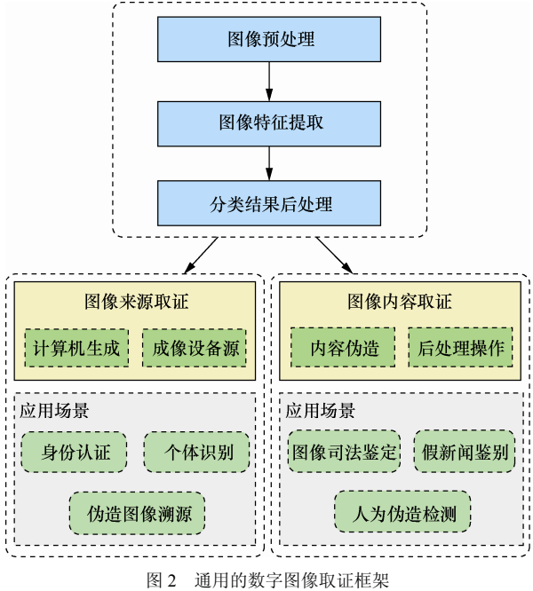

Figure 2 Generic framework for digital image forensic

相关学者对数字图像盲取证技术展开了深入 研究,这些研究主要针对两类问题:①数字图像 来源取证(image origin forensic);②数字图像完 整性取证(image integrity forensic)。数字图像来 源取证的核心问题是如何利用图像的统计分布信 息来确定数字图像拍摄来源,其中包含两个层面: 第一层鉴定数字图像来源于计算机生成图像 (computer-generated graphic)或自然拍摄图像 (natural image);第二层鉴定自然拍摄图像的成像 设备(包括设备品牌、型号、个体)。通常这些 研究广泛应用于个体识别、身份认证以及溯源 取证。数字图像完整性取证分析主要研究数字 图像内容是否被篡改,这些篡改包括复制−粘贴 (copy-move)[12]、拼接(splicing)[13]、物体删 除(removal)[14],以及其他数字图像后处理操作, 包括中值滤波(median filtering)[15]、重采样 (resampling)[16-17]、JPEG 压缩[18]等。通过分析 数字图像完整性,研究学者可以鉴定新闻报道中 的伪造图像和法庭上呈现的伪造证据、对抗人脸 识别系统的假脸攻击等,进而保障图像内容信息 的真实可靠。

在早期的数字图像取证研究中,研究者主 要采用手工特征提取算法提取表征图像固有特 征的指纹,并与已知设备的图像指纹比对,从

而鉴定待检测图像原始性及完整性。一部分研 究人员尝试将数字图像取证分为多个阶段独立 分析。采用分阶段模型有助于模块化取证任务, 提高取证模型的通用性。然而,由于不同阶段 之间独立分析,不存在链式反向传播法则,导 致分阶段研究模型分析效率低、模块与模块之 间耦合度松散。另一部分研究人员研究基于卷 积神经网络(CNN,convolutional neural network)模型的端到端数字图像取证算法。不同 于分离图像预处理、提取及分类特征的思想, 基于 CNN 模型的端到端数字图像取证算法将 图像预处理、提取、分类图像特征等步骤融入 N (N≥1)个级联或并联的神经网络中,并采用随 机梯度下降算法自动优化网络模型。在海量数 据分析场景中,采用端到端取证模型简化了分 析模型的复杂流程,使数据处理更为高效。近 年来,随着学者对 CNN 的深入研究,CNN 模 型在海量数据处理中的高效性、在数字图像指 纹提取的精准性不断凸显出来,因此大量多媒 体取证分析开始采用基于 CNN 模型的端到端 取证框架[19-21]。本文归纳了基于 CNN 模型的端 到端数字图像取证框架步骤,这些步骤包括图 像预处理、图像特征提取、分类结果后处理, 其中根据不同的取证问题,分类结果后处理采 用的算法有所不同。虽然取证算法种类繁多, 但大多数是在框架下开展研究的。表 1 整理了 2017—2019 年具有代表性的取证方法,包括特 征类型、检测级别、神经网络类型、研究模块 以及它们主要针对的问题。接下来,本文将简 述数字图像取证框架中 3 个步骤的发展现状, 并归纳现有研究的优缺点。

# 3 数字图像取证研究现状

## **3.1** 图像预处理

图像预处理旨在消除图像中与分类无关的 信息,增强像素相关性以及最大限度地简化输 入数据,从而改进特征抽取、匹配和识别的准 确性和鲁棒性。由于网络带宽、存储容量等限 制,社交平台通常会压缩在线共享的图片,如 重采样、JPEG 压缩等操作严重破坏图像内在的 固有指纹,干扰图像特征提取器性能。图像预

#### ·16· 网络与信息安全学报 第 7 卷

|
|  |

| 年份    || 参考文献      || 特征类型     || 检测级别  || 神经网络类型          || 研究模型块与主要针对的问题 |
| ---   || ---       || ---      || ---   || ---             || ---           |
| 2017年 || 文献[38]    || CNN特征    || 图像块级别 || CNN             ||               |
|       || 文献[22]    || CNN特征    || 图像块级别 || Constrained-CNN ||               |
|       || 文献[18]    || DCT特征    || 图像块级别 ||                 ||               |
|       || 文献[38]    || CNN特征    || 图像块级别 || CNN             ||               |
|       || 文献[74]    || 重采样指纹    || 像素级别  || LSTM            ||               |
|       || 文献[20]    || CNN特征    || 图像块级别 || Constrained-CNN ||               |
|       || 文献[21]    || CNN特征    || 图像块级别 || CNN             ||               |
|       || 文献[43]    || CNN特征    || 像素级别  || CNN             ||               |
| 2018年 || 文献[79]    || 色度和饱和度特征 || 图像块级别 || CNN             ||               |
|       || 文献[45]    || CNN特征    || 图像级别  || CNN+RNN         ||               |
|       || 文献[31,80] || PRNU噢声   || 图像级别  ||                 ||               |
|       || 文献[81]    || 重采样指纹    || 像素级别  || LSTM            ||               |
| 2019年 || 文献[41]    || CNN特征    || 图像块级别 || DenseNet        ||               |
|       || 文献[82]    || CNN特征    || 图像块级别 || CNN             ||               |
|       || 文献[44]    || CNN特征    || 像素级别  || CNN+LSTM        ||               |
|       || 文献[83]    || CNN特征    || 像素级别  || ResNet+U-Net    ||               |
|       || 文献[46]    || DCT系数    || 图像级别  || CNN             ||               |

处理操作通过去除与分类问题无关的干扰信 息、恢复像素相关性,从而提升数字图像取证 检测的鲁棒性。

传统的图像预处理主要根据不同的分类问题 做特定分析,手工设计有针对性的静态滤波器, 这些滤波器不随输入信号动态调整滤波器参数。 近年来手工设计的滤波器已经广泛应用于数字图 像取证预处理,其中包括中值滤波、高通滤波 (high-pass filtering)[13]、空域富模型(spatial rich model)[23]等。上述静态滤波器对输入的图像做 卷积运算,提取图像残差噪声后送入图像特征提 取器,其有效性已被现有的取证研究验证。然而 静态滤波器存在一个无法忽视的缺点,即静态滤 波器来源于大量的经验分析(empirical analysis), 分析过程漫长繁杂而且可扩展性不高。

随着进一步深入分析,研究者提出了基于神 经网络的可学习滤波器(learnable filter)[20]。静 态滤波器通过抑制图像内容、增强表征图像指纹 的高频信号,滤除数字图像中与分类无关的干扰 信号,以此来提高分类器的鲁棒性。受此启发, Bayar 等[22]提出"模仿"静态滤波器工作原理的 解决方案,即约束性卷积层(constrained convolution layer)。约束性卷积层限制滤波器参数总和 为 0,并作为预处理层在神经网络迭代训练过程 中优化滤波器参数。Bayar 等[22]同时将这一理论 应用于数字图像来源识别,图像后处理操作链检 测[20,24-25]。约束性的卷积层参与神经网络的反向 传播优化过程,随不同的输入信号自适应优化滤 波器参数,并在其输出层保留与图像指纹相关的 图像噪声信号。图 3 给出了静态滤波器与可学习 滤波器工作的流程,静态滤波器使用固定的滤波 器与输入图像做卷积运算;可学习滤波器首先预 设滤波器参数,随后在反向传播中使用随机梯度 下降算法自适应、自动化地更新滤波器参数。

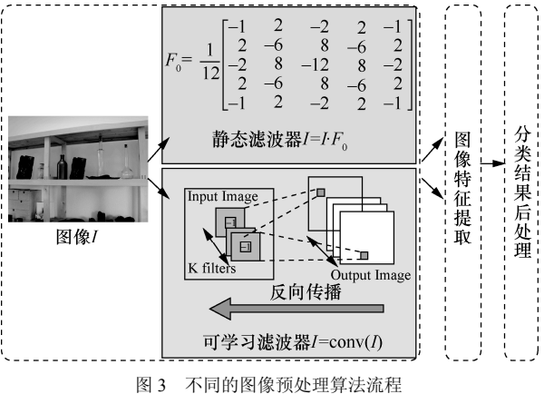

Figure 3 Process of different pre-processing algorithms

通过以上分析可知,相比于静态滤波器,可 学习滤波器的优势在于:自适应学习,不需要手 工设计滤波器参数;根据取证问题动态更新卷积 核参数,使分类器收敛效果更优。然而可学习滤 波器也存在不可避免的缺点。由于静态滤波器使 用预设内核参数,其输出为预处理后的残差噪声, 这些残差噪声有效抑制图像内容对特征提取过程 的干扰,而可学习滤波器需要使用大量的样本训 练内核参数,导致模型收敛比静态滤波器更慢。图 4 展示了不同预处理操作的图像输出效果,图 4(b) 与图 4(c)分别表示静态滤波器和可学习滤波器 的预处理结果。由图 4(b)与图 4(c)可知,静 态滤波器和可学习滤波器均抑制了图像低纹理区 域(天空、墙壁等低频分量)的内容噪声,同时 保留图像高纹理区域(树枝、物体边缘等高频分 量)的噪声,这些保留的残差噪声与数字图像固 有指纹紧密相关,从而大大提升了特征提取器的 性能。未来的研究中,随着理论研究到应用研究 的不断扩展,以及计算机运算速度的不断加快, 面对越来越复杂的数据集,可学习滤波器自适应 学习的优势将更加凸显。

#### **3.2** 图像特征提取

图像特征来源于成像设备生产工艺所带来的 硬件瑕疵和不同图像处理算法所产生的特定模 式。这些瑕疵和模式以图像噪声形式遗留在数字 图像中,共同组成图像指纹,而这些图像指纹隐 藏在图像内容中,充当成像设备唯一标识的重要 线索。

数字图像取证分析人员主要通过研究图像成 像各个阶段遗留的指纹信息,根据捕获的图像指 纹差异性鉴定成像来源,同时分析图像指纹的一 致性追踪图像伪造痕迹。典型的数码相机成像过 程如图 5 所示。首先,成像场景发出的光子通过 相机镜头到达设备前端,色彩滤波阵列(CFA, color filter array)[26]收集单一色彩通道的光谱信 息,其余两个颜色通道采用特定 CFA 插值算法填 充。此时,光信号被图像传感器转换为电信号, 并通过相机内部的模数转换器(A/D converter) 将其转换为数字信号,这些携带大量原始信息的 数字信号组成 RAW 格式图像。由于感光元器件 对光子的响应不一致,不可避免地引入加性噪声 (如散粒噪声、读出噪声和暗电流等)和乘性噪声

图 4 不同预处理操作的图像输出效果

Figure 4 The image output results for different pre-processing operations

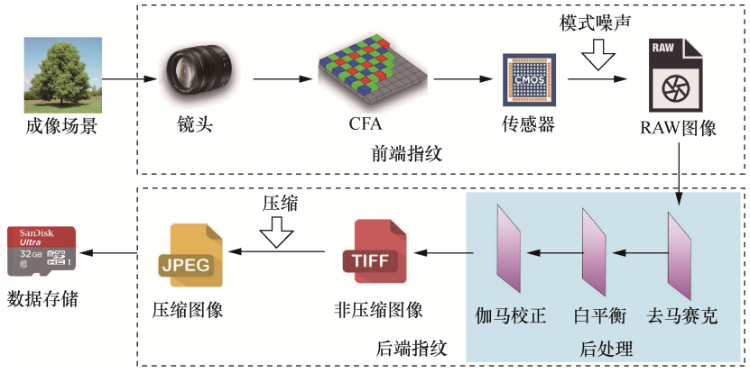

图 5 典型的数码相机成像过程

Figure 5 Process of typical imaging pipeline within a digital image

(如光响应非均匀性噪声,通常被称为 PRNU 模 式噪声(photo-response non-uniformity noise)), 这些模式噪声构成设备的固有指纹。由于固有指 纹与成像设备物理性质直接相关,并且指纹信息 差异明显,通常被用于数字图像取证。此阶段捕 获的RAW格式图像在数字图像后处理之前完成, 因此把这种类型的指纹统称为前端指纹(或固有 指纹)。经过图像后处理操作(如去马赛克[27]、 白平衡[28]、伽马校正)后,成像设备获得一幅非 压缩格式图像。在保证可容忍的失真范围内,引 入压缩算法(如 JPEG 压缩[18]),减少数字图像占 用的存储空间。在 RAW 格式图像生成后,由后 处理操作及图像压缩引入的噪声统称为后端指 纹。后端指纹主要来源于信号处理过程,与成 像设备物理特征相关性低,因而指纹区分度比 前端指纹低,不利于高精度检测(如成像设备 来源个体识别)。在上述的图像成像过程中,由 于镜头元件生产工艺所带来的瑕疵,硬件安装 过程中所产生的误差和不同图像后处理算法产 生的噪声,都将在数字图像中留下图像指纹。 研究人员往往围绕以上成像过程中产生的固有 特征寻找表征数字图像原始性、真实性和完整 性的指纹信息。

根据数字图像特征提取算法原理的不同,取 证分析研究可以分为基于指纹匹配模型和基于学 习模型(本文主要讨论后者)。前者使用信号处理 算法手工提取、分析数字图像指纹(如噪声直方 图、均值、方差等),并采用统计相关系数模型, 根据已知模板匹配指纹信息以达到分类目的。后 者主要使用特征提取器捕获图像指纹,并通过已 训练的监督分类器(如 SVM、Softmax 分类器) 区分不同指纹信息。为了使特征提取器捕获有效 的图像指纹,研究人员首先需要使用已标记标签 的数据集训练特征提取器、分类器,随后使用训 练好的模型测试未标记数据,并完成分类。图 6 给出了基于指纹匹配模型和基于深度学习模型的 数字图像取证框架。接下来将分别归纳这两种框 架的研究进展,阐述其存在的优缺点,并分析未 来的研究方向。

基于指纹匹配模型的研究主要针对数字图像 成像过程残留的噪声信号,并将其作为图像取证 的依据。研究学者从数字图像成像过程产生的传 感器噪声入手,寻找隐藏在传感器中设备个体的 痕迹。LukÁŠ 等[29]对成像过程建模,采用静态滤 波器估计 PRNU 噪声,并验证了 PRNU 作为图像 指纹鉴定数字图像拍摄来源的可靠性。PRNU 噪 声是应用比较广泛的面向设备个体识别的图像指 纹。然而使用 PRNU 噪声存在诸多缺点:①随着 输入尺寸增大,指纹提取算法的计算复杂度增大, 从而影响取证检测算法的运行效率,不利于实时 取证检测;②随着输入尺寸减小,图像 PRNU 指 纹数据不足,降低了取证算法的可用性;③图像 后处理操作(如 JPEG 压缩、中值滤波操作和重 采样等)扰乱图像指纹提取器。随后,大量基于 PRNU 噪声的改进性研究被提出来[30-34],在一定 限度上,弥补了以上缺点。随着基于 PRNU 噪声 的数字图像来源取证研究日趋成熟,研究学者开始 将这一理论应用于移动设备身份认证[35]。然而,基 于 PRNU 噪声的移动设备认证存在诸多挑战:如 何设计可靠的认证协议以防止重放攻击(replay attack);如何提高算法可靠性,抗击图像伪造攻 击(forgery attack);如何提高算法鲁棒性,在图 像经历 JPEG 二次压缩后保持取证正确率。综合 以上分析,基于指纹匹配模型的图像来源取证研 究将着重解决实际场景中检测正确率的问题,增 强算法的鲁棒性,以及提升算法在各种应用场合 的适用性及高效性。

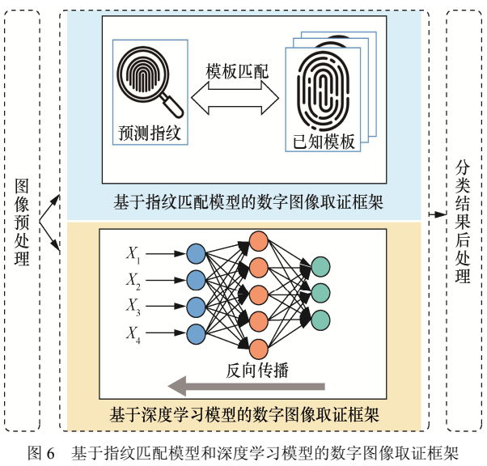

Figure 6 Digital image forensics framework of fingerprint matching model-based and deep learning model-based

基于深度学习模型的研究主要围绕数据驱动 的 CNN 模型算法展开,这类算法的主要特点为 特征提取过程自动化。CNN 模型算法通过标记大 量数据训练神经网络参数,并使用训练好的神经 网络分类器完成未标记的数据分类。Tuama 等[36] 提出采用 CNN 模型识别数字图像拍摄来源,并 且针对 33 个成像设备模型取得 91.9%的正确率。 尽管文献[36]的研究取得重要突破,但由于输入 图像块尺寸(如 256×256×3)的限制,该研究在 小尺寸图像块检测中存在检测鲁棒性低、抗攻击 能力差等问题。随后,越来越多的取证分析人员 开始研究如何设计更高性能的 CNN 模型以提升 数字图像来源检测正确率及鲁棒性。Bondi 等[37] 提出 4 个卷积层的神经网络模型提取图像指纹, 通过使用支持向量机对提取的图像指纹分类以识 别成像设备型号,并采用切分图像块的方法将输 入图像尺寸降至 64×64。在随后的研究中,Bondi 等[38]将上述 CNN 模型用于检测拼接篡改图像, 其中,拼接个体(造假区域)和图像背景(真实 区域)分别来源于不同的成像设备。然而由于缺 乏可解释性的分析以及支持向量机的低效率,文 献[37-38]也存在一定的缺点。一些学者开始分析 设计 CNN 模型网络架构的原理。在具备充足训 练样本的前提下,具有非多项式激活函数的多层 前馈网络能够模拟复杂数学函数[39]。Yao 等[40]基 于这一原理,讨论了神经网络的广度与深度对取 证结果的影响。随着神经网络宽度增加,CNN 模 型的记忆能力不断增强,对函数模拟能力加强, 但模型预测能力有所下降;相反,随着神经网络 的深度增加,CNN 模型对数据的预测能力不断 增强,但对数据的模拟能力受到限制。文献[40] 提出了 13 个卷积层的 CNN 模型,并用投票算法 对多个 64×64 图像块结果投票后,达到接近 100% 的图像来源检测正确率,但 13 个卷积层导致了文 献[40]提出的模型收敛速度慢等问题。考虑到深 度神经网络梯度消失导致网络收敛速度慢、检测 正确率低等问题,Chen 等[41]引入 DenseNet[42]以 增强表征分类问题特征的传播,降低深度神经网 络梯度消失的影响,从而提高了 CNN 模型提取

图像指纹的精确性。文献[41]验证了这一 CNN 模 型对 11 种图像后处理操作(如重采样、添加高斯 白噪声、旋转及 JPEG 压缩等)痕迹检测的有效 性,并最终在 32×32 的小图像块检测上取得高于 91%的正确率。

近年来,CNN 的发展带来自适应特征提取的 热潮,基于 CNN 模型的数字图像取证分析算法 的工作层出不穷[43]。上述分析的 CNN 模型所提 取的图像指纹不仅包括传感器模式噪声,还包括 成像过程各个阶段所产生的噪声。相比基于指纹 匹配模型手工提取图像指纹的算法,基于 CNN 模型算法存在以下优势:一方面,传统手工提取 指纹算法需要分析大尺寸图像(如 512×512 矩 阵),而 CNN 模型能够实现小图像(如 64×64 或 32×32 矩阵)指纹提取,这一优势不仅降低了图 像指纹的复杂度,而且进一步提升了检测单元的 精细度;另一方面,CNN 模型算法在自适应提取 图像指纹方面具有明显优势,提取过程无须根据 取证先验知识修改图像指纹提取算法。此外,基 于数据驱动的 CNN 模型在处理海量数据集时更 高效,训练所得的模型具有更强的鲁棒性。然而 基于机器学习模型的取证方法也存在一些缺点。 例如,目前的研究很难实现成像设备个体级别的 图像来源检测,以及在像素级别的图像篡改定位 精细度仍然有待提高。综合以上分析,未来基于 CNN 模型的图像指纹提取算法将面向检测单元 精细化、提取的图像指纹正确率不断提高、算法 鲁棒性不断增强的方向发展。

#### **3.3** 分类结果后处理

图像分类结果后处理的核心任务是根据图像 指纹特征做出分类决策,同时,利用数字图像空 域层面的相关性特征修正特征提取器异常导致的 误判,进而提高检测正确率。由于分类任务直接 与图像分类结果后处理算法相关,因而针对不同 的取证检测问题其后处理算法的设计亦不相同。 针对图像来源取证,分类结果后处理使用多个图 像块结果投票决策整幅图像设备来源[40];针对图 像内容完整性取证,其检测包括了图像后处理操 作和图像内容伪造检测。常见的分类结果后处理 算法包括融合[38,44-47]等,这些后处理操作最终生 成伪造区域检测二值图,完成伪造区域定位。

通常来说,分类结果后处理存在 3 种不同的 检测精度:全尺寸图像级别、小尺寸图像块级别、 像素级别。其中,图像级别检测以图像为检测单 元鉴定图像原始性与完整性,图像块或像素级别 检测主要用于定位图像伪造区域。由于数字图像 伪造算法多种多样、伪造区域大小不一,以及伪 造区域边缘像素干扰严重等,内容完整性取证比 来源取证的后处理算法更复杂、难度更高。为了 提升图像篡改区域定位的精度,研究学者提出"滑 动窗口"算法将整幅图像切分为图像块,并以图 像块为检测单元单独分析图像区域真伪。基于"滑 动窗口"的取证算法存在"窗口"尺寸大小选择 问题,太小的"窗口"导致特征提取不足,太大 的"窗口"导致检测精度下降。Korus 等[45]认为 基于"滑动窗口"图像内容篡改定位算法在检测 精度层面受限于窗口的大小,因此提出使用大小 不同的切分窗口作为检测单元,并将多种尺寸图 像块检测结果融合,以提升检测准确率和篡改区 域定位精度。

除此之外,数据集中包含多种伪造算法的伪 造检测需求也是取证分析面临的难题之一。为了 在取证检测器中同时检测复制−粘贴和拼接伪造, Li 等[48]首先采用 PatchMatch[49]算法提取复制−粘 贴伪造痕迹遗留的图像指纹,并拼接伪造操作指 纹;随后分析了这两种算法对检测性能的影响;同 时,提出了基于概率模型的融合算法,将两种指纹 特征融合生成伪造区域检测概率图。这种方法的优 点在于能够同时检测多种伪造痕迹,缺点在于提取 高维度图像指纹特征耗费大量计算时间。

综合以上两种图像分类结果后处理算法可 知,这两类算法主要通过手工分析指纹特征设定 窗口尺寸、概率模型阈值等。另外有关研究尝试 将图像分类结果后处理算法加入神经网络随机梯 度下降优化过程中,生成端到端模式取证分析系 统。Wu[44]等首先设计了深度卷积神经网络提取数 字图像后处理痕迹指纹,随后提出本地异常检测 网络(local anomaly detection network)对提取的 图像指纹进一步分析以提升检测精度、增强模型 的可扩展性。该算法使用卷积神经网络和长短期 记忆(LSTM,long short term memory)模型,神 经网络模拟决策者鉴定图像块检测结果的过程, 并讨论模型对 385 种图像后处理操作的检测正确 率。CNN 善于提取信号的空域特征,而 LSTM 网 络善于提取信号的序列特征。相对于早期的手工 设计多种窗口尺寸[45]或多种不同的特征提取器[48], Wu 等[44]提出本地异常检测网络在自适应、自动 化决策方面优势明显。

常见的分类结果后处理算法的基本流程如图 7 所示。本质上来说,分类结果后处理算法主要利 用图像块之间的相关性,通过修正 CNN 误分类结 果,从而提升图像块的检测正确率。面向数字图 像取证问题,分类结果后处理具备以下优点:针 对数字图像来源取证,分类结果后处理提升了图 像级别来源检测正确率;针对数字图像内容完整 性取证,分类结果后处理修正伪造区域检测结果, 降低了误判率,从而提升了伪造检测在图像块及 像素级别的检测精度即篡改定位精度。

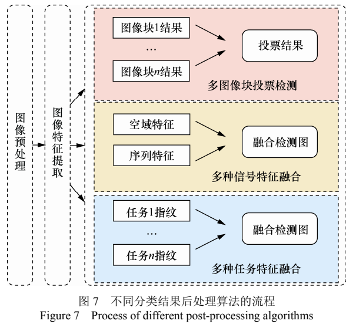

在数字图像取证领域,除了需要研究上述传 统问题,面对新兴的多媒体篡改手段,学者提出 了一系列取证对策。针对两类篡改攻击手段,即 GAN 伪造图像与 Deepfake 伪造视频,本文简单 归纳了以下几种典型的检测方法。

GAN 伪造图像检测方法主要可以分为以下 3 种。第一种方法是利用传统图像取证技术来对 GAN 伪造图像检测。例如,Nataraj 等[50]提出了 利用共生矩阵和深度学习相结合的方法,检测 GAN 伪造图像。GAN 图像在生成过程中往往会 改变原始图像中的一些特征信息,因此第二种方 法是利用真伪图像的某些差异化特征来训练分类 器,实现对 GAN 伪造图像检测。例如,Mccloskey 和Albright[51]发现GAN生成的图像与真实图像相 比,二者饱和度明显不同,因此提出了利用饱和 度来对伪造图像进行检测。Matern 等[52]发现 GAN 生成的人脸图像在眼睛、牙齿和面部轮廓上存在 伪影,并提出利用伪影进行检测。第三种方法是 利用神经网络模型搭建检测器。例如,Mo 等[53] 设计了自定义的卷积神经网络来识别 GAN 生成 的人脸图像。此外,Afchar 等[54]提出利用 MesoNet 来对 GAN 生成的人脸图像进行检测。

相比于图像的伪造,针对视频的伪造技术带 来更大的危害,本文梳理了目前流行的 Deepfake 视频篡改类型以及典型的检测方法。篡改类型大 致可分为两种:面部表情篡改和合成人脸攻击。

(1)面部表情篡改。此类篡改方式也可称为 人脸再扮演(face reenactment),其最大的特点是 不改变目标人脸的身份信息,只改变目标人脸的 面部表情动作。例如,文献[55]提出的 Face2Face 是第一个将面部表情从源视频的人脸转移到目标 视频人脸的技术。此外,诸如"木偶主人" (puppet-master)和"嘴唇同步"(lip-sync)均属 于此类型的篡改方式。在此类型中,源视频(主 人)提供面部表情、嘴部动作及头部姿势,并让 目标视频(木偶)做出相同的面部表情、嘴部动 作及头部姿势。

(2)合成人脸攻击。这种篡改方式也可以称 为换脸技术(Faceswap),此类方法改变了目标视 频中的人物身份,即目标视频中的人脸被替换为 合成的待攻击人脸。随着 GAN 的日渐普及,基 于人工智能的篡改手段层出不穷。例如,FakeApp 充分提取源视频和目标视频中的人脸面部结构, 从而生成更高质量、更加逼真的换脸视频。以上 类型的篡改视频在一些社交平台上被广泛传播, 其危害不可估量。因此,亟须采取相应的检测方 法进行取证。

Deepfake 视频检测方法可以分为以下 3 类。 第一类方法是利用视频中的人脸生物特征信息的 不一致来对深度伪造视频检测。例如,伪造视频 中的人物无法正常眨眼[56]、真实视频与伪造视频 头部姿态的不一致[57]、两类视频中面部表情和头 部动作的相关特征[58]来对伪造视频进行检测。第 二类方法是利用全新的深度神经网络模型来检 测。例如,Zhou 等[59]提出了利用双流网络来进行 检测,Nguyen[60]等发现深度伪造视频人物五官位 置与真实视频存在差异,提出了利用 CapsuleNet 进行检测,Rossler 等[61]利用 FaceForensic++数据 集训练 XceptionNet,实现了对深度伪造视频的检 测。第三类方法是通过提取真伪视频之间的差异 化特征,训练分类器实现深度伪造视频的检测。 例如,Koopman 等[62]提出了利用 PRNU 来对深度 伪造视频进行检测,结果表明真实视频与深度伪 造视频的平均标准化相关系数存在显著差异。 Amerini 等[63]发现真伪视频中图像光流场存在差 异,因此利用此差异实现了对深度伪造视频的检 测。篡改区域和图像剩余区域分辨率不一致,会 导致伪造视频产生伪影,Li 等[64]提出利用伪影对 伪造视频进行检测。

大多数检测方法需要通过大量数据驱动模型 学习,但在实际场景中能获得的样本却很少。为 了解决此问题,Durall 等[65]提出了一种利用图像 功率谱的小样本检测方法来对伪造视频进行检 测。伪造视频在图像融合过程中往往存在融合边 界,Li 等[66]提出了利用"Face X-ray"检测伪造 视频,该方法的训练数据不依赖特定换脸技术生 成的视频,可以直接采用普通的人脸图像进行训 练,因此该方法的检测通用性更强。此外,Liu 等提出[67]的 Gram-Net 通过分析图像全局纹理对 GAN 图像进行检测,该网络不仅在跨数据集场景 下表现良好,而且面对图像下采样、JPEG 压缩、 模糊等攻击时,具有较强的鲁棒性。

## 4 图像取证实例分析

本文提出的数字图像取证框架包含从图像预 处理到特征提取,再到分类结果后处理等步骤, 这一框架将数字图像取证研究模块化,有利于本 领域的学者深入研究和探讨。纵观近年来数字图 像取证技术的发展,大多数算法往往基于 CNN 模型设计完成。接下来,本文将围绕图像来源和内 容完整性取证的方法实例,在 CNN 模型理论框架 下进一步阐述该领域研究现状及未来发展趋势。

### **4.1** 图像来源取证

数字图像来源取证完成图像成像设备鉴定的 过程,其本质原理是利用成像过程中模式噪声信

号的差异区分不同的成像设备源。这些噪声来源 于传感器工艺缺陷、光电转换误差及图像后处理 算法差异等。利用模式噪声信号差异,研究者设 计分类器鉴别成像设备源。数字图像来源取证算 法广泛应用于身份认证[35]、网络图像溯源[68]以及 网络视频溯源[69]等领域。

通常在多阶层(hierarchical)的数字图像来 源取证算法中,第一步主要鉴定数字图像的成像 类型,即计算机生成图像和自然图像[21,70],第二 步鉴定自然图像中的成像设备型号,其中包括成 像设备品牌[29]、成像设备型号[30]、成像设备个体 鉴定[71]。图 8 给出了在 CNN 模型理论下,一种 通用的数字图像来源取证框架。在图像预处理中, 待检测图像首先被切分成图像块(图 8(a)中的 Pk 表示第 k 个图像块),随后使用 CNN 提取表征拍 摄来源的图像指纹,输出每个图像块的检测结果 Yk(图 8(c)中的 Yk表示特征提取器对第 k 个图像 块预测标签),并采用多数投票算法融合 k 个图像 块检测结果,输出图像级别的预测结果,即设备 型号多分类鉴别。

根据文献[40]的阐述,图 9 给出了 20 个型号 测试相机来源取证检测的混淆矩阵(归一化概率 为 0∼1),其中"−"表示数值低于 0.01。在混淆矩 阵中,每一行代表来源取证检测器的检测结果, 而每一列表示真实数据被预测为该类别的概率。 沿矩阵对角线的概率被定义为预测标签正确的概 率,正确率越高表明检测器性能越优。

通过观察可以发现,文献[40]提出的相机来 源取证检测器可以有效且精准地筛选出不同类别 的成像设备。值得注意的是,该多分类检测器对 " Nikon D200 "" Kodak M1063 "" Rollei RCP-7325XS"的分类正确率均达到 99%以上; 同时,平均检测正确率达到 89%。需要特别注意

的是,检测器基本无法鉴别相机"Nikon D70"和 "Nikon D70s"所拍摄的数字图像。通过文献[72] 可知,由于 Dresden 数据集中"Nikon D70"和 "Nikon D70s"采用相同型号的镜头拍摄,因此两 者的模式噪声非常相似,导致其检测正确率不佳。 在这种情况下,首先将两种不同来源的型号视为 同一个相机型号,记为"Nikon D70_70s",然后 采用文献[71]所提出的图像来源设备个体检测 器鉴别两者。另外,相机型号"Sony DSC-T77" 和"Sony DSC-W170"可视为相似情况进行解 释与处理。

虽然近年来各种性能优异的数字图像来源取 证模型不断被提出,但在现实场景中,这些研究 的可行性仍有待进一步探索。一方面,现有的研 究主要局限于实验室的数据集,其图像特征不经 历 JPEG 二次压缩等编辑操作,即由成像设备直 接捕获原始数据。因此,现有方法在实现环境中 的检测正确率往往不及预期。另一方面,基于 CNN 模型的数字图像来源取证算法虽然能够在 处理海量数据时保持算法的检测准确度,却很难 实现成像设备个体鉴定;基于指纹匹配模型的算 法虽然实现了设备个体级别的拍摄来源检测,但 在现实环境中其鲁棒性仍然有待进一步提升。此 外,采用全尺寸图像矩阵输入分类器,导致计算 复杂度大幅提升,成为两类算法的一大问题。

### **4.2** 图像内容完整性取证

数字图像内容完整性取证检测图像内容是否 遭受篡改攻击。通常来说,在多阶层的数字图像内 容取证分析中,第一步主要在图像级别鉴定数字图 像是否被篡改,第二步定位图像篡改区域以及篡改 类型,其中包括图像内容的恶意伪造和图像后处理 操作(语义内容未受攻击)等。从本质上讲,内容 完整性取证涉及数字图像成像过程的各个步骤。例

图 8 基于 CNN 模型的数字图像来源取证框架 Figure 8 Digital image source framework based on CNN

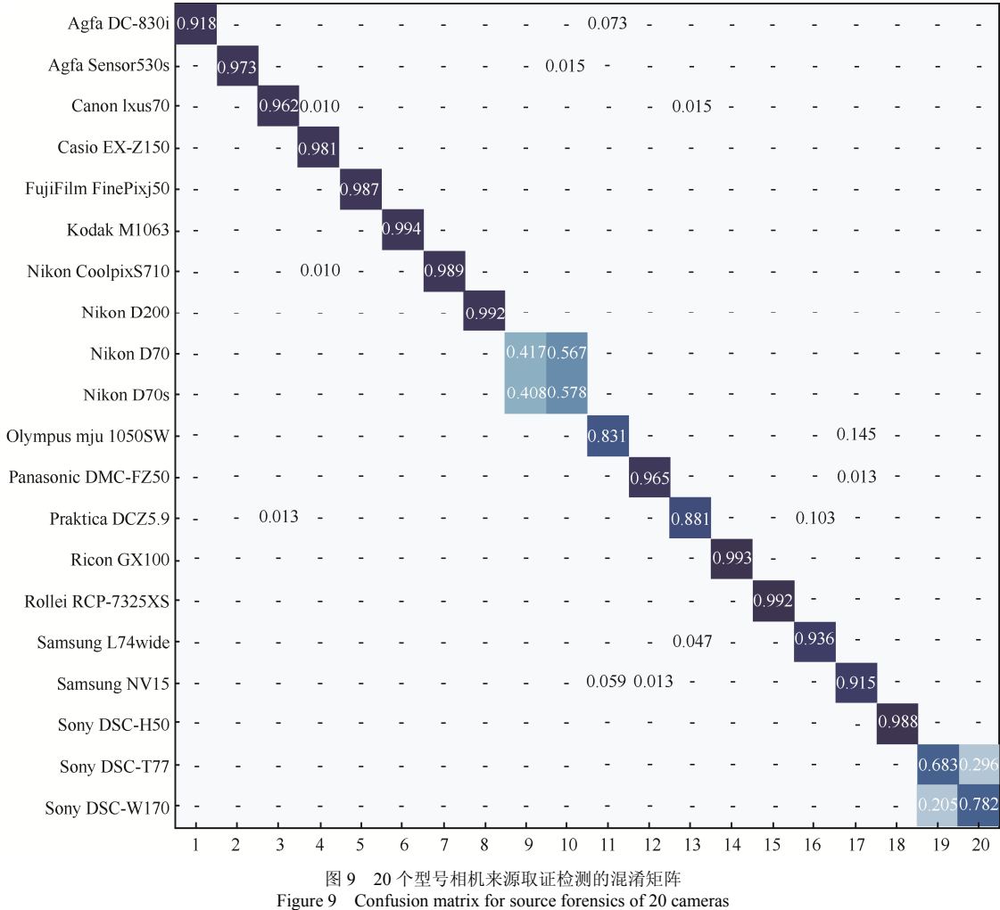

如,利用成像设备模式噪声差异鉴定拼接个体(造 假区域)和图像背景(真实区域)分别来源于不同 成像设备的拼接篡改[38],利用造假区域与真实区域 存在的图像指纹信息不连续检测拼接篡改[73],利用 造假区域与真实区域存在重采样特征差异定位伪 造区域[74],以及基于经典图像特征 SIFT[75]、LBP[76] 等设计的取证算法。此外,随着数字图像取证技术 日趋成熟,一些学者相继提出取证链应用研究[20,41], 通过分析数字图像拍摄来源,鉴定数字图像内容真

伪,定位篡改区域,排序各种篡改操作历史,最终 完成数字图像操作链取证。另一些研究学者则提出 设计针对多种图像篡改手段的通用取证方法,旨在 一次性检测多种篡改痕迹[43]。

图 10 给出了数字图像篡改检测的基本流程, 其中红框中的区域为图像篡改区域。待检测图像 首先通过图 10(a)滤波器做预处理并保留图像残 差噪声,随后使用图 10(b)中列举的 CNN 模型提 取图像指纹,最后将提取的图像指纹分类并融合,

Figure 10 Basic process of digital image forgery detection based on CNN

在此阶段排除误判图像块,筛选正检图像块, 从而提升篡改定位精准度,其可视化检测结果 如图 10(c)所示。相比于图像来源取证,图像完整 性取证难度更高。首先,图像篡改区域通常不大, 并且需要定位篡改区域,对取证分析算法提出巨 大的挑战。其次,恶意篡改者通常使用中值滤波、 JPEG 二次压缩等后处理操作隐藏伪造区域,这些 操作不可避免地干扰了特征提取器对图像指纹的 有效提取,降低了图像篡改的检测正确率。

根据上述检测过程,本文进一步展示检测大 规模数据集的结果。实验采用局部正确率(local accuracy)和全局正确率(global accuracy)评估 算法精确度,以及精度(fineness)评估取证检测 器的最小检测单元。其中,局部正确率评估伪造 区域的正检率,全局正确率评估整幅图像的正检 率。检测结果如表 2 所示。

如表 2 所示,本文采用两次后处理操作,优 化待检查图像块取证结果。第一次采用 K-means 聚类算法,第二次采用阈值裁切算法,其输出为 优化后的二值图像。在检测中需要调整两个重要 参数,Γ dist 及Γ conf 分别表示后处理操作中使用的 两个裁切阈值。通过修正异常特征向量和置信度 较低的图像块的检测结果,提升分类正确率。其 中,Γ dist 主要用于 K-means 聚类算法首次阈值裁 切;Γ conf 用于第二次置信度阈值裁切。在两种阈 值条件下,全局正确率基本保持一致,更小的Γ conf 可以帮助分类器进一步提高局部正确率。字段"精 度"代表该检测器可以识别的最小检测单元。

表 2 图像篡改定位实验结果

| Table 2       || Results of image tampering location experiment ||       ||       ||       |
| ---           || ---                                            || ---   || ---   || ---   |
| 阈值            ||                                                || 局部正确率 || 全局正确率 || 精度    |
| dist Γ = 0.7, || conf Γ = 0.2                                   || 0.712 || 0.982 || 64×64 |
| dist Γ = 0.7, || conf Γ = 0.0                                   || 0.734 || 0.983 || 64×64 |

数字图像内容取证技术在若干问题上已经取 得突破,然而在现实场景中算法的鲁棒性[22]、抗攻 击性[7]仍然存在一定缺陷。现有研究通常忽略 JPEG 二次压缩、重采样,以及对抗攻击环境产生 的干扰攻击,导致现有的理论研究在现实应用场 景中受到限制。为了适应现实场景的应用,未来 的理论研究需要面向抗对抗样本攻击、增强鲁棒 性的研究方向发展。

# 5 数字取证技术面临的问题与挑战

随着数字图像取证技术不断发展,目前一些瓶 颈已经突破,如在检测小尺寸图像拍摄来源[22,37], 在层次化取证链中检测多种类别数字图像伪造痕 迹[20,77],在定位数字图像像素级别的伪造区域[43], 定位针对非压缩格式的图像来源识别[78]等。然 而,数字图像取证研究仍存在许多亟待解决的难 题,并且该技术推广至实际应用面临诸多挑战, 现有的理论研究仍需要进一步改进。当前数字图 像取证技术主要面临的问题与挑战有以下几方面。

(1)开放数据集环境中的检测正确率和鲁棒 性问题。目前的研究主要集中于实验室搭建的数 据集环境中,这些数据集通常没有经过裁剪、编 辑等图像后处理操作。然而数字图像在实际网络 传输环境中,通常会经历 JPEG 压缩、重采样等 后处理操作。如何在开放数据集环境中保持高检 测正确率、强鲁棒性对取证研究提出巨大的挑战。

(2)在恶意攻击的环境中如何保证算法的可 靠性问题。随着反取证技术的不断更新,基于各 种假设场景的对抗攻击算法广泛流行。然而近年 来提出的 CNN 模型算法通常没有考虑对抗样本 的恶意攻击场景,使对抗算法可以轻易攻击神经 网络模型。因此,如何增强算法的抗攻击性对当 前取证研究提出严峻的挑战。

(3)实际应用场景中取证检测的精确率与精 细度问题。目前基于 CNN 模型的数字图像来源 取证研究很难实现成像设备个体级别检测,以及 数字图像篡改定位在像素级别的检测正确率仍然 无法满足实际需求。随着取证研究的应用普及, 成像设备个体溯源的身份认证系统精确率,及数 字图像篡改定位系统的精细度是数字图像取证研 究的重要挑战。

(4)目前取证方法的泛化能力不够理想。首 先,针对不同的篡改手段,现有的通用性取证方 法的检测效果并没有达到较高的水平。虽然深度 学习算法给通用性取证方法的设计带来福音,但 距离理想的检测正确率还存在一定差距。取证问 题不同于其他类型的识别,作为数字证据在法庭 上呈现,力图达到完美的检测正确率是学者长期 追求的目标。同时,当训练集与测试集的样本分 布存在明显差异时,现有的检测方法往往效果不 佳。因此,跨数据集检测问题是目前亟待解决的 一大难题。

针对数字图像取证技术面临的问题与挑战, 研究者既需要深入研究数字图像取证的理论、模 型和方法,也需要全面考虑实际场景中数字图像 取证技术的局限性。因此,数字图像取证技术未 来主要的研究方向归纳如下。

(1)从数字图像取证的实际需求出发,排查 理论算法在现实网络平台(如微信、Flickr、 Instagram 等)性能下降的原因,探索增强算法鲁 棒性的方案,使取证算法在实际环境中保持其理 论研究的正确率;构建来源于网络平台的数据收 集中心,收集网络环境中海量数字图像。

(2)为应对反取证技术的挑战,研究反取证 算法的本质原理,探索对抗攻击算法原理,达到 拒绝接受恶意训练样本的目的。同时,逆向分析 神经网络模型,检测模型是否受污染,拒绝受污 染模型在现实取证场景中使用。在此基础上,分 析如何提升神经网络模型的鲁棒性以对抗现有的 反取证攻击。此外,在现实场景中可以融入交互 式检测机制,鉴别对抗样本。

(3)针对实际应用场景中的精确率和精细度 问题,研究者需要进一步探索如何提高成像设备 个体溯源的精确率,以及像素级别的数字图像内 容伪造定位精细度。为了实现成像设备个体来源 检测,研究者需融合指纹匹配算法和深度学习算 法的优势,提升指纹提取效率以及增强图像指纹 可区分度[84-85];为了实现像素级别图像内容伪造 定位,研究者将采取更精细的图像块分析模型, 进一步探究邻域内像素间的相关特性。

(4)针对模型泛化能力弱的弊端,从数据样 本、特征选择、分类器 3 个角度提出了解决方案。 从数据样本角度分析,在训练模型前对数据样本 进行增广,目前大规模伪造视频数据集的多样性 不足,通过数据增广提高训练数据集的多样性进 而提高检测模型的泛化能力;从特征选择角度分 析,寻找区分度大、泛化性强的特征,如通过融 合多种检测特征、构造不同伪造技术留下的指纹 特征等手段来提高检测模型的泛化能力,此外,

可以对特征进行域泛化(如图 11 所示),将在源 域中无法区分的测试样本(左图),转换为目标域 中可以有效区分的测试样本(右图),进而提高检 测器的泛化能力;从分类器角度分析,可以设计 集成分类器,对不同篡改技术生成的数据集单独 训练子分类器,通过融合子分类器的输出结果, 进一步提高检测模型的泛化能力。

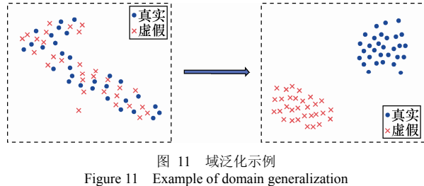

# 6 结束语

随着数字图像取证研究理论到应用研究的不 断推广与发展,本文提出的数字图像取证框架需 要根据实际应用场景不断改进,以应对实际取证 场景提出的新问题和新挑战,从而满足人们对于 数字图像原始性、真实性和完整性鉴定日益增长 的需求。

## 参考文献:

- [1] 梁瑞刚, 吕培卓, 赵月, 等. 视听觉深度伪造检测技术研究综述[J]. 信息安全学报, 2020, 5(2): 1-17. LIANG R G, LYU P Z, ZHAO Y, et al. A survey of audiovisual
Deepfake detection techniques[J]. Journal of Cyber Security, 2020, 5(2): 1-17.

- [2] 国家互联网信息办公室.网络信息内容生态治理规定[R]. 2019. Cyberspace Administration of China. Regulations on the Governance of Network Information Content[R]. 2019.
- [3] QIAO T, LUO X, WU T, et al. Adaptive steganalysis based on statistical model of quantized DCT coefficients for JPEG images[J]. IEEE Transactions on Dependable and Secure Computing, 2019(99): 1-16.
- [4] QIAO T, RETRAINT F, COGRANNE R, et al. Steganalysis of JSteg algorithm using hypothesis testing theory[J]. EURASIP Journal on Information Security, 2015(1): 1-16.
- [5] USMAN B, DUFOUR N, SAENKO K, et al. PuppetGAN: cross-domain image manipulation by demonstra-tion[C]//Proceedings of the IEEE International Conference on Computer Vision (ICCV). 2019: 9450-9458.
- [6] LIANG X, ZHANG H, LIN L, et al. Generative semantic manipulation with mask-contrasting GAN[C]//Proceedings of the European Conference on Computer Vision (ECCV). 2018: 558-573.
- [7] PENG F, YIN L P, ZHANG L B, et al. CGR-GAN: CG facial image regeneration for anti-forensics based on generative adversarial

network[J]. IEEE Transactions on Multimedia, 2020(3): 1-14.

- [8] CHEN C, ZHAO X, STAMM M C. Generative adversarial attacks against deep-learning-based camera model identification[J]. IEEE Transactions on Information Forensics and Security, 2019(99): 1-16.
- [9] PENG P, NING P, REEVES D S. On the secrecy of tim-ing-based active watermarking trace-back techniques[C]//IEEE Symposium on Security and Privacy (S&P). 2006: 1-15.
- [10] ZHOU G, LYU D. An overview of digital watermarking in image forensics[C]//IEEE International Joint Conference on Computational Sciences and Optimization (CSO). 2011: 332-335.
- [11] ZHAO J, WANG Q, GUO J, et al. An overview on passive image forensics technology for automatic computer forgery[J]. International Journal of Digital Crime and Forensics (IJDCF), 2016, 8(4): 14-25.
- [12] SONI B, DAS P K, THOUNAOJAM D M. Copy-Move tampering detection based on local binary pattern histogram fourier feature[C]//Proceedings of the 7th International Conference on Computer and Communication Technology. 2017: 78-83.
- [13] YAO H, WANG S, ZHANG X, et al. Detecting image splicing based on noise level inconsistency[J]. Multimedia Tools and Applications, 2017, 76(10): 12457-12479.
- [14] JIN X, SU Y, ZOU L, et al. Video logo removal detection based on sparse representation[J]. Multimedia Tools and Applications, 2018, 77(22): 29303-29322.
- [15] CHEN J, KANG X, LIU Y. Median filtering forensics based on convolutional neural networks[J]. IEEE Signal Processing Letters, 2015, 22(11): 1849-1853.
- [16] QIAO T, ZHU A, RETRAINT F. Exposing image resampling forgery by using linear parametric model[J]. Multimedia Tools and Applications, 2018, 77(2): 1501-1523.
- [17] QIAO T, SHI R, LUO X, et al. Statistical model-based detector via texture weight map: application in re-sampling authentication[J]. IEEE Transactions on Multimedia, 2019, 21(5): 1077-1092.
- [18] THAI T H, COGRANNE R, RETRAINTETAL F. JPEG quantization step estimation and its applications to digital image forensics[J]. IEEE Transactions on Information Forensics and Security, 2017, 12(1): 123-133.
- [19] QIAN Y, DONG J, WANG W, et al. Deep learning for steganalysis via convolutional neural networks[J]. Media Watermarking, Security, and Forensics, 2015(9409): 94090J1-94090J10.
- [20] BAYAR B, STAMM M C. Constrained convolutional neural networks: a new approach towards general purpose image manipulation detection[J]. IEEE Transactions on Information Forensics and Security, 2018, 13(11): 2691-2706.
- [21] QUAN W, WANG K, YAN D M. Distinguishing between natural and computer-generated images using convolutional neural networks[J]. IEEE Transactions on Information Forensics and Security, 2018, 13(11): 2772-2787.
- [22] BAYAR B, STAMM M C. Augmented convolutional feature maps for robust CNN-based camera model identifica-tion[C]//2017 IEEE International Conference on Image Processing (ICIP). 2017: 4098-4102.
- [23] FRIDRICH J, KODOVSKY J. Rich models for steganalysis of digital images[J]. IEEE Transactions on Information Forensics and Security, 2012, 7(3): 868-882.

- [24] BAYAR B, STAMM M C. A generic approach towards image manipulation parameter estimation using convolutional neural networks[C]//Proceedings of the 5th ACM Workshop on Information Hiding and Multimedia Security (IH&MMSec). 2017: 147-157.
- [25] BAYAR B, STAMMM C.A deep learning approach to universal image manipulation detection using a new convolutional layer[C]// Proceedings of the 4th ACM Workshop on Information Hiding and Multimedia Security (IH&MMSec). 2016: 5-10.
- [26] BAYRAM S, SENCAR H, MEMON N, et al. Source camera identification based on CFA interpolation[C]//IEEE International Conference on Image Processing (ICIP). 2005: 1-4.
- [27] CAO H, KOTA C. Accurate detection of demosaicing regularity for digital image forensics[J]. IEEE Transactions on Information Forensics and Security, 2009, 4(4): 899-910.
- [28] FAN J, CHEN T, KOT A C. Exif-white balance recognition for image forensic analysis[J]. Multidimensional Systems and Signal Processing, 2017, 28(3): 795-815.
- [29] LUKÁŠ J, FRIDRICH J, GOLJAN M. Digital camera identification from sensor pattern noise[J]. IEEE Transactions on Information Forensics and Security, 2006, 1(2): 205-214.
- [30] FILLER T, FRIDRICH J, GOLJAN M. Using sensor pattern noise for camera model identification[C]//IEEE International Conference on Image Processing(ICIP). 2008: 1296-1299.
- [31] MARRA F, POGGI G, SANSONE C, et al. Blind PRNU-based image clustering for source identification[J]. IEEE Transactions on Information Forensics and Security, 2017, 12(9): 2197-2211.
- [32] COZZOLINO D, MARRA F, GRAGANIEEL O D, et al. Combining PRNU and noiseprint for robust and efficient device source identification[J]. EURASIP Journal on Information Security, 2020, 2020(1): 1-12.
- [33] GOLJAN M, FRIDRICH J, KIRCHNER M. Image manipulation detection using sensor linear pattern[J]. Electronic Imaging, 2018(7).
- [34] LAWGALY A, KHELIFI F. Sensor pattern noise estimation based on improved locally adaptive DCT filtering and weighted averaging for source camera identification and verification[J]. IEEE Transactions on Information Forensics and Security, 2016, 12(2): 92-404.
- [35] VALSESIA D, COLUCCIA G, BIANCHI T, et al. User authentication via PRNU-based physical unclonable functions[J]. IEEE Transactions on Information Forensics and Security. 2017, 12(8): 1941-1956.
- [36] TUAMA A, COMBY F, CHAUMONT M. Camera model identification with the use of deep convolutional neural networks[C]// IEEE Int Workshop Information Forensics Security (WIFS). 2016: 1-6.
- [37] BONDI L, BAROFFIO L, GÜERA D, et al. First steps toward camera model identification with Convolutional Neural Networks[J].IEEE Signal Processing Letters, 2017, 24(3): 259-263.
- [38] BONDI L, LAMERI S, GÜERA D, et al. Tampering detection and localization through clustering of camera-based CNN features[C]// 2017 IEEE Conference on Computer Vision and Pattern Recognition Workshops (CVPRW). 2017: 1855-1864.
- [39] LESHNO M, LINV Y, PINKUS A. Multilayer feedforward networks with a non-polynomial activation function can approximate any function[J]. Neural Networks, 1993, 6(6):

861-867.

- [40] YAO H, QIAO T, XU M, et al. Robust multi-classifier for camera model identification based on convolution neural network[J]. IEEE Access, 2018(6): 24973-24982.
- [41] CHEN Y, KANG X, SHIY Q, et al. A multi-purpose image forensic method using densely connected convolutional neural networks[J]. Journal of Real-Time Image Processing, 2019,16(3): 725-740.
- [42] HUANG G, LIU Z, VAN DE R MAATEN L, et al. Densely connected convolutional networks[C]//Proceedings of the IEEE Conference on Computer Vision and Pattern Recognition (CVPR). 2017: 4700-4708.
- [43] LIU Y, GUAN Q, ZHAO X, et al. Image forgery localization based on multi-scale convolutional neural net-works[C]//Proceedings of the 6th ACM Workshop on Information Hiding and Multimedia Security (IH&MMSec). 2018: 85-90.
- [44] WU Y, ABD-ALMAGEED W, NATARAJAN P. Mantra-net: Manipulation tracing network for detection and localization of image forgeries with anomalous features[C]//Proceedings of the IEEE Conference on Computer Vision and Pattern Recognition (CVPR). 2019: 9543-9552.
- [45] KORUS P, HUANG J. Multi-scale fusion for improved localization of malicious tampering in digital images[J]. IEEE Transactions on Image Processing, 2016, 25(3): 1312-1326.
- [46] DENG C, LI Z, GAO X, et al. Deep multi-scale discriminative networks for double JPEG compression forensics[J]. ACM Transactions on Intelligent Systems and Technology, 2019, 10(2): 1-20.
- [47] LI H, LUO W, QIU X, et al. Image forgery localization via integrating tampering possibility maps[J]. IEEE Transactions on Information Forensics and Security, 2017, 12(5): 1240-1252.
- [48] LI H, LUO W, QIU X, et al. Identification of various image operations using residual-based features[J]. IEEE Transactions on Circuits and Systems for Video Technology, 2016, 28(1): 31-45.
- [49] BARNES C, SHECHTMAN E, FINKELSTEIN A, et al. Patchmatch: a randomized correspondence algorithm for structural image editing[J]. ACM Transactions on Graphics (ToG), 2009, 28(3): 1-11.
- [50] NATARAJ L, MOHAMMED T M, CHANDRASEKARANS, et al. Detecting GAN generated fake images using co-occurrence matrices[J]. Electronic Imaging, 2019, 5.
- [51] MCCLOSKEY S, ALBRIGHT M. Detecting GAN-Generated Imagery Using Saturation Cues[C]//IEEE International Conference on Image Processing (ICIP). 2019: 4584-4588.
- [52] MATERN F, RIESS C, STAMMINGER M. Exploiting visual artifacts to expose Deepfakes and face manipulations[C]//IEEE Winter Applications of Computer Vision Workshops (WACVW). 2019: 83-92.
- [53] MO H, CHEN B, LUO W. Fake faces identification via convolutional neural network[C]//Proceedings of the 6th ACM Workshop on Information Hiding and Multimedia Security (IH&MMSec). 2018: 43-47.
- [54] AFCHAR D, NOZICK V, YAMAGISHI J, et al. MesoNet: a compact facial video forgery detection network[C]//IEEE International Workshop on Information Forensics and Security (WIFS). 2018: 1-7.
- [55] THIES J, ZOLLHOFER M, STAMMINGER M, et al.Face2face: real-time face capture and reenactment of RGB videos[C]//IEEE Conference on Computer Vision and Pattern Recognition (CVPR).

2016: 2387-2395.

- [56] LI Y, CHANGM C, LYU S. In ICTU oculi: exposing AI generated fake face videos by detecting eye blinking[C]//In IEEE International Workshop on Information Forensics and Security (WIFS). 2018: 1-7.
- [57] YANG X, LI Y, LYU S. Exposing deep fakes using inconsistent head poses[C]//IEEE International Conference on Acoustics, Speech and Signal Processing (ICASSP). 2019: 8261-8265.
- [58] AGARWAL S, FARID H, GU Y, et al. Protecting world leaders against Deepfakes[C]//IEEE Conference on Computer Vision and Pattern Recognition Workshops (CVPRW). 2019: 38-45.
- [59] ZHOU P, HAN X, MORARIU V I, et al. Two-stream neural networks for tampered face detection[C]//IEEE Conference on Computer Vision and Pattern Recognition Workshops (CVPRW). 2017: 839.
- [60] NGUYEN H H, YAMAGISHI J, ECHIZEN I. Capsule-forensics: Using capsule networks to detect forged images and videos[C]//IEEE International Conference on Acoustics, Speech and Signal Processing (ICASSP). 2019: 2307-2311.
- [61] ROSSLER A, COZZOLINO D, VERDOLIVA L, et al. FaceForensics++: learning to detect manipulated facial images[C]//IEEE International Conference on Computer Vision (ICCV). 2019: 1-11.
- [62] KOOPMAN M, RODRIGUEZ A M, GERADTS Z. Detection of Deepfake video manipulation[C]//IMVIP. 2018: 133-136.
- [63] AMERINI I, GALTERI L, CALDELLI R, et al. Deepfake video detection through optical flow basedCNN[C]//Proceedings of the IEEE International Conference on Computer Vision Workshops. 2019: 1-3.
- [64] LI Y, LYU S. Exposing Deepfake videos by detecting face warping artifacts[C]//IEEE Conference on Computer Vision and Pattern Recognition Workshops (CVPRW). 2019: 46-52.
- [65] DURALL R, KEUPER M, KEUPER J. Watch your up-convolution: CNN based generative deep neural networks are failing to reproduce spectral distributions[C]//IEEE Conference on Computer Vision and Pattern Recognition(CVPR). 2020: 7890-7899.
- [66] LI L, BAO J, ZHANG T, et al. Face X-ray for more general face forgery detection[C]//IEEE Conference on Computer Vision and Pattern Recognition(CVPR). 2020: 5001-5010.
- [67] LIUZ, QIX, TORRP H. Global texture enhancement for fake face detection in the wild[C]//IEEE Conference on Computer Vision and Pattern Recognition(CVPR). 2020: 8060-8069.
- [68] AMERINII, LIC T, CALDELLI R. Social network identification through image classification with CNN[J]. IEEE Access, 2019, 7: 35264-35273.
- [69] JÚNIORP R M, BONDI L, BESTAGINI P, et al. A PRNU-based method to expose video device compositions in open-set setups[C]//2019 IEEE International Conference on Image Processing (ICIP). 2019: 96-100.
- [70] HE P, JIANG X, SUN T, et al. Computer graphics identification combining convolutional and recurrent neural networks[J]. IEEE Signal Processing Letters, 2018, 25(9): 1369-1373.
- [71] QIAO T, RETRAINT F, COGRANNE R, et al. Individual camera device identification from JPEG images[J]. Signal Processing: Image Communication, 2017, 52: 74-86.
- [72] GLOE T, BÖHME R. The dresden image database for

benchmarking digital image forensics[C]//Proceedings of the 2010 ACM Symposium on Applied Computing. 2010: 1584-1590.

- [73] HUH M, LIU A, OWENS A, et al. Fighting fake news: image splice detection via learned self-consistency[C]//Proceedings of the
- European Conference on Computer Vision (ECCV). 2018: 101-117. [74] BUNK J, BAPPYJ H, MOHAMMEDT M, et al. Detection and localization of image forgeries using resampling features and deep learning[C]//IEEE Conference on Computer Vision and Pattern Recognition Workshops (CVPRW). 2017: 1881-1889.
- [75] HUANG H, GUO W, ZHANG Y. Detection of copy-move forgery in digital images using sift algorithm[C]//2008 IEEE Pacific-Asia Workshop on Computational Intelligence and Industrial Application. 2008: 272-276.
- [76] LI L, LI S, ZHU H, et al. An efficient scheme for detecting copy-move forged images by local binary patterns[J]. Journal of Information Hiding and Multimedia Signal Processing (IIH-MSP), 2013, 4(1): 46-56.
- [77] GAO S, LIAO X, LIU X. Real-time detecting one specific tampering operation in multiple operator chains[J]. Journal of Real-Time Image Processing, 2019, 16(3): 741-750.
- [78] QIAO T, RETRAINT F. Identifying individual camera device from raw images[J]. IEEE Access, 2018, 6: 78038-78054.
- [79] WU Y, ABD-ALMAGEED W, NATARAJAN P. Deep matching and validation network: an end-to-end solution to constrained image splicing localization and detection[C]//Proceedings of the 25th ACM International Conference on Multimedia. 2017: 1480-1502.
- [80] BONDI L, BESTAGINI P, PEREZ-GONZALEZ F, et al. Improving PRNU compression through preprocessing, quantization, and coding[J].IEEE Transactions on Information Forensics and Security, 2018, 14(3): 608-620.
- [81] MOHAMMEDT M, BUNK J, NATARAJ L, et al. Boosting image forgery detection using resampling features and copy-move analysis[J]. Electronic Imaging, 2018(7): 1-7.
- [82] MARRA F, GRAGNANIELLO D, VERDOLIVA L, et al. A full-image full-resolution end-to-end trainable CNN framework for image forgery detection[J]. arXiv preprint arXiv:1909.06751, 2019.
- [83] BI X, WEI Y, XIAO B, et al. RRU-Net: the ringed residual u-net for image splicing forgery detection[C]//IEEE Conference on Computer Vision and Pattern Recognition Workshops (CVPRW). 2019: 1-10.
- [84] MANDELLI S, COZZOLINO D, BESTAGINI P, et al. CNN-based fast source device identification[J]. arXiv preprint arXiv: 2001.11847, 2020.
- [85] COZZOLINO D, MARRA F, GRAGNANIELLO D, et al. Combining PRNU and noise print for robust and efficient device source identification[J]. EURASIP Journal on Information Security, 2020(1): 1-12.

乔通(1986− ),男,河南新乡人,博 士,杭州电子科技大学副教授,主要研 究方向为数字图像取证、信息隐藏。

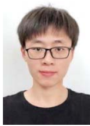

姚宏伟(1993− ),男,福建泉州人, 杭州电子科技大学硕士生,主要研究方 向为数字图像取证、人工智能安全。

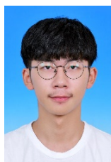

潘彬民(2000− ),男,浙江温州人, 主要研究方向为图像隐写分析。

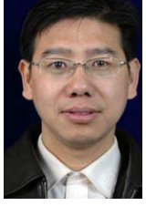

徐明(1972− ),男,浙江杭州人,博 士,杭州电子科技大学教授、博士生导 师。主要研究方向为数字图像取证、网 络安全。

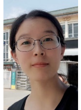

陈艳利(1992− ),女,山东青岛人, 法国特鲁瓦工程技术大学博士生,主要 研究方向为数字图像取证。

