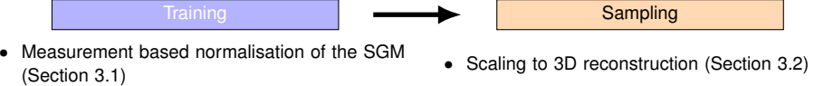

# Score-Based Generative Models for PET Image Reconstruction

Imraj R D Singh∗ https://orcid.org/0000-0003-2186-0977 imraj.singh.20@ucl.ac.uk Department of Computer Science, University College London, 66-72 Gower St, WC1E 6EA, London, United Kingdom.

Alexander Denker∗ https://orcid.org/0000-0002-7265-261X adenker@uni-bremen.de Center for Industrial Mathematics, University of Bremen, Bibliothekstr. 5, 28359 Bremen, Germany.

Riccardo Barbano∗ https://orcid.org/0000-0003-1863-2092 riccardo.barbano.19@ucl.ac.uk Department of Computer Science, University College London, 66-72 Gower St, WC1E 6EA, London, United Kingdom.

Željko Kereta https://orcid.org/0000-0003-2805-0037 z.kereta@ucl.ac.uk Department of Computer Science, University College London, 66-72 Gower St, WC1E 6EA, London, United Kingdom.

Bangti Jin https://orcid.org/0000-0002-3775-9155 b.jin@cuhk.edu.hk Department of Mathematics, The Chinese University of Hong Kong, Shatin, N.T., Hong Kong.

Kris Thielemans https://orcid.org/0000-0002-5514-199X k.thielemans@ucl.ac.uk Institute of Nuclear Medicine, University College London, London, United Kingdom.

Peter Maass https://orcid.org/0000-0003-1448-8345 pmaass@uni-bremen.de Center for Industrial Mathematics, University of Bremen, Bibliothekstr. 5, 28359 Bremen, Germany.

Simon Arridge https://orcid.org/0000-0003-1292-0210 s.arridge@ucl.ac.uk Department of Computer Science, University College London, 66-72 Gower St, WC1E 6EA, London, United Kingdom.

## Abstract

Score-based generative models have demonstrated highly promising results for medical image reconstruction tasks in magnetic resonance imaging or computed tomography. However, their application to Positron Emission Tomography (PET) is still largely unexplored. PET image reconstruction involves a variety of challenges, including Poisson noise with high variance and a wide dynamic range. To address these challenges, we propose several PET-specific adaptations of scorebased generative models. The proposed framework is developed for both 2D and 3D PET. In addition, we provide an extension to guided reconstruction using magnetic resonance images. We validate the approach through extensive 2D and 3D *in-silico* experiments with a model trained on patient-realistic data without lesions, and evaluate on data without lesions as well as out-ofdistribution data with lesions. This demonstrates the proposed method's robustness and significant potential for improved PET reconstruction.

Keywords: Positron emission tomography, score-based generative models, image reconstruction

## 1. Introduction

Positron Emission Tomography (PET) is a functional medical imaging technique for quantifying and visualising the distribution of a radio-tracer within the body, and is vital in clinical practice for accurate diagnosis, treatment planning, and monitoring of diseases. In a PET scan, radio-tracers are injected to probe a specific biological pathway of interest. Through the decay of the radio-tracer a positron is released, which upon annihilating with an electron produces a pair of coincident photons that travel in approximately anti-parallel directions. These emitted photons are detected and are then

Submitted 08/2023 Published 01/2024

<sup>* .</sup> Equal contribution.

<sup>©2024</sup> Singh, Denker, Barbano, Kereta, Jin, Thielemans, Maass, and Arridge. License: CC-BY 4.0 https://doi.org/10.59275/j.melba.2024-5d51

used to reconstruct the underlying radio-tracer distribution. The relationship between the measured emissions and the radio-tracer can be approximated with the Poisson noise model as

$\bf y\sim\rm{Pois}(\bar{\bf y}),\quad\bar{\bf y}=Ax+\bar{\bf b},$

where y¯ ∈ R m is the expected value of the measurements (m is the number of detector bins) and x ∈ R n is the discrete (voxel) basis representation of the tracer distribution (n is the number of voxels). The system matrix A ∈ R m×n includes approximate line integrals between detectors as well as physical phenomena such as photon attenuation, positron range, and detector sensitivity. It should be noted that 3D measurements detect pairs of photons between detector rings, i.e. they are not a stack of 2D measurements. The expected background b¯ ∈ R m are estimates of scatter and randoms events Qi and Leahy (2006). The unique challenges that distinguish PET from other imaging modalities, e.g. Magnetic Resonance Imaging (MRI) and Computed Tomography (CT), include Poisson noise with low mean number of counts, and widely varying dynamic range of images due to functional differences between patients.

Most inverse problems in imaging are ill-posed, in the sense that the solution may not exist, not be unique, or not depend continuously on the measurement noise (Engl et al., 1996; Ito and Jin, 2015). To stabilise the reconstruction process, prior knowledge is often leveraged through a penalising functional that promotes solutions from a desirable image subset. The priors are typically hand-crafted to promote desired features in the reconstructed image, such as sparsity of edges (Rudin et al., 1992) or smoothness. Furthermore, if an additional image is available, e.g. with high resolution structural information, a suitable prior can promote common features between the two images, commonly referred to as guided reconstruction (Ehrhardt, 2021). In recent years, deep learning approaches have shown state-of-the-art performance in PET image reconstruction, see surveys (Reader et al., 2021; Pain et al., 2022). Existing approaches include post-processing (Kaplan and Zhu, 2019), to synthesise high-dose images from low-dose ones (which is akin to denoising), and deep unrolled optimisation (Mehranian and Reader, 2021; Guazzo and Colarieti-Tosti, 2021). However, these supervised approaches require large volumes of paired data that is often hard to acquire, and their performance may degrade greatly in the presence of distributional shift (Antun et al., 2020; Darestani et al., 2022).

In contrast, generative models require a dataset only of images of the target domain. These can, for example, be high-quality reconstructions acquired from prior scans. The aim of generative modelling is to approximate the image manifold of a given dataset (Bengio et al., 2013). There are a variety of methods for this task, e.g. generative adversarial networks (Goodfellow et al., 2014), variational autoencoders (Kingma and Welling, 2014) and recently Score-based Generative Models (SGMs), which aim to generate high-quality samples, sample quickly, and have adequate mode coverage (Xiao et al., 2022). Over recent years, SGMs have become the *de facto* method for image generation due to the quality and diversity of generated images (Dhariwal and Nichol, 2021). Generative models can be integrated into the reconstruction process as data-driven priors, through the learnt image manifold, but which are independent of the specifics of the forward model, cf. (Dimakis, 2022). For example, a generative model trained on PET brain data would not be appropriate for MRI reconstruction of knees, but would be appropriate for the reconstruction of other PET brain images. In the latter case, by suitably changing the forward model, the generative model could be used across scanners and noise levels.

SGMs have been applied to CT and MR image reconstruction (Song et al., 2022). These reconstructions condition the SGM image generation on measurements, and balance the consistency with measurements versus consistency with the SGM learnt image manifold (Kobler and Pock, 2023). There are different methods to enforce measurement consistency of the reconstructions, which can be broadly classified into gradient based methods (Jalal et al., 2021; Chung et al., 2023a) and projection based methods (Song et al., 2022; Chung and Ye, 2022; Chung et al., 2023b). Recently, denoising diffusion models (discrete variants of SGMs) were used for PET image denoising (Gong et al., 2022). Instead, our work focuses on PET image reconstruction, and we present the following contributions:

- We develop a novel algorithmic framework building upon SGMs that carefully addresses the challenges inherent to PET. To do so, we modify the conditional sampling method (Chung et al., 2023b; Zhu et al., 2023), recently proposed for inverse problems with Gaussian noise, for PET image reconstruction. This is achieved with a penalised Maximum A Posteriori (MAP) estimator computed with an accelerated algorithm that evaluates subsets of the measurements.
- We leverage additional MR images to enhance the proposed framework, leading to improved image quality that better agrees with the measured data.
- We scale the approach to 3D PET reconstruction.

The proposed method is tested on multiple noise levels, radio-tracers, and in both 2D and 3D settings with an SGM trained on patient-realistic BrainWeb data without lesions (Collins et al., 1998). In addition to data without lesions, we test on out-of-distribution (OOD) data with lesions to validate method robustness. The rest of the paper is structured as follows. In Section 2 we provide the background on PET reconstruction and SGMs. In particular, we present different methods for using SGMs in image reconstruction. In Section 3 we propose modifications needed to apply SGMs for PET reconstruction. We describe the experimental setting in Section 4, and present and discuss the results in Section 5. The code is publicly available on Github 1 , and the dataset on Zenodo2 .

## 2. Background

#### 2.1 Fundamentals of Positron Emission Tomography Reconstruction

PET measurements are the result of a low-count photon-counting process. The true forward process, from tracer-distribution to photon detection, is approximated by the forward model defined in Eq. (1). The likelihood of the measured photon counts, for an unknown tracer distribution, can be modelled by an independent Poisson distribution. One of the first methods developed for estimating the tracer distribution through a Poisson model was maximum likelihood. This selects an image x ∈ R n ≥0 by maximising the Poisson Log-Likelihood (PLL) function, given by

$$L({\bf y}|{\bf x})=\sum_{i=1}^{m}y_{i}\log([{\bf Ax}+\bar{\bf b}]_{i})-[{\bf Ax}+\bar{\bf b}]_{i}-\log(y_{i}!).\tag{2}$$

By maximising the PLL, the Maximum Likelihood Estimate (MLE) is obtained. A particularly important algorithm for computing the MLE is Expectation Maximisation (EM) (Shepp and Vardi,

<sup>1.</sup> https://github.com/Imraj-Singh/Score-Based-Generative-Models-for-PET-Image-Reconstruction

<sup>2.</sup> https://zenodo.org/records/10509379

1982). However, due to its slow convergence, acceleration is sought through splitting the PLL into a sum of nsub ≥ 1 sub-objectives. This gives rise to the greatly sped-up Ordered Subset Expectation Maximisation (OSEM) (Hudson and Larkin, 1994) algorithm. Because of the ill-conditioning of PET reconstruction, the MLE tends to overfit to measurement noise. To address the ill-conditioning and improve reconstruction quality, it is common practice to regularise the reconstruction problem via the use of an image-based prior. This gives rise to the MAP objective

$\Phi({\bf x})=L({\bf y}|{\bf x})+\lambda R({\bf x})$,

where R(x) is the log of a chosen image-based prior with penalty strength λ. Block-Sequential Regularised Expectation Maximisation (BSREM) (Pierro and Yamagishi, 2001; Ahn and Fessler, 2003) is an iterative algorithm, globally convergent under mild assumptions, that applies the subset idea of OSEM to the MAP objective. For Φ(x) = Pnsub j=1 Φj(x), where Φj is the sub-objective Φj(x) = Lj(y|x)+λR(x)/nsub, and Lj is the likelihood for a subset of the measurements. The BSREM update iterations are given by

$$\mathbf{x}^{i+1}=P_{\mathbf{x}\geq0}\left[\mathbf{x}^{i}+\alpha_{i}\mathbf{D}(\mathbf{x}^{i})\nabla\Phi_{j}(\mathbf{x}^{i})\right]\quad i\geq0,\tag{4}$$

where Px≥0[·] denotes the non-negativity projection, i is the iteration number, and index j = (i mod nsub)+1 cyclically accesses sub-objectives. The preconditioner is D(x i ) = diag max(x i , δ)/A ⊤1 , where 1 ∈ R m denotes the vector with all entries equal to 1, δ is a small positive constant to ensure positive definiteness, and A ⊤ the matrix transpose. The quantity A ⊤1 is referred to as the sensitivity image. The step-sizes are αi = α0/(ζ⌊i/nsub⌋ + 1), where α0 = 1 and ζ is a relaxation coefficient. A common regulariser for PET reconstruction is the Relative Difference Prior (RDP) (Nuyts et al., 2002), see Appendix A.3 for details. The gradient of the RDP is scale-invariant as it is computed using the ratio of voxel values. This partially overcomes the issue with the wide dynamic range observed in emission tomography images, helping to simplify the choice of the penalty strength across noise levels.

## 2.2 Score-based Generative Models

SGMs have emerged as a state-of-the-art method for modelling, and sampling from, high-dimensional image distributions (Song et al., 2021c). They reinterpret denoising diffusion probabilistic modelling (Sohl-Dickstein et al., 2015; Ho et al., 2020) and score-matching Langevin dynamics (Song and Ermon, 2019) through the lens of Stochastic Differential Equations (SDE). SGMs are often formulated by prescribing a forward diffusion process defined by an Itô SDE

$$d{\bf x}_{t}={\bf f}({\bf x}_{t},t)dt+g(t)d{\bf w}_{t},\quad{\bf x}_{0}\sim p_{0}:=\pi,\tag{5}$$

where {xt}t∈[0,T] is a stochastic process indexed by time t and π is the image distribution. Each random vector xt has an associated time-dependent density p(xt). To emphasise that the density is a function of t we write pt(xt) := p(xt). The multivariate Wiener process {wt}t≥0 is the standard Brownian motion. Starting at the image distribution π, the drift function f(·, t) : R n → R n and the diffusion function g : R n → R are chosen such that the terminal distribution at t = T approximates the standard Gaussian, pT ≈ N(0, I). Thus, the forward diffusion process maps the image distribution π to a simple, tractable distribution. The aim of SGMs is to invert this process, i.e. start at the Gaussian distribution and go back to the image distribution π. Under certain conditions on f and g, a reverse diffusion process can be defined (Anderson, 1982)

$$d{\bf x}_{t}=[{\bf f}({\bf x}_{t},t)-g(t)^{2}\nabla_{\bf x}\log p_{t}({\bf x}_{t})]dt+g(t)d\bar{\bf w}_{t},\tag{6}$$

that runs backwards in time. The Wiener process {w¯ t}t≥0 is time-reversed Brownian motion, and the term ∇x log pt(xt) is the score function. Denoising Score Matching (DSM) (Vincent, 2011) provides a methodology for estimating ∇x log pt(xt) by matching the transition densities pt(xt |x0) with a time-conditional neural network sθ(xt , t), called the score model, parametrised by θ. The resulting optimisation problem is given by

$$\min_{\theta}\left\{L_{\text{DSM}}(\theta)=\mathbb{E}_{t-U[0,T]}\mathbb{E}_{\mathbf{x}_{0}\sim p(\mathbf{x}_{t}|\mathbf{x}_{0})}\left[\omega_{t}||s_{\theta}(\mathbf{x}_{t},t)-\nabla_{\mathbf{x}}\log p_{t}(\mathbf{x}_{t}|\mathbf{x}_{0})||_{2}^{2}\right]\right\},\tag{7}$$

where ωt > 0 are weighting factors, balancing the scores at different time steps. For general SDEs, the loss LDSM(θ) may still be intractable, since it requires access to the transition density pt(xt |x0). However, for SDEs with an affine linear drift function, pt(xt |x0) is a Gaussian and thus can be given in closed form (Särkkä and Solin, 2019). Throughout the paper, we use T = 1 and the variance preserving SDE (Ho et al., 2020) given by

$$d{\bf x}_{t}=-\frac{\beta(t)}{2}{\bf x}_{t}dt+\sqrt{\beta(t)}d{\bf w}_{t},\tag{8}$$

where β(t) : [0, 1] → R>0 is an increasing function defining the noise schedule. We use β(t) = βmin +t(βmax −βmin) giving the transition kernel pt(xt |x0) = N(xt ; γtx0, ν2 t I) with coefficients γt , νt ∈ R computed from drift and diffusion coefficients, see Appendix A.1 for details. Generating samples with the score model sθ(xt , t) as a surrogate requires solving the reverse SDE (6), with the score model sθ(xt , t) in place of ∇x log pt(xt)

$$d{\bf x}_{t}=[{\bf f}({\bf x}_{t},t)-g(t)^{2}s_{\theta}({\bf x}_{t},t)]dt+g(t)d\bar{\bf w}_{t}.\tag{9}$$

Drawing samples from the resulting generative model thus involves two steps. First, drawing a sample from the terminal distribution x1 ∼ N(0, I) ≈ p1, and second, initialising the reverse SDE (9) with x1 and simulating backwards in time until t = 0. The latter can be achieved by Euler-Maruyama schemes or predictor-corrector methods (Song et al., 2021c).

## 2.2.1 Denoising diffusion implicit models

Simulating the reverse SDE can be computationally expensive as a fine time grid is often necessary to produce realistic samples. Denoising Diffusion Implicit Models (DDIMs) (Song et al., 2021a) were introduced to allow faster sampling, and build upon a result by Tweedie (Efron, 2011) to approximate the expectation E[x0|xt] via the score model sθ(xt , t) as

$$\mathbb{E}[\mathbf{x}_{0}|\mathbf{x}_{t}]=\frac{\mathbf{x}_{t}+\nu_{t}^{2}\nabla_{\mathbf{x}}\log p_{t}(\mathbf{x}_{t})}{\gamma_{t}}\approx\frac{\mathbf{x}_{t}+\nu_{t}^{2}s_{\theta}(\mathbf{x}_{t},t)}{\gamma_{t}}:=\hat{\mathbf{x}}_{0}(\mathbf{x}_{t}),\tag{10}$$

where the positive scalars γt and ν 2 t are the coefficients for the mean and covariance, respectively, defining the transition kernel, cf. (38) in the Appendix for details. DDIM defines a non-Markovian sampling rule, which uses both the current sample xt and Tweedie's estimate xˆ0(xt) to create an accelerated sampler. Let 0 = tk1 ≤ · · · ≤ tkN = 1 be the time discretisation. The DDIM sampling update can be written as

$$\begin{array}{l}{\bf x}_{t_{k-1}}=\gamma_{t_{k-1}}\hat{\bf x}_{0}({\bf x}_{t_{k}})+{\rm Noise}({\bf x}_{t_{k}},s_{\theta})+\eta_{t_{k}}{\bf z},\quad{\bf z}\sim{\cal N}(0,I)\\ \mbox{with Noise}({\bf x}_{t_{k}},s_{\theta}):=-\nu_{t_{k}}\,\sqrt{\nu_{t_{k-1}}^{2}-\eta_{t_{k}}^{2}}s_{\theta}({\bf x}_{t_{k}},t_{k}).\end{array}\tag{11}$$

The sampling rule can be split into a denoising step (predicting xˆ0(xtk ) using the score model), and adding an appropriate amount of noise back. Thus, the sampling mimics an iterative refinement process, as the prediction of the denoised estimate xˆ0(xtk ) will be more accurate for smaller tk. Different choices of ηt result in different sampling schemes. We choose ηtk = ηβtk with a hyperparameter η ∈ [0, 1], controlling the amount of stochasticity in the sampling, and βtk = νtk−1 /νtk p 1 − γtk /γtk−1 (Song et al., 2021a).

## 2.3 Using Score-based Generative Models for Inverse Problems

The goal of the Bayesian framework of inverse problems is to estimate the posterior p post(x|y), i.e. the conditional distribution of images x given noisy measurements y. Using Bayes' theorem the posterior can be factored into

$$p^{\rm post}({\bf x}|{\bf y})\propto p^{\rm lkd}({\bf y}|{\bf x})\pi({\bf x}),\quad\nabla_{\bf x}\log p^{\rm post}({\bf x}|{\bf y})=\nabla_{\bf x}\log p^{\rm lkd}({\bf y}|{\bf x})+\nabla_{\bf x}\log\pi({\bf x}),\tag{12}$$

where p lkhd denotes the likelihood and π the prior given by the image distribution. We can set up a generative model for the posterior in the same way as for the prior π in Section 2.2 by defining a forward SDE which maps the posterior to random noise. To generate a sample from the posterior p post(x|y), we can simulate the corresponding reverse SDE

$$d{\bf x}_{t}=[{\bf f}({\bf x}_{t},t)-g(t)^{2}\nabla_{\bf x}\log p_{t}({\bf x}_{t}|{\bf y})]dt+g(t)d\bar{\bf w}_{t},\tag{13}$$

where we need access to the time-dependent posterior ∇x log pt(xt |y). Similar to Eq. (12), we use Bayes' theorem for the score of the posterior and decompose ∇x log pt(xt |y) into a prior and a likelihood term, where the former is approximated with the trained score model

$$\begin{split}\nabla_{\mathbf{x}}\log p_{t}(\mathbf{x}_{t}|\mathbf{y})&=\nabla_{\mathbf{x}}\log p_{t}(\mathbf{x}_{t})+\nabla_{\mathbf{x}}\log p_{t}(\mathbf{y}|\mathbf{x}_{t})\\ &\approx s_{\theta}(\mathbf{x}_{t},t)+\nabla_{\mathbf{x}}\log p_{t}(\mathbf{y}|\mathbf{x}_{t}).\end{split}\tag{14}$$

Substituting the above approximation into (13), we obtain

$$d{\bf x}_{t}=[{\bf f}({\bf x}_{t},t)-g(t)^{2}(s_{\theta}({\bf x}_{t},t)+\nabla_{{\bf x}_{t}}\log p_{t}({\bf y}|{\bf x}_{t}))]dt+g(t)d\bar{\bf w}_{t}.\tag{15}$$

We can recover approximate samples from the posterior p post(x|y), by simulating the reverse SDE (15). Through iterative simulation of the reverse SDE with varying noise initialisations, we can estimate moments of the posterior distribution. As is common practice in the field (Song et al., 2022; Chung and Ye, 2022; Jalal et al., 2021) we use one sample for the reconstruction, due to computational costs of repeatedly solving the reverse SDE. In addition to the score model sθ(xt , t), we need the score of the time-dependent likelihood ∇x log pt(y|xt). At the start of the forward SDE (for t = 0), it is equal to the true likelihood p lkhd. However, for t > 0 the score ∇x log pt(y|xt) is intractable to compute exactly and different approximations have been proposed. In (Jalal et al., 2021; Ramzi et al., 2020), this term was approximated with the likelihood p lkhd evaluated at the noisy sample xt with time-dependent penalty strength λt

$$\nabla_{\bf x}\log p_{t}({\bf y}|{\bf x}_{t})\approx\lambda_{t}\nabla_{\bf x}\log p^{\rm lkd}({\bf y}|{\bf x}_{t}).\tag{16}$$

We refer to Eq. (16) as the Naive approximation. The Diffusion Posterior Sampling (DPS) (Chung et al., 2023a) uses Tweedie's formula to obtain xˆ0(xt) ≈ E[x0|xt] and approximates ∇x log pt(y|xt) by

$$\nabla_{\bf x}\log p_{t}({\bf y}|{\bf x}_{t})\approx\nabla_{\bf x}\log p^{\rm lkhd}({\bf y}|\hat{\bf x}_{0}({\bf x}_{t})),\tag{17}$$

where ∇x denotes taking derivative in xt (instead of xˆ0). It was shown that this approximation leads to improved performance for several image reconstruction tasks (Chung et al., 2023a). However, DPS comes with a higher computational cost, due to the need to back-propagate the gradient through the score model.

Recently, several works proposed modifying the DDIM sampling rule in Eq. (11) for conditional generation (Zhu et al., 2023; Chung et al., 2023b). These methods generally consist of three steps: (1) estimating the denoised image x0 using Tweedie's estimate xˆ0(xtk ); (2) updating xˆ0(xtk ) with a data consistency step using the measurements y; and (3) adding the noise back, according to the DDIM update rule, in order to get a sample for the next time step tk−1. Importantly, with this approach there is no need to estimate the gradient of the time-dependent likelihood ∇x log pt(y|xt) as data consistency is only enforced on Tweedie's estimate at t = 0. These conditional DDIM samplers differ most greatly in the implementation of the data consistency update. Decomposed Diffusion Sampling (DDS) (Chung et al., 2023b) proposes to align Tweedie's estimate with the measurements by running p steps of a Conjugate Gradient (CG) scheme for minimising the negative log-likelihood at each sampling step. Let CG(p) (xˆ0) denote the p-th CG update initialised with xˆ0(xtk ). This can be seen as an approximation to the conditional expectation, i.e. E[x0|xt , y] ≈ CG(p) (xˆ0) (Ravula et al., 2023). Using this approximation, the update step for DDS can be written as

$${\bf x}_{t_{k-1}}=\gamma_{t_{k-1}}{\rm CG}^{(p)}(\hat{\bf x}_{0})+{\rm Noise}({\bf x}_{t_{k}},s_{\theta})+\eta_{t_{k}}{\bf z},\ {\rm with}\ {\bf z}\sim{\cal N}(0,I),\tag{18}$$

where the introduction of the conditional expectation offers us the possibility to explore different approximations specific for PET image reconstruction.

## 3. PET-specific Adaptations for SGMs

To apply SGMs to PET reconstruction, several key components of the pipeline in Section 2.2 have to be modified in order to incorporate PET-specific constraints. Namely, we introduce measurementbased normalisation of the input to the score model, and explain how to apply a score model trained on 2D slices for 3D reconstruction. Additionally, we adapt the sampling methods from Section 2.3 to incorporate the Poisson noise model. Finally, we demonstrate that the SGM framework allows for the incorporation of additional information, e.g. MR images, by using classifier-free guidance (Ho and Salimans, 2022). The overall adaption steps are summarised in Fig. 1.



- Incorporation of additional MR information (Section 3.4)
- Modification of sampling rules to include the PLL (Section 3.3)

Figure 1: Schematic illustration of the modification for training and sampling steps of SGMs.

## 3.1 Measurement-based Normalisation

The intensity of the unknown tracer distribution in emission tomography can significantly vary across different scans, resulting in a high dynamic range that poses challenges for deep learning approaches. Neural networks may exhibit bias toward intensity levels that appear more frequently in the training set. Consequently, the network might struggle to handle new images with unseen intensity levels, leading to instability in the learning and evaluation process (Tran et al., 2020). For SGMs the intensity range of images must be predefined to ensure that the forward diffusion process converges to a standard Gaussian distribution and to stabilise the sampling process (Lou and Ermon, 2023). Input normalisation is a standard deep learning methodology to deal with intensity shifts and normalise the inputs to the network. In a similar vein, we propose a PET-specific normalisation method to ensure that the score model sθ(xt , t) is able to estimate the score function of images with arbitrary intensity values. Namely, we normalise each training image x0 to ensure voxel intensities are within a certain range. To do this we introduce a training normalisation factor ctrain that when applied ensures the average emission per emission voxels (a voxel with non-zero intensity value) is 1. This is computed as

$$c_{\rm train}=c({\bf x}_{0}):=\frac{\sum_{j=1}^{m}[{\bf x}_{0}]_{j}}{\#\{j:[{\bf x}_{0}]_{j}>0\}},\tag{19}$$

where the numerator captures the total emission in the image, and the denominator is the number of emission voxels. The normalisation factor is incorporated into the DSM training objective function by rescaling the initial image, yielding the objective

$$\mathbb{E}_{t\sim U[0,T]}\mathbb{E}_{\mathbf{x}_{0}\sim\mathbf{\pi}}\mathbb{E}_{\mathbf{z}\sim\mathcal{N}(0,t)}\mathbb{E}_{c\sim U[\frac{\gamma_{\text{max}}}{2},\frac{\gamma_{\text{max}}}{2}]}\left[\omega_{t}\left\|s_{\theta}\left(\tilde{\mathbf{x}}_{t},t\right)-\nabla_{\mathbf{x}}\log p_{t}(\tilde{\mathbf{x}}_{t}|\mathbf{x}_{0}/c)\right\|_{2}^{2}\right],\tag{20}$$

with x˜t = γtx0/c + νtz. Compared with Eq. (7), the scale-factor in range c ∼ U[ ctrain 2 , 3ctrain 2 ] is used to encourage the score model to be more robust with respect to misestimations of the normalisation constant during sampling.

An analogue of Eq. (19) is unavailable during the sampling, and thus a surrogate is required. This is obtained through an approximate reconstruction, computed using a single epoch of OSEM from a constant non-negative initialisation. The resulting sampling normalisation factor is given by

$$c_{\text{OSEM}}=\frac{\sum_{j=1}^{m}[\text{X}_{\text{OSEM}}]_{j}}{\#\{j:[\text{X}_{\text{OSEM}}]_{j}>Q_{0.01}\}},\tag{21}$$

where Q0.01 defines the 1% percentile of xOSEM values. This threshold is heuristically chosen to ensure that noise and reconstruction artefacts do not cause an over-estimation of the number of emission voxels. In the reconstruction process the normalisation constant cOSEM is applied as a factor scaling the time-dependent likelihood, giving

$$d{\bf x}_{t}=[{\bf f}({\bf x}_{t},t)-g(t)^{2}(s_{\theta}({\bf x}_{t},t)+\nabla_{\bf x}\log p_{t}({\bf y}|{\rm cosEM}{\bf x}_{t}))]dt+g(t)d{\bf\tilde{w}}_{t}.\tag{22}$$

At final time step t = 0, the output x is rescaled by cOSEM to recover the correct intensity level.

## 3.2 Scaling to 3D Reconstruction

While some SGM studies deal with fully 3D image generation (Pinaya et al., 2022), the majority of work is restricted to 2D images. This is largely due to the fact that the learning of full 3D volume distributions is computationally expensive and requires access to many training volumes. Therefore, we propose to train the score model on 2D axial slices and use a specific decomposition of the conditional sampling rules to apply the model for 3D reconstruction. Upon simulating the conditional reverse SDE in Eq. (15) using the Euler-Maruyama approach, we arrive at the iteration rule

$$\tilde{\bf x}_{t_{k-1}}={\bf x}_{t_{k}}+[{\bf f}({\bf x}_{t_{k}},t_{k})-g(t_{k})^{2}s_{\theta}({\bf x}_{t_{k}},t_{k})]\Delta t+g(t_{k})\,\sqrt{|\Delta t|}{\bf z},\quad{\bf z}\sim{\cal N}(0,I),\tag{23}$$

$${\bf x}_{t_{k-1}}=\bar{\bf x}_{t_{k-1}}-g(t_{k})^{2}\nabla_{\bf x}\log p_{t_{k}}({\bf y}|{\bf x}_{t_{k}})\Delta t,\tag{24}$$

using an equidistant time discretisation 0 = tk1 ≤ · · · ≤ tkN = 1 for N ∈ N, with a time step ∆t = −1/N. We split the Euler-Maruyama update into two equations to highlight the influences of the score model and the measurements y. First, Eq. (23) is the Euler-Maruyama discretisation for the unconditional reverse SDE, see Eq. (9). This update is independent of the measurements y and can be interpreted as a prior update, increasing the likelihood of xtk under the SGM. The second step in Eq. (24) is a data consistency update, pushing the current iterate to better fit the measurements. Notably, this step is fully independent of the score model. This strategy was developed for 3D reconstruction, focusing on sparse view CT and MRI (Chung et al., 2023c). It was proposed to apply the prior update in Eq. (23) to all slices in the volume independently and use the 3D forward model in the data consistency step. Further, a regulariser in the direction orthogonal to the slice was introduced, to improve consistency of neighbouring slices. However, applying this approach to the Euler-Maruyama discretisation results in slow sampling times as a small time step |∆t| is necessary. To accelerate the sampling of high quality samples, we propose to use the DDS update in Eq. (18) that uses a similar decomposition of independent score model updates to axial slices, and 3D data consistency updates. Additionally, we accelerate data consistency updates by splitting the measurement data into ordered subsets and applying the forward model block-sequentially. The details are explained below.

## 3.3 Modifications of Sampling Methods

The sampling schemes and approximations in Section 2.3 were originally proposed for inverse problems with Gaussian noise. The work on DPS (Chung et al., 2023a) also considers inverse problems with Poisson noise, but utilises a Gaussian approximation to the Poisson noise, which is known to be unsuitable for PET reconstruction in the event of the low photon count (Bertero et al., 2009; Hohage and Werner, 2016). To apply the Naive approximation or the DPS approach to Poisson inverse problems, one could simply replace the Gaussian log-likelihood with the PLL in Eq. (16) and Eq. (17). However, PLL and its gradient are only defined for non-negative values. Therefore, we have to introduce a non-negativity projection into the sampling to ensure that the gradient of the PLL can be evaluated. In the context of guided diffusion, it was proposed to project the iterates xtk to a specified domain after each sampling step (Li et al., 2022; Saharia et al., 2022). In our case this would require thresholding all negative values. However, this creates a mismatch between the forward and reverse SDEs. It was observed that this mismatch results in artefacts in the reconstructions and may even lead to divergence of the sampling (Lou and Ermon, 2023). In our experiments, thresholding all negative values of xtk leads to a divergence of the sampling process. Therefore, we propose to only threshold the input to the PLL, i.e. with L being the PLL, see Eq. (2), for the PET-Naive approximation we use

$$\nabla_{\bf x}\log p_{t}({\bf y}|{\bf x}_{t})\approx\lambda_{t}^{\rm New}\nabla_{\bf x}L({\bf y}|c_{\rm OSEM}P_{\bf x\geq0}[{\bf x}_{t}]),\tag{25}$$

and likewise for PET-DPS

$$\nabla_{\bf x}\log p_{t}({\bf y}|{\bf x}_{t})\approx\lambda_{t}^{\rm DPS}\nabla_{\bf x}L({\bf y}|c_{\rm OSEM}P_{\bf x\geq0}[\hat{\bf x}_{0}({\bf x}_{t})]).\tag{26}$$

Note that this leads to a perturbed likelihood gradient that is not computed on the true iterate xt , but only on the projection. In order to reconstruct the PET image we have to solve the reverse SDE using the specific approximation (PET-Naive or PET-DPS) as the likelihood term. This usually requires around 1000 sampling steps to produce an appropriate reconstruction and results in impractically long reconstruction times for 3D volumes.

To reduce the reconstruction times we propose to modify the conditional DDIM sampling rule, which we call PET-DDS, similar to the DDS framework (Zhu et al., 2023; Chung et al., 2023b), cf. Section 3.3. This circumvents the usage of ∇x log pt(y|xt), instead enforcing data consistency for Tweedie's estimate xˆ0(xtk ). For PET reconstruction we propose to implement this data consistency with a MAP objective, leading to the PET-DDS update

$${\bf x}_{l_{k}}^{0}=\hat{\bf x}_{0}({\bf x}_{l_{k}})\tag{27}$$

$${\bf x}_{k_{k}}^{i+1}=P_{{\bf x}\geq0}\left[{\bf x}_{k_{k}}^{i}+{\bf D}({\bf x}_{k_{k}}^{i})\nabla_{\bf x}\Phi_{j}({\bf x}_{k_{k}}^{i})\right]\tag{28}$$ $$i=0,\ldots,p-1$$ $$P_{{\bf x}\geq0}\ {\bf N}\ {\bf i}_{\bf x}({\bf x}_{\bf x},{\bf x})\ {\bf i}_{\bf x}({\bf x}_{\bf x},{\bf x})\ {\bf M}({\bf\Omega},{\bf\Omega})\tag{29}$$

$${\bf x}_{k-1}=\gamma_{k-1}{\bf x}_{k}^{p}+{\rm Noise}({\bf x}_{k},s_{\theta})+\eta_{k}{\bf z},\quad{\bf z}\sim{\cal N}(0,I),\tag{29}$$

where D(x) = diag n max(x, 10−4 )/A ⊤1 o is the preconditioner and the sub-objective is

$$\Phi_{j}({\bf x}^{i})=L_{j}({\bf y}|c_{\rm OSOEM}{\bf x}^{i})+(\lambda^{\rm RDP}R_{z}({\bf x}^{i})-\lambda^{\rm DDS}\|{\bf x}^{i}-\hat{\bf x}_{0}\|_{2}^{2})/n_{\rm sub}.\tag{30}$$

The sub-objective index j = j(i) is given by j = (p(N − k) + i mod nsub) + 1, which cyclically accesses sub-objectives. The RDP used for 3D data Rz is applied in the z-direction, perpendicular to the axial slice, see Appendix A.3 for more details. The prior in Eq. (30) consists of two components: one anchoring to the Tweedie's estimate ∥x − xˆ0∥ 2 2 , and the other RDP in the z-direction Rz(x). The components have associated penalty strengths λ RDP and λ DDS, respectively.

In a PET-DDS update we first independently compute Tweedie's estimate based on xtk for each axial slice (Eq. 27). Tweedie's estimate xˆ0 impacts the reconstruction in two ways: first through the Tikhonov regulariser scaled with λ DDS, and second as the initial value for the projected gradient descent in Eq. (28). Through running p steps of projected gradient descent consistency is balanced between a PLL on measurements, RDP in the z-direction, and Tweedie's estimate (Eq. 30). To speed up computation of the objective gradient, the objective is split into sub-objectives and the gradient of the log-likelihood is evaluated using only subsets of the measurements y, similar to the BSREM update in Eq. (4). The subsets are partitioned in a staggered configuration and are ordered with a Herman-Meyer order (Herman and Meyer, 1993). Eq. (29) is the DDIM update applied to the conditioned Tweedie estimate x p , where the score update is again applied independently for each axial slice, here the notation of Noise(xtk , sθ) is overloaded. The DDIM update gives xtk−1 , and these PET-DDS updates repeat until t0 = 0 giving reconstruction xˆ.

| Method | Sampling type | Data consistency with L in (2) | Algorithm |
| --- | --- | --- | --- |
| PET-Naive | Euler-Maruyama (23) | L(y|cOSEMPx≥0[x]) (25) | Algo. 1 |
| PET-DPS | Euler-Maruyama (23) | L(y|cOSEMPx≥0[xˆ0(x)]) (26) | Algo. 2 |
| PET-DDS | DDIM (11) | Lj(y|cOSEMx) (28) and (30) | Algo. 3 |

Table 1: Summary of different sampling schemes proposed for PET.

In Table 1, we list the details and differences of the proposed score-based schemes for PET.

## 3.4 MR Image Guided Reconstruction

In recent years, several regularisation methods have been proposed which leverage the availability of additional MR images to improve PET image reconstruction (Ehrhardt et al., 2016; Bai et al., 2013; Somayajula et al., 2011). These studies often encode anatomical features of the MR image as edges or level sets and build hand-crafted regularisers based on these encoded features. This is commonly referred to as guided reconstruction (Ehrhardt, 2021), where the MR image is first reconstructed and is then used in the PET reconstruction pipeline. The SGM approach can be modified for guided reconstruction. In this setting we can use Bayes' theorem to express the posterior

$$\nabla_{\bf x}\log p^{\rm post}({\bf x}|{\bf y},{\bf x}_{\rm MR})=\nabla_{\bf x}\log p^{\rm knd}({\bf y}|{\bf x})+\nabla_{\bf x}\log\pi({\bf x}|{\bf x}_{\rm MR}),\tag{31}$$

assuming that both y and xMR are conditionally independent given x. Here, the likelihood p lkhd(y|x) is given by the Poisson noise model and π(x|xMR) is a prior conditioned on the MR image xMR, which will be learned via a score model. Using this decomposition, the reverse SDE, given the MR image, can be written as

$$d{\bf x}_{t}=[{\bf f}({\bf x}_{t},t)-g(t)^{2}\left(\nabla_{\bf x}\log p_{t}({\bf y}|{\bf x})+\nabla_{\bf x}\log\pi({\bf x}|{\bf x}_{\rm MR})\right)]dt+g(t)d\tilde{\bf w}_{t}.\tag{32}$$

We can use PET-Naive or PET-DPS to approximate the score of the time dependent likelihood ∇x log pt(y|x). However, we have to train a score model, conditioned on the MR image, to estimate the conditional score function

$s_{\theta}({\bf x}_{t};l,{\bf x}_{\rm MR})\approx\nabla_{\bf x}\log p_{t}({\bf x}|{\bf x}_{\rm MR})$, (33)

where xMR is an additional input to the score model. This method was recently proposed and applied to PET image denoising (Gong et al., 2022). To train such a score model we need a paired dataset {(x i , x i MR)} m i=1 of PET images and corresponding MR images. In contrast, using the Classifier Free Guidance (CFG) framework (Ho and Salimans, 2022), we only need a partly paired dataset, i.e. besides paired data {(x i , x i MR)} m1 i=1 we can also make use of unpaired data {x i } m2 i=1 . In particular, CFG trains both a conditional and unconditional score model simultaneously and utilises their combination during the sampling process. CFG uses a zero image 0 to distinguish between the conditional and unconditional score model

$$s_{\theta}({\bf x}_{i};t,{\bf x}_{\rm MR})\approx\nabla_{\bf x}\log p_{t}({\bf x}_{i}|{\bf x}_{\rm MR})\quad\mbox{and}\quad s_{\theta}({\bf x}_{i};t,{\bf x}_{\rm MR}={\bf0})\approx\nabla_{\bf x}\log p_{t}({\bf x}_{i}),\tag{34}$$

yielding a conditional DSM objective

$$\mathbb{E}_{t\sim U[0,T]}\mathbb{E}_{\mathbf{x}_{0},\mathbf{x}_{\text{MR}}\sim\pi}\mathbb{E}_{\mathbf{x}\sim p_{t}(\mathbf{x}_{t}|\mathbf{x}_{0})}\mathbb{E}_{p\sim B(q)}\Big{\{}\omega_{t}\|s_{\theta}(\mathbf{x}_{t},t;\rho\ \mathbf{x}_{\text{MR}})-\nabla_{\mathbf{x}}\log p_{t}(\mathbf{x}_{t}|\mathbf{x}_{0})\|_{2}^{2}\Big{\}},\tag{35}$$

where B(q) is a Bernoulli distribution with parameter q. Thus, if the additional MR input is set to zero, the conditional DSM loss matches the unconditional DSM loss defined in Eq. (7). After training, CFG defines a combined score model

$$\bar{s}_{\theta}({\bf x}_{t};t,{\bf x}_{\rm MR})=(1+w)s_{\theta}({\bf x}_{t};t,{\bf x}_{\rm MR})-ws_{\theta}({\bf x}_{t};t,{\bf0}),\tag{36}$$

as a linear combination with w as the guidance strength. This combined score model sθ(xt ; t, xMR) can then be used for any of the presented sampling methods.

## 4. Experimental Setup

## 4.1 Dataset and Evaluation Metrics

We use the BrainWeb dataset consisting of 20 patient-realistic volumes (Aubert-Broche et al., 2006). The tracer simulated was 18F-Fluorodeoxyglucose (FDG) and the volumes were further perturbed by three realisations of random distortions (Schramm, 2021). 19 out of the 20 volumes were used for training. Axial slices with non-zero intensity were removed, resulting in a training dataset of 4569 slices. We conducted two simulations for the evaluation, i.e., image and measurement. The image simulation utilised the segmentation mask of the held-out volume, subject 04. In 2D, an FDG tracer was simulated by perturbing the contrast, applying a bias-field to grey matter, blurring and adding noise as per Schramm (2021). In 3D, FDG and Amyloid tracers were independently simulated, and blurring and noise were added. The Amyloid tracer was included to provide a further OOD evaluation set. To further diversify the evaluation sets, simulated lesions were included in both 3D simulations and added to an additional 2D evaluation set. Lesions were simulated as local regions of ellipsoidal hyper-intensity of random size and location within soft-tissue, and allowed for local evaluation metrics to be computed. The setting of measurement simulation is described below separately for the 2D and 3D cases.

For 2D evaluation, resolution modelling, attenuation, sensitivity, and background contamination were modelled and subsequently included in the forward model utilising ParallelProj (Schramm, 2022). We use 20 equidistant axial slices from the simulation of subject 04. The noise level of simulated measurements was set by re-scaling forward projected ground truth images, where the scale ensured that the total counts divided by emission volume was 2.5 or 10. These rescaled measurements are the clean measurements, which were then corrupted with Poisson noise and constant background contamination. In addition, 10 noise realisations were obtained. Herein, we refer to the noise levels as 2.5 and 10, where the total true counts averaged over evaluation dataset were 122 808 and 491 232, respectively.

For the 3D evaluation, measurements of subject 04 were simulated with an Siemens Biograph mMR scanner geometry (Karlberg et al., 2016). Measurements with detector sensitivities and attenuation were simulated and included in the forward model using SIRF and STIR (Ovtchinnikov et al., 2020; Thielemans et al., 2012). The noise level was equivalent to 40 million counts without background, and 5 noisy realisations were obtained. Unless otherwise specified, the projector and measurements were split into 28 ordered subsets in the experiments below.

We evaluate the performance between reconstructions and ground truths using two global metrics: Peak-Signal-to-Noise Ratio (PSNR) and Structural Similarity Index Measure (SSIM) (Wang et al., 2004). Moreover, we compute two local quality scores over a Region of Interest (ROI). First, to quantify the detectability of lesions, we compute the Contrast Recovery Coefficient (CRC). Second, the noise in reconstructions is estimated over background ROIs using Standard Deviation (STD), which computes standard deviation across realisations and then averages over ROI voxels (Tong et al., 2010). In 2D, we evaluate the reconstruction consistency by computing the Kullback-Leibler Divergence (KLDIV) between measurements y and estimated measurements y¯ = Axˆ + b¯, where xˆ denotes the reconstruction. Furthermore, we include the "mean KL" between the noisy and clean measurements across the 2D evaluation dataset. More information about quality metrics can be found in Appendix A.4.

We present tables of best performing methods with optimal penalty strengths, as well as qualitative figures of reconstructed images. Furthermore, to allow direct comparison between methods, we give sensitivity plots of PSNR, SSIM, KLDIV or CRC vs. STDs. Since STD gives an estimate of the noise in the image, these plots can show the effect of varying penalty strength on reconstruction quality or data-consistency. A lower STD typically corresponds to lower data-fidelity (a higher prior strength), and the converse is true for higher STD. In practice, with a generative model as a prior, higher penalty strengths do not necessarily lead to a lower STD as there may be multiple reconstruction with high likelihood under the model. Variations in STD are further exacerbated by approximate nature and stochasticity of SGM sampling.

## 4.2 Comparison Methods

In the 2D setting, we compare against two established supervised learning methods used in medical image reconstruction: the UNet post-processing FBPConvNet (Jin et al., 2017) and unrolled iterative learned primal dual (Adler and Öktem, 2018). We modify both models for PET reconstruction; the post-processing method is referred to as PET-UNet, and the unrolled method as PET-LPD. Additionally we compare against a state-of-the-art SGM approach for PET image denoising (Gong et al., 2022), referred to as Naive (OSEM). This denoising approach replaces the likelihood on the measurements with a likelihood modelled as a Gaussian centred at the noisy reconstruction. Therefore, Naive (OSEM) is able to use the same pre-trained score model as our proposed PET-Naive, PET-DPS, and PET-DDS methods.

For 3D evaluation, Deep Image Prior (DIP) reconstruction was included as an unsupervised comparison method with a 3D network architecture well-established in literature (Gong et al., 2019; Ote et al., 2023; Singh et al., 2023). For comparison, converged MAP solutions with an RDP regulariser were computed. BSREM algorithm was used with a range of penalty strengths, cf. PET background Sect. 2.1.

Further details on all comparison methods can be found in Appendix A.3.

## 5. Numerical Experiments

The first set of experiments investigates the performance of the SGM methods (Naive (OSEM), PET-Naive, PET-DPS, PET-DDS) against one-another and against established supervised methods (PET-UNet, PET-LPD). This is done in 2D and at two noise levels, with and without lesions. In the second set of experiments we present results with MR image guidance. The last set of experiments investigates the best performing SGM method (PET-DDS) on 3D reconstruction, and provides a comparison against classical MAP and state-of-the-art DIP reconstructions with lesions and two simulated tracers. For all SGM results we make use of a single score model trained on the dataset of axial BrainWeb slices described in Section 4.1. The details about the training process and network architecture can be found in Appendix A.1. Further results can be found in the Appendix B. All results were computed with a single NVIDIA GeForce RTX 3090.

## 5.1 2D Reconstruction

The aim of 2D experiments is to benchmark the SGM and supervised methods, and analyse the stability of SGM methods with respect to the choice of different penalty strengths λ Naive t , λ DPS t and λ DDS. The penalty strengths for PET-Naive and PET-DPS depends on the time step t, and the details about their specific choice can be found in Appendix A.2.


Figure 2: Results for BrainWeb without lesions with noise level 2.5 for different penalty parameters. Standard deviation is across reconstructions from different realisations of measurements. The points represent different values of the parameter λ, and the notation and _ denote the smallest and largest value of λ, respectively.

## 5.1.1 Reconstruction without Lesion

The results in Fig. 2 show that the performance of the four SGM methods vary greatly for data of noise level 2.5 with no lesions. PET-DPS is the best performing method, consistently giving high PSNR, SSIM and low KLDIV values. However, it is also computationally the most expensive, requiring 1000 steps with back-propagation through the score model. PET-DDS preforms competitively with a much lower computational overhead of 100 steps without score model back-propagation. Naive (OSEM) performs well with regards to PSNR, but performs poorly in terms of data-consistency (KLDIV) and SSIM. As Naive (OSEM) computes the likelihood on an early-stopped OSEM image, increasing data-consistency ensures the reconstruction approaches the OSEM image. The maximum achievable likelihood of Naive (OSEM) does not give a KLDIV lower than the "mean KL". Hence it is not deemed a strong surrogate to the true likelihood computed on measurements. The PET-Naive reconstructions have substantially higher STD values. This is attributed to instability when computing the PLL gradient due to non-negativity projection directly applied on xt .

In Table 2 we show quantitative results of the optimal penalty strength choice for each metric, and comparisons against PET-UNet and PET-LPD. These supervised methods are trained on data with noise levels of 5, 10 and 50 without lesions. Using noise levels 2.5 and 10 in evaluation allows investigating the effect of OOD noise levels on supervised methods. PET-LPD is the best performing method, giving the best SSIM at noise level 10, and best PSNR at both noise levels. Between noise levels 10 and 2.5 PET-LPD observes a drop of 6.7% and 6.6% for PSNR and SSIM, whereas PET-DPS exhibits a drop of 3.4% and 3.8%, respectively. PET-DPS performs competitively across both noise levels and metrics, and gives the best SSIM value at noise level 2.5. The competitive performance and the reduced performance drop of quality metrics, with increasing noise, provides evidence that PET-DPS is more robust to different noise levels. This may be attributed to the unsupervised nature of SGM methods. Namely, as they are not trained on data of given noise levels they are less affected by distributional differences in noise levels at evaluation and training stages. How-

- Table 2: The mean quality score and standard error using the best hyperparameters for each method for BrainWeb without lesions for noise level 2.5 (out-of-distribution) and 10 (indistribution). The penalty strength used for each SGM method is denoted by λ. The best SGM is highlighted in grey, and overall best metric is underlined. Supervised methods are trained on data with noise levels 5, 10 and 50.

| Noise Level || Model                  || Method                         || PSNR, λ                               ||            || SSIM, λ                               ||           |
| ---         || ---                    || ---                            || ---                                   || ---        || ---                                   || ---       |
| 2.5         ||                        || Naive (OSEM)                   || 22 38±0                               ||            || 0 770±0                               ||           |
|             || Score-based            || PET-Naive                      || .82, . 21 52±0 .84,                   || 0.527 12.0 || .02, . 0 781±0 .01,                   || 3.08 12.0 |
|             || Generative             || PET-DPS PET-DDS                || . 22 80±0 .81, . 22 46±0              || 650.       || . 0 818±0 .01, . 0 789±0              || 750.      |
|             ||                        ||                                || .82, .                                || 0.25       || .02, .                                || 0.2       |
|             || Supervised             || PET-LPD PET-UNet               || 23 06±0 .85, . 22 80±0                || N/A N/A    || 0 806±0 .01, . 0 798±0                || N/A N/A   |
|             ||                        ||                                || .82, .                                ||            || .01, .                                ||           |
|             || Score-based Generative || Naive (OSEM) PET-Naive PET-DPS || 23 40±0 .84, . 22 81±0 .87, . 23 70±0 || 0.2 10.    || 0 793±0 .02, . 0 815±0 .01, . 0 850±0 ||           |
|             ||                        ||                                ||                                       ||            ||                                       || 0.9 10.   |
| 10          ||                        ||                                || .83,                                  || 400.       || .01,                                  || 400.      |
|             ||                        || PET-DDS                        || . 23 55±0 .77, .                      || 0.025      || . 0 849±0 .01, .                      || 0.025     |
|             ||                        || PET-LPD                        || 24 74±0                               || N/A        || 0 861±0                               || N/A       |
|             || Supervised             || PET-UNet                       || .91, . 24 52±0 .85,                   || N/A        || .01, . 0 868±0 .01,                   || N/A       |
|             ||                        ||                                || .                                     ||            || .                                     ||           |


Table 3: The computing time of a single reconstruction, averaged over 5 reconstructions. Method PET-Naive PET-DPS PET-DDS

Method | PET-Naive | PET-DPS | PET-DDS
Time (s) | 41.52    |43.64   | 3.90

ever, a more comprehensive study over a wider range of noise levels is needed to robustly support this observation. Interestingly, the standard deviation of the different samples is non-negligible in terms of PSNR, but the SSIM is nearly independent of the samples. The larger standard deviation for the PSNR is due to the different dynamic range, e.g., the maximum intensity varies between 11.89 and 24.15 for different slices at noise level 2.5. We leave a full investigation of uncertainty quantification using SGM methods to future work. The supervised methods, i.e., PET-LPD and PET-UNet, perform better than score-based models for both noise levels. Note, this margin is larger for the in-distribution case, i.e., the noise level 10.

In the table, we also observe a pronounced change in the selected λ values between noise levels 2.5 and 10 for PET-DDS, especially when compared with other methods. This phenomenon is attributed to the following fact. In the experiments, the BSREM-like data consistency updates are run for p steps, with a small p (see Appendix A.2 for the heuristic rule to determine p), not giving a converged MAP estimate, and there is an implicit regularisation that is proportional to the rate of convergence to noisier images. Hence iterative reconstructions at the noise level 2.5 fit to noise quicker, thereby necessitating much stronger regularisation than the noise level 10.

In Table 3, we compare the computing time for one single reconstruction. PET-Naive and PET-DPS are largely comparable in terms of inference efficiency, and are about ten times slower than PET-DDS. The difference in computing times can be attributed to the fact that PET-DDS requires fewer time steps; through the use of the accelerated DDIM sampling method.


Figure 3: Results for BrainWeb with lesions with noise level 2.5 for different penalty parameters. Standard deviation is across reconstructions from different realisations of measurements. The points represent different values of the parameter λ, and the notation and _ denote the smallest and largest numerical value of λ, respectively.

## 5.1.2 2D Reconstruction with Lesion

As the score model was trained on data without lesions, testing on data with simulated hot lesions gives an insight into generalisability to OOD data. The quantitative results in Fig. 3 and Table 4 show results that are consistent with those for data with no lesions in Fig. 2. CRC was computed to quantify the detectability of hot lesions. The CRC results indicate that PET-DDS is better at resolving lesions than other SGM methods. Further, Fig. 3 shows a clear trade-off between reconstruction quality in terms of PSNR and SSIM and visibility of lesions. Here, a lower regularisation results in a better performance in terms of CRC. Results for noise level 10 are shown in Appendix B.1.

Comparing the results between noise levels 2.5 and 10 in Table 4, we observe that SGMs increase CRC values as compared to supervised methods. SGMs also compare favourably with regards to PSNR and SSIM. CRC is local metric that is more relevant than PSNR or SSIM in a clinical setting, as it quantifies the detectability of lesions. Therefore, it is of greater interest to improve this local metric rather than global metrics. With this perspective, SGMs outperform supervised methods, and the best-preforming SGM methods are PET-DPS and PET-DDS . Due to the performance observed and computational overhead, PET-DDS is considered the most appropriate method to test in guided reconstruction and in the 3D setting.

Numerically, we observe that PET-DDS performs better than PET-DPS in terms of CRC but worse in terms of PSNR and SSIM. Note that PSNR and SSIM are global quality metrics, evaluating the full reconstructed image relative to the reference, whereas CRC is a local quality metric that focuses on the contrast in a specific ROI. While both global and local measures are desirable for PET reconstructions, they are not always consistent. For example, smoothing may suppress the noise and increase PSNR and SSIM, but it can reduce the contrast, leading to a worse CRC. Likewise, if the method preserves details, it may increase the contrast at the expense of having a higher noise in the image and decreasing PSNR and SSIM. Thus, the results in Table 4 indicate that PET-DDS is more effective in enhancing the contrast of the ROIs, but less effective in suppressing the noise, when compared to PET-DPS.

Table 4: Results using the best hyperparameters for each method for BrainWeb with lesions for noise level 2.5 and 10. The penalty strength used for each SGM method is denoted by λ. The best score-based method is highlighted in grey. The overall best score per noise level is underlined.

| Noise Level || Model || Method || PSNR,     || SSIM,    || CRC,  || λ    || λ     || λ     ||            ||         ||       ||            ||             ||      ||      ||       ||           ||     ||      ||      ||      ||       ||       ||      ||       ||      ||             ||         ||       ||       ||     |
| ---         || ---   || ---    || ---       || ---      || ---   || ---  || ---   || ---   || ---        || ---     || ---   || ---        || ---         || ---  || ---  || ---   || ---       || --- || ---  || ---  || ---  || ---   || ---   || ---  || ---   || ---  || ---         || ---     || ---   || ---   || --- |
| Naive       || 27    || 60±0   || .87,      || 0        || 821±0 || .02, || 0     || 891±0 || .02,       || (OSEM)  || 0.527 || 1.71       || 50.         || .    || .    || .     || PET-Naive || 26  || 82±0 || .90, || 0    || 817±0 || .02,  || 0    || 908±0 || .03, || Score-based || 12.     || 12.   || 50.   ||     |
| .           || .     || .      || 27        || 99±0     || .85,  || 0    || 855±0 || .01,  || 0          || 886±0   || .02,  || Generative || PET-DPS     || 625. || 650. || 1500. || 2.5       || .   || .    || .    ||      ||       ||       ||      ||       ||      ||             ||         ||       ||       ||     |
| 27          || 46±0  || .83,   || 0         || 841±0    || .01,  || 0    || 977±0 || .01,  || PET-DDS    || 0.15    || 0.15  || 0.01       || .           || .    || .    ||       ||           ||     ||      ||      ||      ||       ||       ||      ||       ||      ||             ||         ||       ||       ||     |
| 28          || 40±0  || .92,   || 0         || 853±0    || .01,  || 0    || 865±0 || .03,  || PET-LPD    || N/A     || N/A   || N/A        || Supervised  || .    || .    || .     || PET-UNet  || 27  || 74±0 || .83, || 0    || 836±0 || .01,  || 0    || 805±0 || .03, || N/A         || N/A     || N/A   ||       ||     |
| .           || .     || .      || Naive     || 28       || 87±0  || .93, || 0     || 847±0 || .01,       || 0       || 902±0 || .02,       || (OSEM)      || 0.25 || 0.9  || 4.    ||           ||     ||      ||      ||      ||       ||       ||      ||       ||      ||             ||         ||       ||       ||     |
| .           || .     || .      || PET-Naive || 28       || 07±0  || .94, || 0     || 845±0 || .01,       || 0       || 911±0 || .02,       || Score-based || 10.  || 7.5  || 20.   || .         || .   || .    ||      ||      ||       ||       ||      ||       ||      ||             ||         ||       ||       ||     |
| 29          || 01±0  || .87,   || 0         || 878±0    || .01,  || 0    || 920±0 || .02,  || Generative || PET-DPS || 400.  || 400.       || 550.        || 10   || .    || .     || .         || 3   || 28   || 99±0 || .88, || 0     || 879±0 || .01, || 1     || 00±0 || .01,        || PET-DDS || 0.025 || 0.025 || 0.  |
| .           || .     || .      || 30        || 07±0     || .96,  || 0    || 894±0 || .01,  || 0          || 904±0   || .02,  || PET-LPD    || N/A         || N/A  || N/A  ||       ||           ||     ||      ||      ||      ||       ||       ||      ||       ||      ||             ||         ||       ||       ||     |
| Supervised  || .     || .      || .         || PET-UNet || 29    || 41±0 || .82,  || 0     || 889±0      || .01,    || 0     || 865±0      || .03,        || N/A  || N/A  || N/A   || .         || .   || .    ||      ||      ||       ||       ||      ||       ||      ||             ||         ||       ||       ||     |


## 5.1.3 MR Guided Reconstruction

Experiments with and without additional MR image guidance were conducted to illustrate the flexibility of the proposed approach, and tested at three guidance strengths w = 0.25, 0.5, 1.0, where the guidance strength w closer to zero constitutes more guidance. We use high resolution, low noise T1 weighted simulated MR image, which allows testing the worst case scenario where the MR image misrepresents the lesions. The results with best hyper-parameters are given in Table 5. It is observed that there are significant improvements to PSNR (> 18%) and SSIM (> 13%) with guidance. On PET data with lesions, the lesions were only simulated for PET and not MR images. Therefore, the data was of a worse-case scenario where clinically important features are only present in the PET image. The results with lesions show increasing the guidance strength decreased of CRC values and the lesions were more difficult to detect - see Fig. 13. Conversely, the PSNR and SSIM values on with lesions data increased with w closer to zero (more guidance). This highlights the potential dangers of guidance, as well as the importance of evaluating local and global quality metrics.

- Table 5: Results using the best hyperparameters for SGM methods for noise level 2.5 with MR image guidance. The penalty strength used for each SGM method is denoted by λ. The best method by performance metric is highlighted in grey for with/without lesion. The penalty strength is tuned for each method individually.

| without lesions || with lesions || PSNR, || SSIM, || PSNR, || SSIM, || CRC,     ||     ||      ||     ||      ||     ||      ||      ||      ||      ||      ||      ||      ||      ||      ||      ||      ||      ||     ||     ||     ||     ||     ||     ||     ||     ||     ||     ||      ||     ||     ||     ||      ||     ||      ||      ||      ||     ||      ||     |
| ---             || ---          || ---   || ---   || ---   || ---   || ---      || --- || ---  || --- || ---  || --- || ---  || ---  || ---  || ---  || ---  || ---  || ---  || ---  || ---  || ---  || ---  || ---  || --- || --- || --- || --- || --- || --- || --- || --- || --- || --- || ---  || --- || --- || --- || ---  || --- || ---  || ---  || ---  || --- || ---  || --- |
| λ               || λ            || λ     || λ     || λ     || DDS   || (w/o MR) || 22  || 46,  || 0   || 789, || 27  || 46,  || 0    || 841, || 0    || 910, || 0.25 || 0.2  || 0.15 || 0.15 || 0.01 ||      ||      ||     ||     ||     ||     ||     ||     ||     ||     ||     ||     ||      ||     ||     ||     ||      ||     ||      ||      ||      ||     ||      ||     |
| .               || .            || .     || .     || .     || DDS   || w        || =   || 0    || 25  || 30   || 22, || 0    || 950, || 31   || 21,  || 0    || 954, || 0    || 726, || 0.35 || 0.35 || 0.15 || 0.25 || 0.0 || .   || .   || .   || .   || .   || .   ||     ||     ||     ||      ||     ||     ||     ||      ||     ||      ||      ||      ||     ||      ||     |
| DDS             || w            || =     || 0     || 5     || 29    || 32,      || 0   || 940, || 31  || 12,  || 0   || 946, || 0    || 778, || 0.25 || 0.25 || 0.15 || 0.25 || 0.0  || .    || .    || .    || .    || .   || .   || DDS || w   || =   || 1   || 0   || 26  || 66, || 0   || 899, || 29  || 31, || 0   || 906, || 0   || 939, || 0.15 || 0.15 || 0.1 || 0.15 || 0.0 |
| .               || .            || .     || .     || .     || .     ||          ||     ||      ||     ||      ||     ||      ||      ||      ||      ||      ||      ||      ||      ||      ||      ||      ||      ||     ||     ||     ||     ||     ||     ||     ||     ||     ||     ||      ||     ||     ||     ||      ||     ||      ||      ||      ||     ||      ||     |


<sup>3.</sup> Regularised due to denoised score estimate initialisation.


Figure 4: Comparisons of single slice reconstructions with the PET-DDS MR guided vs. unguided at noise level 2.5 without lesion (top) and with lesion (bottom).

From Fig. 4 a reconstruction without guidance and with guidance of various strengths is presented for data without and with lesions at noise level 2.5. The reconstructions indicate that MR guidance helps to reconstruct the specific anatomical boundaries and structure, i.e., white matter tracts. In Appendix B.2 we give additional qualitative slices with and without lesions, cf. Figs. 12 and 13, and the associated sensitivity plots in Figs. 10 and 11.

## 5.2 3D Reconstruction

Full 3D reconstructions were analysed for two tracers with simulated lesions. We evaluate the performance of PET-DDS with additional RDP regularisation in the z-direction perpendicular to axial slices (termed RDPz), and introduce subset-based data consistency updates as in Eq. (28). Acceleration of PET-DDS was obtained through the use of subset-based data consistency updates, see Table 6. For further experiments 28 subsets were used. We compare against a BSREM computed MAP solution with RDP, and DIP with RDP, similar to Singh et al. (2023). In Fig. 5 we show sensitivity plots for the FDG tracer and in Fig. 7 we plot the axial, coronal and sagittal slices centred on the lesion location. Additionally, sensitivity curves for the amyloid tracer are given in Fig. 6, and the associated reconstructions are available in Appendix B, see Fig. 16. In Table 6, we present the computing time for 3D PET-DDS+RDPz versus the number of subsets. The results indicate that the computing time decreases with the number of subsets while having minimal affect on evaluation metrics, indicating the preference for using more subsets for better computational efficiency in practice.

- Table 6: 3D PET-DDS+RDPz computing time with different numbers of subsets. Quality metrics computed on the first realisation of FDG tracer measurements using 3D PET-DDS+RDPz with λ = 158.0 and β = 21.9. Best values are highlighted in grey.

| Number of subsets              || 1     ||        || 4     ||        || 7      ||       || 14     ||       || 28     ||       || 42     ||       |
| ---                            || ---   || ---    || ---   || ---    || ---    || ---   || ---    || ---   || ---    || ---   || ---    || ---   |
| Reconstruction time (min) PSNR || 47 25 || 8 . 91 || 13 25 || 6 . 90 || 8 . 25 || 6 89  || 5 . 25 || 1 84  || 3 . 25 || 4 72  || 2 . 25 || 8 57  |
| SSIM                           || 0     || . 927  || 0     || . 927  || 0      || . 927 || 0      || . 925 || 0      || . 922 || 0      || . 919 |
| CRC                            || . 0   || 990    || . 0   || 990    || . 0    || 990   || . 0    || 985   || . 0    || 987   || . 0    || 988   |
|                                || .     ||        || .     ||        || .      ||       || .      ||       || .      ||       || .      ||       |


The FDG tracer sensitivity plot in Fig. 7 shows that adding RDPz into PET-DDS improves SSIM and CRC metrics, while classical RDP provides highest PSNR values. Since PSNR is computed using a mean squared reconstruction error, the resulting metric is biased toward blurrier reconstructions. This can be observed in the qualitative images given in Fig. 7, where RDP gives high PSNR values while the image insets show excessive blurring on the lesion. PET-DDS without RDPz performs worse than with RDPz, since the score model only acts on axial slices and, without RDPz, consistency in z-direction is only ensured through data consistency. Qualitatively this can be observed in Fig. 7, where coronal and sagittal slices display discontinuities in the z-direction whereas the axial slice is smoother. DIP reconstructions give improvements in SSIM and CRC as compared to classical RDP results, but fail to improve PSNR. Results with OOD Amyloid tracer show milder improvements with PET-DDS, with trends similar to those seen with the FDG tracer.

PET reconstructions by the proposed methods in Fig. 7 closely match the ground truth. However, unlike in RDP and DIP-RDP reconstructions, the results by PET-DDS and PET-DDS-RDPz exhibit regions with much higher intensity values than in neighbouring areas. The inhomogeneity is attributed to the presence of noise in the data, and PET-DDS without RDPz is expected to be more inhomogenous for slices that are not axial, because the score-model was only enforced axially.

- Table 7: Results using the best hyperparameters for each method for 3D BrainWeb data with FDG and Amyloid tracers. The penalty strength used for each SGM method is denoted by λ. The best performing method is highlighted in grey.

| Tracer  || Method               ||           || PSNR,   ||              ||         || SSIM,                  ||         || CRC,      ||            |
| ---     || ---                  || ---       || ---     || ---          || ---     || ---                    || ---     || ---       || ---        |
|         ||                      ||           ||         || λ            ||         || λ                      ||         ||           || λ          |
| FDG     || RDP                  || 25        ||         ||              ||         ||                        ||         || 994,      || 0.5        |
|         ||                      || .         || 74,     || 1.81         || 0 .     || 911, 2.77              || 0 .     ||           ||            |
|         || DIP+RDP              || 25 .      || 26,     || 9, 800       || 0 .     || 917, 10, 800           || 0 .     || 966,      || 9, 500     |
|         || PET-DDS PET-DDS+RDPz || 24 . 25 . || 83, 70, || 398 158      || 0 . 0 . || 910, 398 922, 63.1     || 1 . 0 . || 01, 996,  || 158 158    |
| Amyloid || RDP DIP+RDP          || 24 . 24   || 15, 10, || 2.77 10, 200 || 0 . 0   || 898, 1.81 894, 10, 800 || 0 . 0   || 996, 964, || 0.5 9, 500 |
|         || PET-DDS              || . 23 .    || 08,     || 1000         || . 0 .   || 890, 398               || . 1 .   || 009,      || 10         |
|         || PET-DDS+RDPz         || 24 .      || 15,     || 398          || 0 .     || 906, 158               || 0 .     || 999,      || 10         |


- Figure 5: Results for 3D reconstruction using the FDG tracer for different penalty values. PETDDS-RDPz β = 21.9, and DIP+RDP β = 0.1. Standard deviation is across reconstructions from different realisations of measurements. For DIP, the points corresponds to various number of optimisation steps. For the other methods, the points represent different values of the parameter λ, and the notation and _ denote the smallest and largest numerical value of λ, respectively.


Figure 6: Results for 3D reconstruction using the Amyloid tracer for different penalty values. PETDDS-RDPz β = 21.9, and DIP+RDP β = 0.1. Standard deviation is across reconstructions from different realisations of measurements. For DIP, the points corresponds to various number of optimisation steps. For the other methods, the points represent different values of the parameter λ, and the notation and _ denote the smallest and largest numerical value of λ, respectively.

## 6. Conclusion

In this work we adapt SGMs for PET image reconstruction by incorporating PET specific constraints, e.g. Poisson noise and non-negativity, into several popular sampling techniques. We further


Figure 7: 3D reconstruction for the different methods with FDG tracer, and metrics computed on the inset lesion.

introduce a measurement-based normalisation technique, to improve the generalisability to different intensity values by stabilising the dynamic range encountered by the score model. In future work, reflected SGMs, recently proposed by Lou and Ermon (2023), could be leveraged to introduce non-negativity into the sampling procedure in a more principled manner. This work provides a first investigation of the generalisation capabilities by training the score model on patient-realistic slices without lesions and testing on slices with lesions. However, further work is needed to comprehensively evaluate the generalisation performance on more diverse datasets of *in-vivo* data, to investigate the biases of SGMs, which is vitally important for clinical adoption. The proposed SGM sampling methods can produce multiple samples from the posterior p(x|y), and in this vein one can draw multiple samples from the posterior for empirical uncertainty estimation; this is left for future work. This work proposes guided SGM reconstruction with an additional MR guidance image using CFG. The preliminary results are promising and further validation is required. A clinically pertinent investigation into robustness to misregistration of the MR image could be investigated. Furthermore, guidance could be extended to a joint PET-MRI reconstruction. Recently, Levac et al. (2023) used similar ideas for a joint reconstruction of multi-contrast MR images.

## Acknowledgments

I.R.D. Singh and R. Barbano are supported by the EPSRC-funded UCL Centre for Doctoral Training in Intelligent, Integrated Imaging in Healthcare (i4Health) (EP/S021930/1) and the Department of Health's NIHR-funded Biomedical Research Centre at University College London Hospitals. A. Denker acknowledges the support by the Deutsche Forschungsgemeinschaft (DFG, German Research Foundation) - Project number 281474342/GRK2224/2. Ž. Kereta was supported by the UK EPSRC grant EP/X010740/1. B. Jin and S. Arridge are supported by the UK EPSRC EP/V026259/1, and B. Jin is also supported by a start-up fund from The Chinese University of Hong Kong. Software used in this project is partially maintained by CCP SyneRBI (EPSRC EP/T026693/1). P. Maass acknowledges support by DFG-NSFC project M-0187 of the Sino-German Center mobility programme. The authors thank Georg Schramm for help with ParallelProj.

## Ethical Standards

The work follows appropriate ethical standards in conducting research and writing the manuscript, following all applicable laws and regulations regarding treatment of animals or human subjects.

## Conflicts of Interest

We declare we don't have conflicts of interest.

## References

- Jonas Adler and Ozan Öktem. Learned primal-dual reconstruction. *IEEE Transactions on Medical Imaging*, 37(6):1322–1332, 2018.
- Sangtae Ahn and Jeffrey A Fessler. A globally convergent image reconstruction for emission tomography using relaxed ordered subsets algorithms. *IEEE Transactions on Medical Imaging*, 22 (5):623–626, 2003.
- Brian D O Anderson. Reverse-time diffusion equation models. *Stochastic Processes and their Applications*, 12(3):313–326, 1982.
- Vegard Antun, Francesco Renna, Clarice Poon, Ben Adcock, and Anders C Hansen. On instabilities of deep learning in image reconstruction and the potential costs of ai. *Proceedings of the National Academy of Sciences*, 117(48):30088–30095, 2020.
- Bérengère Aubert-Broche, M Griffin, G Bruce Pike, Alan C Evans, and D Louis Collins. Twenty new digital brain phantoms for creation of validation image data bases. *IEEE Transactions on Medical Imaging*, 25(11):1410–1416, 2006.
- Bing Bai, Quanzheng Li, and Richard M Leahy. Magnetic resonance-guided positron emission tomography image reconstruction. In *Seminars in Nuclear Medicine*, volume 43, pages 30–44. Elsevier, 2013.

- Yoshua Bengio, Aaron Courville, and Pascal Vincent. Representation learning: A review and new perspectives. *IEEE Transactions on Pattern Analysis and Machine Intelligence*, 35(8):1798– 1828, 2013.
- M. Bertero, P. Boccacci, G. Desiderà, and G. Vicidomini. Image deblurring with Poisson data: from cells to galaxies. *Inverse Problems*, 25(12):123006, 26, 2009. ISSN 0266-5611,1361-6420. . URL https://doi.org/10.1088/0266-5611/25/12/123006.
- Hyungjin Chung and Jong Chul Ye. Score-based diffusion models for accelerated MRI. *Medical Image Analysis*, 80:102479, 2022.
- Hyungjin Chung, Jeongsol Kim, Michael T McCann, Marc L Klasky, and Jong Chul Ye. Diffusion posterior sampling for general noisy inverse problems. In *Proceedings of the Eleventh International Conference on Learning Representations*. ICLR, 2023a.
- Hyungjin Chung, Suhyeon Lee, and Jong Chul Ye. Fast diffusion sampler for inverse problems by geometric decomposition. *CoRR*, abs/2303.05754, 2023b.
- Hyungjin Chung, Dohoon Ryu, Michael T McCann, Marc L Klasky, and Jong Chul Ye. Solving 3D inverse problems using pre-trained 2D diffusion models. In *Proceedings of the Thirty Seventh IEEE*/*CVF Conference on Computer Vision and Pattern Recognition*, pages 22542–22551. CVPR, 2023c.
- D Louis Collins, Alex P Zijdenbos, Vasken Kollokian, John G Sled, Noor Jehan Kabani, Colin J Holmes, and Alan C Evans. Design and construction of a realistic digital brain phantom. *IEEE Transactions on Medical Imaging*, 17(3):463–468, 1998.
- Mohammad Zalbagi Darestani, Jiayu Liu, and Reinhard Heckel. Test-time training can close the natural distribution shift performance gap in deep learning based compressed sensing. In *International Conference on Machine Learning*, pages 4754–4776. PMLR, 2022.
- Prafulla Dhariwal and Alexander Q Nichol. Diffusion models beat GANs on image synthesis. In *Proceedings of the Thirty Fourth Conference on Advances in Neural Information Processing Systems*, pages 8780–8794. NeurIPS, 2021.
- Alexandros G Dimakis. Deep generative models and inverse problems. In *Mathematical Aspects of Deep Learning*, page 400–421. Cambridge University Press, Cambridge, UK, 2022.
- Bradley Efron. Tweedie's formula and selection bias. *Journal of the American Statistical Association*, 106(496):1602–1614, 2011.
- Matthias J Ehrhardt. Multi-modality imaging with structure-promoting regularizers. In Ke Chen, Carola-Bibiane Schönlieb, Xue-Cheng Tai, and Laurent Younces, editors, *Handbook of Mathematical Models and Algorithms in Computer Vision and Imaging: Mathematical Imaging and Vision*, pages 1–38. Springer International Publishing, Cham, Switzerland, 2021. ISBN 978-3- 030-03009-4.
- Matthias J Ehrhardt, Pawel Markiewicz, Maria Liljeroth, Anna Barnes, Ville Kolehmainen, John S Duncan, Luis Pizarro, David Atkinson, Brian F Hutton, Sébastien Ourselin, Kris Thielemans,

and Simon R Arridge. PET reconstruction with an anatomical MRI prior using parallel level sets. *IEEE Transactions on Medical Imaging*, 35(9):2189–2199, 2016.

- Heinz W Engl, Martin Hanke, and Andreas Neubauer. *Regularization of inverse problems*. Mathematics and its Applications. Kluwer Academic Publishers Group, Dordrecht, 1996.
- Kuang Gong, Ciprian Catana, Jinyi Qi, and Quanzheng Li. PET image reconstruction using deep image prior. *IEEE Transactions on Medical Imaging*, 38(7):1655–1665, 2019.
- Kuang Gong, Keith A. Johnson, Georges El Fakhri, Quanzheng Li, and Tinsu Pan. PET image denoising based on denoising diffusion probabilistic models. *CoRR*, abs/2209.06167, 2022.
- Ian J Goodfellow, Jean Pouget-Abadie, Mehdi Mirza, Bing Xu, David Warde-Farley, Sherjil Ozair, Aaron C Courville, and Yoshua Bengio. Generative adversarial nets. In *Proceedings of the Second Conference on Advances in Neural Information Processing Systems*, pages 2672–2680. NeurIPS, 2014.
- Alessandro Guazzo and Massimiliano Colarieti-Tosti. Learned primal dual reconstruction for PET. *Journal of Imaging*, 7(12), 2021.
- Gabor T Herman and Lorraine B Meyer. Algebraic reconstruction techniques can be made computationally efficient (positron emission tomography application). *IEEE Transactions on Medical Imaging*, 12(3):600–609, 1993.
- Jonathan Ho and Tim Salimans. Classifier-free diffusion guidance. *CoRR*, abs/2207.12598, 2022.
- Jonathan Ho, Ajay Jain, and Pieter Abbeel. Denoising diffusion probabilistic models. In *Proceedings of the Thirty Third Conference on Advances in Neural Information Processing Systems*. NeurIPS, 2020.
- Thorsten Hohage and Frank Werner. Inverse problems with Poisson data: statistical regularization theory, applications and algorithms. *Inverse Problems*, 32(9):093001, 56, 2016. ISSN 0266- 5611,1361-6420. . URL https://doi.org/10.1088/0266-5611/32/9/093001.
- H Malcolm Hudson and Richard S Larkin. Accelerated image reconstruction using ordered subsets of projection data. *IEEE Transactions on Medical Imaging*, 13(4):601–609, 1994.
- Kazufumi Ito and Bangti Jin. *Inverse problems: Tikhonov theory and algorithms*. World Scientific, Hackensack, NJ, 2015. ISBN 978-981-4596-19-0.
- Ajil Jalal, Marius Arvinte, Giannis Daras, Eric Price, Alexandros G. Dimakis, and Jonathan I. Tamir. Robust compressed sensing MRI with deep generative priors. In *Proceedings of the Thirty Fourth Conference on Advances in Neural Information Processing Systems*, pages 14938–14954. NeurIPS, 2021.
- Kyong H Jin, Michael T McCann, Emmanuel Froustey, and Michael Unser. Deep convolutional neural network for inverse problems in imaging. *IEEE Transactions on Image Processing*, 26(9): 4509–4522, 2017.
- Sydney Kaplan and Yang-Ming Zhu. Full-dose PET image estimation from low-dose PET image using deep learning: a pilot study. *Journal of Digital Imaging*, 32(5):773–778, 2019.

- Anna M Karlberg, Oddbjørn Sæther, Live Eikenes, and Pål Erik Goa. Quantitative comparison of PET performance—siemens biograph mCT and mMR. *European Journal of Nuclear Medicine and Molecular Imaging: Physics*, 3(1), 2016.
- Diederik P Kingma and Max Welling. Auto-encoding variational bayes. In *Proceedings of the Second International Conference on Learning Representations*. ICLR, 2014.
- Erich Kobler and Thomas Pock. Learning gradually non-convex image priors using score matching. *CoRR*, abs/2302.10502, 2023.
- Johannes Leuschner, Maximilian Schmidt, Daniel Otero Baguer, David Erzmann, and Mateus Baltazar. DIVαl library, 2021. URL https://doi.org/10.5281/zenodo.4428220.
- Brett Levac, Ajil Jalal, Kannan Ramchandran, and Jonathan I Tamir. MRI reconstruction with side information using diffusion models. *arXiv*, 2023. URL https://arxiv.org/abs/2303. 14795.
- Xiang Li, John Thickstun, Ishaan Gulrajani, Percy Liang, and Tatsunori B Hashimoto. Diffusion-LM improves controllable text generation. In *Proceedings to the Thirty Fifth Conference on Advances in Neural Information Processing Systems*, pages 4328–4343. NeurIPS, 2022.
- Aaron Lou and Stefano Ermon. Reflected diffusion models. In *Proceedings of the Fortieth International Conference on Machine Learning*, volume 202, pages 22675–22701. PMLR, 2023.
- Abolfazl Mehranian and Andrew J Reader. Model-based deep learning PET image reconstruction using forward–backward splitting expectation–maximization. *IEEE Transactions on Radiation and Plasma Medical Sciences*, 5(1):54–64, 2021.
- Johan Nuyts, Dirk Bequé, Patrick Dupont, and Luc Mortelmans. A concave prior penalizing relative differences for maximum-a-posteriori reconstruction in emission tomography. *IEEE Transactions on Nuclear Science*, 49(1):56–60, 2002.
- Kibo Ote, Fumio Hashimoto, Yuya Onishi, Takashi Isobe, and Yasuomi Ouchi. List-mode PET image reconstruction using deep image prior. *IEEE Transactions on Medical Imaging*, 42(6): 1822–1834, 2023.
- Evgueni Ovtchinnikov, Richard Brown, Christoph Kolbitsch, Edoardo Pasca, Casper O da Costa-Luis, Ashley Gillman, Benjamin A Thomas, Nikos Efthimiou, Johannes Mayer, Palak Wadhwa, Matthias J Ehrhardt, Sam Ellis, Jakob S Jørgensen, Julian C Matthews, Claudia Prieto, Andrew J Reader, Charalampos Tsoumpas, Martin J Turner, and Kris Thielemans. SIRF: synergistic image reconstruction framework. *Computer Physics Communications*, 249:107087, 2020.
- Cameron D Pain, Gary F Egan, and Zhaolin Chen. Deep learning-based image reconstruction and post-processing methods in positron emission tomography for low-dose imaging and resolution enhancement. *European Journal of Nuclear Medicine and Molecular Imaging*, 49(9):3098–3118, 2022.
- Alvaro R De Pierro and Michel E B Yamagishi. Fast EM-like methods for maximum 'a posteriori' estimates in emission tomography. *IEEE Transactions on Medical Imaging*, 20(4):280–288, 2001.

- Walter H L Pinaya, Petru-Daniel Tudosiu, Jessica Dafflon, Pedro F Da Costa, Virginia Fernandez, Parashkev Nachev, Sébastien Ourselin, and M Jorge Cardoso. Brain imaging generation with latent diffusion models. In *Proceedings of the Twenty Fifth Conference on Medical Image Computing and Computer Assisted Intervention*, pages 117–126. MICCAI, 2022.
- Jinyi Qi and Richard M Leahy. Iterative reconstruction techniques in emission computed tomography. *Physics in Medicine* & *Biology*, 51(15):R541, 2006.
- Zaccharie Ramzi, Benjamin Remy, François Lanusse, Jean-Luc Starck, and Philippe Ciuciu. Denoising score-matching for uncertainty quantification in inverse problems. *CoRR*, abs/2011.08698, 2020.
- Sriram Ravula, Brett Levac, Ajil Jalal, Jonathan I Tamir, and Alexandros G Dimakis. Optimizing sampling patterns for compressed sensing MRI with diffusion generative models. *CoRR*, abs/2306.03284, 2023.
- Andrew J Reader, Guillaume Corda, Abolfazl Mehranian, Casper da Costa-Luis, Sam Ellis, and Julia A Schnabel. Deep learning for PET image reconstruction. *IEEE Transactions on Radiation and Plasma Medical Sciences*, 5(1):1–25, 2021.
- Olaf Ronneberger, Philipp Fischer, and Thomas Brox. U-net: Convolutional networks for biomedical image segmentation. In *Proceedings of the Eighteenth Conference on Medical Image Computing and Computer-Assisted Intervention*, pages 234–241. MICCAI, 2015.
- Leonid I Rudin, Stanley Osher, and Emad Fatemi. Nonlinear total variation based noise removal algorithms. *Physica D: Nonlinear Phenomena*, 60(1-4):259–268, 1992.
- Chitwan Saharia, William Chan, Saurabh Saxena, Lala Li, Jay Whang, Emily L Denton, Seyed Kamyar Seyed Ghasemipour, Raphael Gontijo Lopes, Burcu Karagol Ayan, Tim Salimans, Jonathan Ho, David J Fleet, and Mohammad Norouzi. Photorealistic text-to-image diffusion models with deep language understanding. In *Proceedings of the Thirty Fifth Conference on Advances in Neural Information Processing Systems*, pages 36479–36494. NeurIPS, 2022.
- Georg Schramm. Simulated brainweb PET/MR data sets for denoising and deblurring, 2021. URL https://zenodo.org/record/4897350.
- Georg Schramm. PARALLELPROJ an open-source framework for fast calculation of projections in tomography, 2022. URL https://arxiv.org/abs/2212.12519.
- Lawrence A Shepp and Yehuda Vardi. Maximum likelihood reconstruction for emission tomography. *IEEE Transactions on Medical Imaging*, 1(2):113–122, 1982.
- Imraj RD Singh, Riccardo Barbano, Željko Kereta, Bangti Jin, Kris Thielemans, and Simon Arridge. 3D PET-DIP reconstruction with relative difference prior using a SIRF-based objective. In *Proceedings to the Seventeenth International Meeting on Fully Three-Dimensional Image Reconstruction in Radiology and Nuclear Medicine*. Fully3D, 2023.
- Imraj RD Singh, Alexander Denker, Bangti Jin, Kris Thielemans, and Simon Arridge. Investigating intensity normalisation for pet reconstruction with supervised deep learning. In *Proceedings of*

*2023 IEEE Nuclear Science Symposium and Medical Imaging Conference, together with the International Symposium on Room-Temperature Semiconductor X-Ray and Gamma-Ray Detectors*, in-press. URL https://discovery.ucl.ac.uk/id/eprint/10181467.

- Jascha Sohl-Dickstein, Eric A Weiss, Niru Maheswaranathan, and Surya Ganguli. Deep unsupervised learning using nonequilibrium thermodynamics. In *Proceedings of the Thirty Second International Conference on Machine Learning*, pages 2256–2265, 2015.
- Sangeetha Somayajula, Christos Panagiotou, Anand Rangarajan, Quanzheng Li, Simon R Arridge, and Richard M Leahy. PET image reconstruction using information theoretic anatomical priors. *IEEE Transactions on Medical Imaging*, 30(3):537–549, 2011.
- Jiaming Song, Chenlin Meng, and Stefano Ermon. Denoising diffusion implicit models. In *Proceedings of the Ninth International Conference on Learning Representations*. ICLR, 2021a.
- Yang Song and Stefano Ermon. Generative modeling by estimating gradients of the data distribution. In *Proceedings of the Thirty Second Conference on Advances in Neural Information Processing Systems*, pages 11895–11907. NeurIPS, 2019.
- Yang Song, Conor Durkan, Iain Murray, and Stefano Ermon. Maximum likelihood training of score-based diffusion models. In *Proceedings of the Thirty Fourth Conference on Advances in Neural Information Processing Systems*, pages 1415–1428. NeurIPS, 2021b.
- Yang Song, Jascha Sohl-Dickstein, Diederik P Kingma, Abhishek Kumar, Stefano Ermon, and Ben Poole. Score-based generative modeling through stochastic differential equations. In *Proceedings of the Ninth International Conference on Learning Representations*. ICLR, 2021c.
- Yang Song, Liyue Shen, Lei Xing, and Stefano Ermon. Solving inverse problems in medical imaging with score-based generative models. In *Proceedings of the Tenth International Conference on Learning Representations*. ICLR, 2022.
- Simo Särkkä and Arno Solin. *Applied Stochastic Di*ff*erential Equations*. Institute of Mathematical Statistics Textbooks. Cambridge University Press, Cambridge, 2019. ISBN 978-131-6649-46-6.
- Kris Thielemans, Charalampos Tsoumpas, Sanida Mustafovic, Tobias Beisel, Pablo Aguiar, Nikolaos Dikaios, and Matthew W Jacobson. STIR: software for tomographic image reconstruction release 2. *Physics in Medicine* & *Biology*, 57(4):867, 2012.
- Shan Tong, Adam M Alessio, and Paul E Kinahan. Noise and signal properties in PSF-based fully 3D PET image reconstruction: an experimental evaluation. *Physics in Medicine & Biology*, 55 (5):1453, 2010.
- Dustin Tran, Jasper Snoek, and Balaji Lakshminarayanan. Practical uncertainty estimation and out-of-distribution robustness in deep learning. NeurIPS Tutorial, Google Brain, 2020. URL https://neurips.cc/media/neurips-2020/Slides/16649.pdf.
- Dmitry Ulyanov, Andrea Vedaldi, and Victor S Lempitsky. Deep image prior. In *Proceedings of the Thirty First IEEE*/*CVF Conference on Computer Vision and Pattern Recognition*, pages 9446–9454. CVPR, 2018.

- Pascal Vincent. A connection between score matching and denoising autoencoders. *Neural Computation*, 23(7):1661–1674, 2011.
- Zhou Wang, Alan C Bovik, Hamid R Sheikh, and Eero P Simoncelli. Image quality assessment: from error visibility to structural similarity. *IEEE Transactions on Image Processing*, 13(4): 600–612, 2004.
- Zhisheng Xiao, Karsten Kreis, and Arash Vahdat. Tackling the generative learning trilemma with denoising diffusion GANs. In *Proceedings of the Tenth International Conference on Learning Representations*. ICLR, 2022.
- Yuanzhi Zhu, Kai Zhang, Jingyun Liang, Jiezhang Cao, Bihan Wen, Radu Timofte, and Luc Van Gool. Denoising diffusion models for plug-and-play image restoration. *CoRR*, abs/2305.08995, 2023.

## Appendix A. Appendix

## A.1 Training of Score-based Models

Forward SDE In our experiments, we make use of the variance preserving SDE (Ho et al., 2020)

$$d{\bf x}_{t}=-\frac{\beta(t)}{2}{\bf x}_{t}dt+\sqrt{\beta(t)}d{\bf w},\tag{37}$$

were we employ β(t) = βmin + t(βmax − βmin) as a linear schedule with βmin = 0.1 and βmax = 10 with a terminal time T = 1. The coefficients were chosen such that the terminal distribution approximates a Gaussian, i.e. p1(x) ≈ N(0, I). We also tested the Variance Exploding (VE) SDE (Song et al., 2021c); it was found that VE-SDE was more unstable than VP-SDE for PET image reconstruction. The transition kernel for the variance preserving SDE is a Gaussian, i.e. pt(xt |x0) = N(xt ; γtx0, ν2 t I), with coefficients

$$\gamma_{t}=\exp\left(-\frac{1}{2}\int_{0}^{t}\beta(s)ds\right),\quad\nu_{t}^{2}=1-\exp\left(-\int_{0}^{t}\beta(s)ds\right).\tag{38}$$

Using this closed form expression for the transition kernel, the denoising score matching loss can be rewritten as

$$L_{\rm DSM}(\theta)=\mathbb{E}_{t\sim U[0,1]}\mathbb{E}_{\mathbb{R}_{0}\sim\pi}\mathbb{E}_{\mathbb{R}\sim\mathcal{N}(0,I)}\left[\omega_{t}\left\|s_{\theta}(\mathbf{x}_{t},t)+\frac{1}{\nu_{t}}\mathbb{I}\right\|_{2}^{2}\right],\tag{39}$$

with xt = γtx0 + νtz. The weighting ωt is chosen as ωt = ν 2 t to approximate maximum likelihood training (Song et al., 2021b).

Model Architecture We use the architecture proposed by Dhariwal and Nichol (2021)4 . The architecture is based on the popular U-Net architecture (Ronneberger et al., 2015) consisting of a decoder implemented as a stack of residual blocks and downsampling operations and an encoder of residual blocks and upsampling operations. At the lowest resolution (8×8), additional global attention layers are used. To incorporate the timestep into each residual block, the authors use adaptive group normalisation (AdaGN) layers defined as AdaGN(h, e) = esGroupNorm(h) + eb, where h are intermediate features and e = [es , eb] is the encoded time step. The specific implementation and the choice of our hyperparameters can be seen in our github. For the MRI guided model we apply the clean MRI image as an additional channel to the input of the network.

## A.2 Experimental Details

The sampling methods presented in Section 3 use different penalty strengths in order to scale the likelihood term for PET-Naive and PET-DPS or to set the strength of the additional Tikhonov regularisation for PET-DDS. For Naive it is recommended to choose λ naive t s.t. the penalty is zero at the start of sampling and increased as t → 0 (Jalal et al., 2021). We use λt = λ(1 − t) in all our experiments. For the PET-DPS approach (Chung et al., 2023a) define the sampling iteration as

$$\begin{array}{l}\tilde{\bf x}_{k_{l-1}}={\bf x}_{k}+[{\bf f}({\bf x}_{k_{l}},t_{k})-g(t_{k})^{2}s_{\theta}({\bf x}_{k_{l}},t_{k})]\Delta t+g(t_{k})\,\sqrt{|\Delta t|}{\bf z}\quad{\bf z}\sim{\cal N}(0,I),\\ {\bf x}_{k_{l-1}}=\tilde{\bf x}_{k_{l-1}}-\lambda_{t_{k}}^{\rm DPSK}\nabla_{\bf x}L({\bf y}|\hat{\bf x}_{0}({\bf x}_{k_{l}})).\end{array}\tag{40}$$

<sup>4.</sup> available at https://github.com/openai/guided-diffusion

This is equivalent to the classical Euler-Maruyama scheme, when λ DPS tk is chosen in such a way that it incorporates the step size ∆t and the diffusion function g(tk) 2 . We follow Chung et al. (2023a) and define λ DPS t = λ DKL(Axˆ0||y) . For PET-DDS a constant penalty λ DDS, without time dependency, is used. Heuristically, the number of iterations used for data-consistency projection were adjusted such that the results, with λ DDS = 0, overfit to noise. The penalty strength λ DDS was then increased to regularise the reconstruction more. In 2D the number of projection steps for PET-DDS were set to 4 for noise level 2.5 and 15 for noise level 10. In 3D the number of projection steps for PET-DDS were set to 5 for both tracers. For guided reconstruction, 10 steps for noise level 2.5 and 20 steps for noise level 10 were used for PET-DDS.

## A.3 Baseline Methods

Classical Methods Relative Difference Prior (RDP) is a common penalty for PET reconstruction (Nuyts et al., 2002), defined by

$$R(\mathbf{x})=-\sum_{j=1}^{n}\sum_{k\in N_{j}}{\frac{(x_{j}-x_{k})^{2}}{x_{j}+x_{k}+\xi|x_{j}-x_{k}|}},$$

where Nj is a pre-defined neighbourhood around xj , typically 3 × 3 in 2D or 3 × 3 × 3 in 3D. Rz(x) is a variant of RDP whereby the neighbourhood is defined in the axial dimensions in 3D, i.e. 3×1×1. A Neumann boundary was chosen where neighbourhoods that were outside of the domain. The tunable parameter ξ > 0 controls the degree of edge-preservation (ξ = 1, in-line with clinical practice), and with its gradient given by

$$\frac{\partial R(\mathbf{x})}{\partial x_{j}}=\sum_{k\in N_{j}}-\frac{(r_{jk}-1)(\xi|r_{jk}-1|+r_{jk}+3)}{(r_{jk}+1+\xi|r_{jk}-1|)^{2}},\quad\text{with}r_{jk}:=\frac{x_{j}}{x_{k}}.\tag{41}$$

The penalisation is scale-invariant since the gradient is computed using the ratio of voxel values rjk. This partially overcomes the issue with the wide dynamic range observed in emission tomography images. For BSREM algorithm the convergence criteria was set based on the change of voxel values within the reconstruction between iterates. Specifically, the change in mean voxel values across non-zero voxel values was less than 0.01%, we set the relaxation coefficient to ζ = 0.1.

PET Image Denoising with SGM In PET image denoising, the goal is to sample from the posterior p(x|xnoisy) of the true image x given an initial (low-count) reconstruction xnoisy. This is differs from PET reconstruction, where the goal is to sample from the posterior p post(x|y) conditioned on the measurements y. In this framework the denoising likelihood is given by Gaussian noise, i.e.

$$p({\bf x}_{\rm OSEM}|{\bf x})={\cal N}({\bf x}_{\rm noisy};{\bf x},\sigma_{d}^{2}I),\tag{42}$$

with the noise level σd to be specified. Using the Naive approximation, we get the following reverse SDE for the PET denoising likelihood

$$d{\bf x}_{t}=[{\bf f}({\bf x}_{t},t)-g(t)^{2}(s_{\theta}({\bf x}_{t},t)-1/\sigma_{d}^{2}({\bf x}_{\rm noisy}-{\bf x}_{t})]dt+g(t)d\bar{\bf w}_{t}.\tag{43}$$

In our implementation we estimate the initial reconstruction using OSEM with 34 subsets and iterations (i.e. 1 epoch). The same score model sθ(xt , t) is used for both PET denoising and reconstruction. The noise level σd is chosen based on a held-out evaluation dataset.

Supervised Learning We are using two popular supervised learning techniques: post-processing and learned iterative methods. For the post-processing method we used a variant of the FBPConvNet (Jin et al., 2017), modified to PET reconstruction. The input to the FBPConvNet was changed to an OSEM with 34 subsets and iterations, this variation is denoted by PET-UNet. For the learned iterative method, we adopt Learned Primal Dual (LPD) (Adler and Öktem, 2018), referred to as PET-LPD. For PET-LPD we use the same OSEM reconstruction as initialisation for the primal channels and include the affine forward model with sample specific attenuation maps. Note that these sample specific factors were not included in previous implementation of learned iterative methods for PET image reconstruction (Guazzo and Colarieti-Tosti, 2021). Three primal and dual unrolled iterations were used. Both of these networks were implemented using DivαL (Leuschner et al., 2021) with only minimal changes to the architecture; PET-UNet was a UNet with 1 783 249 parameters, and PET-LPD used a block of convolutional filters for each primal and dual network with a total of 132 300 parameters. Both networks were trained using the dataset in Section 4.1 without lesions and noise levels of 5, 10, and 50. The dataset was split into training and evaluation, and training was terminated when over-fitting was observed. Additionally, data-corrected mean normalisation was included to promote generalisability between noise levels. The code for these supervised learning models is publicly available at https://github.com/Imraj-Singh/pet_ supervised_normalisation and for further details see (Singh et al., in-press).

Deep Image Prior The Deep Image Prior (DIP) (Ulyanov et al., 2018) is a popular framework for unsupervised image reconstruction, relying only on a single measurement. A common problem of the DIP is its tendency to overfit to noise. Therefore some regularisation has to be used. We included RDP into the objective function to elevate the need for early-stopping and prevent over-fitting to noise. The architecture used was a three-scale U-Net (Ronneberger et al., 2015) with 1 606 899 parameters, with a rectified linear unit on the output to ensure non-negativity. This architecture is minimally changed from previous applications of DIP to PET (Gong et al., 2019; Ote et al., 2023; Singh et al., 2023). DIP results are computed on reconstructions along the optimisation trajectory, every 100 iterations from 6,600 iterations to 11,600.

## A.4 Evaluation metrics

In addition to peak-signal-to-noise ratio (PSNR) and structural similarity index measure (SSIM) (Wang et al., 2004), we compute two local quality scores over a Region of Interest (ROI). For reconstructions with lesions a Contrast Recovery Coefficient (CRC) was computed to quantify detectability of these local features. This was computed between lesion L and background B ROIs, these have NL and NB number of elements respectively5 . Additionally, there are R realisations of the measured data. Given an ROI Z, we include subscript indices for element and realisation Zr,k, where r is the realisation index, and k is the element index. An average over the elements of the ROI is denoted as Z¯ r = 1 NZ PNZ k=1 Zr,k. The CRC is defined by

$${\rm CRC}:=\sum_{r=1}^{R}\left(\frac{\bar{L}_{r}}{\bar{B}_{r}}-1\right)/\left(\frac{L_{\rm t}}{B_{\rm t}}-1\right),\tag{44}$$

where the subscript t denotes the ground truth ROIs. We study the noise over realisations of the measured data using normalised STD (also referred to as ensemble noise, see Tong et al. (2010),

<sup>5.</sup> We use L to denote the lesion ROI in this section only; in the main manuscript L is the likelihood.

and is reported to give a true estimate of noise in the image). We define an average over realisations of the ROI as Z¯ k = 1 R PR r=1 Zr,k where STD is computed on background ROIs it is given by

$$\text{STD}:=\frac{1}{N_{B}}\sum_{k=1}^{N_{B}}\sqrt{\frac{1}{R-1}\sum_{r=1}^{R}\frac{(B_{r,k}-\bar{B}_{k})^{2}}{\bar{B}_{k}}}.\tag{45}$$

For reconstructions with lesions the background ROI was used, and without lesions a background of the whole emission volume (defined on reference images) was used. In 2D R = 10 noise realisations of acquisition data were used, and R = 5 in 3D. To evaluate the consistency of our reconstructions to the true measurements, we compute the Kullback-Leibler divergence (KLDIV)

$$\text{KLDIV}:=\sum_{j=1}^{m}\bar{y}_{j}\log\left(\frac{\bar{y}_{j}}{y_{j}}\right)-\bar{y}_{j}+y_{j},\tag{46}$$

between measurements y and estimated measurements y¯ = Axˆ + b¯ where xˆ denotes the reconstruction.

## Appendix B. Additional Results

#### B.1 2D Reconstruction

We show additional sensitivity plots for 2D reconstruction. For noise level 10 these results are presented in Fig. 8 and Fig. 9 without and with lesions, respectively. The results are similar to the settings for noise level 2.5, as we see a clear trade-off between reconstruction quality in terms of PSNR/SSIM and visibility of lesions in terms of CRC in Fig. 9. Here, a higher regularisation leads to better PSNR/SSIM scores and a lower regularisation to a better recovery of lesions. A high regularisation, i.e. a high influence of the score model, may lead to a worse reconstruction of the lesions, as the score model was trained on images without lesions.

## B.2 MR guidance

We show additional results for the MR guided model. Sensitivity plots without and with lesions are presented in Fig. 10 and Fig. 11. These results support the findings of the paper, as the MR guided models achieve better reconstruction quality w.r.t. PSNR and SSIM. However, the CRC is similar to the unguided model. As the lesions were not visible in the MR image, no additional information about the lesions are introduced through guidance. We show two more reconstruction examples without lesions in Fig. 12 and examples with lesions in Fig. 13.

## B.3 3D results RDPz sweeps

We show the sensitivity plots for different penalty values of the additional RDP regularizer in zdirection for PET-DDS in Fig. 14 and 15 for the two different tracers. In addition, we show axial, coronal and saggital slices of the reconstruction with the Amyloid tracer in 16.


- Figure 8: Results for BrainWeb without lesions with noise level 10 for different penalty parameters. The Standard Deviation is computed over reconstructions of different noise realisations y. The points represent different values of the parameter λ, and the notation and _ denote the smallest and largest numerical value of λ, respectively.


- Figure 9: Results for BrainWeb with lesions with noise level 10 for different penalty parameters. The Standard Deviation is computed over reconstructions of different noise realisations y. The points represent different values of the parameter λ, and the notation and _ denote the smallest and largest numerical value of λ, respectively.


- Figure 10: Results for 2D reconstruction guided vs unguided without lesions for noise level 2.5. The points represent different values of the parameter λ, and the notation and _ denote the smallest and largest numerical value of λ, respectively.


- Figure 11: Results for 2D reconstruction guided vs unguided with lesion for noise level 2.5. The points represent different values of the parameter λ, and the notation and _ denote the smallest and largest numerical value of λ, respectively.


Figure 12: Comparisons of the PET-DDS MR guided vs. unguided at noise level 2.5 without lesions.

#### Algorithm 1 PET-Naive Require: Measurements y Require: Number of steps N ∈ N Require: Time discretisation 0 = tk1 ≤ · · · ≤ tkN = 1 xtN ∼ p1 ▷ Sample initial noise for k = N − 1, . . . , 1 do sθ ← sθ(xtk+1 , tk+1) z ∼ N(0,I) ∆t ← tk − tk+1 x˜tk ← xtk+1 + - f(xtk+1 , tk+1) − g(tk+1) 2 sθ ∆t + g(tk+1) √ |∆t|z ▷ Unconditional score update xtk ← x˜tk − g(tk+1) 2λ Naive tk+1 ∇xL(y|cOSEMPx≥0[xtk+1 ])∆t ▷ Data consistency step end for xˆ ← cOSEMxt1


Figure 13: Comparison of the PET-DDS MR guided vs. unguided with a noise level 2.5 with lesions.


Figure 14: Results for 3D reconstruction using the FDG tracer for different penalty values. The points represent different values of the parameter λ, and the notation and _ denote the smallest and largest numerical value of λ, respectively.


- Figure 15: Results for 3D reconstruction using the Amyloid tracer for different penalty values. The points represent different values of the parameter λ, and the notation and _ denote the smallest and largest numerical value of λ, respectively.

```
Algorithm 2 PET-DPS
Require: Measurements y
Require: Number of steps N ∈ N
Require: Time discretisation 0 = tk1 ≤ · · · ≤ tkN = 1
Require: Transition density p(xt
|x0) = N(xt
; γtx0, ν2
                                              t
I)
  xtN ∼ p1 ▷ Sample initial noise
  for k = N − 1, . . . , 1 do
     s ← sθ(xtk+1
, tk+1)
     xˆ0(xtk+1
) ← γ
                 −1
                 tk+1
                   (xtk+1 + ν
                           2
                           tk+1
                              sθ) ▷ Compute Tweedie estimate
     z ∼ N(0,I)
     ∆t ← tk − tk+1
     x˜tk ← xtk+1 +
-

f(xtk+1
, tk+1) − g(tk+1)
                                    2
sθ

∆t + g(tk+1)
                                                  √
|∆t|z ▷ Unconditional score update
     ℓ ← L(y|cOSEMPx≥0[xˆ0(xtk+1
                              )])
     xtk ← x˜tk − λ
                DPS
                tk+1
/ℓ ∇xL(y|cOSEMPx≥0[xˆ0(xtk+1
)]) ▷ Data consistency step
  end for
  xˆ ← cOSEMxt1
```


Figure 16: 3D reconstruction for the different method with Amyloid tracer, and metrics computed on inset lesion.

```
Algorithm 3 PET-DDS
```

```
Require: Measurements y
Require: Number of steps N ∈ N
Require: Time discretisation 0 = tk1 ≤ · · · ≤ tkN = 1
Require: Transition density p(xt
|x0) = N(xt
; γtx0, ν2
                                                  t
                                                   I)
Require: Number of inner optimisation steps p ∈ N, number of subsets nsub ∈ N
Require: Stochasticity {ηt}t≥0
  xtN ∼ p1 ▷ Sample initial noise
  for k = N − 1, . . . , 1 do
      sθ ← sθ(xtk+1
, tk+1)
     xˆ0(xtk+1
)
             0 ← γ
                   −1
                   tk+1
                      (xtk+1 + ν
                               2
                               tk+1
                                  sθ) ▷ Compute Tweedie estimate
     for i = 0, . . . , p − 1 do ▷ Inner optimisation for data consistency
         j ← (p(N − k) + i mod nsub) + 1
         Φj(x
              i
tk+1
                 ) ← Lj(y|cOSEMx
                                 i
tk+1
                                    ) + (λ
                                         RDPRz(x
                                                 i
tk+1
                                                    ) − λ
                                                         DDS∥x
                                                              i
tk+1
                                                                  − xˆ0(xtk+1
)
                                                                            0
∥
                                                                              2
                                                                              2
                                                                               )/nsub
         x
          i+1
          tk+1 ← Px≥0
                      h
x
                        i
tk+1
                           + D(x
                                 i
tk+1
                                    )∇xΦj(x
                                            i
tk+1
                                               )
                                               i
     end for
     z ∼ N(0,I)
     Noise(xtk+1
, sθ) ← −νtk+1
                             q
                               ν
                                2
                                tk
                                  − η
                                     2
                                     tk+1
                                        sθ
     xtk ← γtk
x
                p
               tk+1
                   + Noise(xtk+1
, sθ) + ηtk+1
z
  end for
  xˆ ← cOSEMxt1
```
